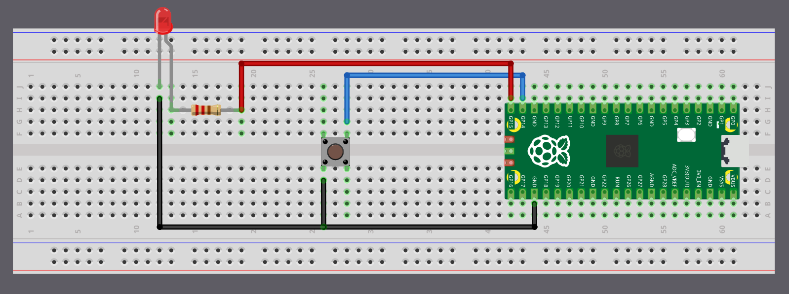

# LED on Button Press

Let's build a simple project that turns on an LED whenever the button is pressed. We will use GPIO 14 as a button input with an internal pull-up resistor, and another GPIO pin 15 as an output to drive the LED. When the button is pressed, the input pin goes LOW and the LED is turned on. When the button is released, the input pin goes HIGH and the LED turns off.

> [!Tip]
> I have connected the LED to GPIO 15 in the same way as in the external LED section, so we can reuse that wiring and build on top of it without changing the LED connection.

## Circuit

<div class="image-with-caption" style="text-align:center; ">
    
    <div class="caption" style="font-size:0.9em; color:#555; margin-top:6px;">Button with Raspberry Pi Pico</div>
</div>
<br/>

### Button Connection

<table>
  <thead>
    <tr>
      <th>Pico Pin</th>
      <th style="width: 250px; margin: 0 auto;">Wire</th>
      <th>Component</th>
    </tr>
  </thead>
  <tbody>
    <tr>
      <td>GPIO 14</td>
      <td style="text-align: center; vertical-align: middle; padding: 0;">
        <div class="wire blue" style="width: 200px; margin: 0 auto;">
          <div class="female-left"></div>
          <div class="female-right"></div>
        </div>
      </td>
      <td>One terminal of Button</td>
    </tr>
    <tr>
      <td>Other terminal of Button</td>
      <td style="text-align: center; vertical-align: middle; padding: 0;">
        <div class="wire black" style="width: 200px; margin: 0 auto;">
          <div class="female-left"></div>
          <div class="female-right"></div>
        </div>
      </td>
      <td>GND</td>
    </tr>
  </tbody>
</table>

### LED Connection

<table>
  <thead>
    <tr>
      <th>Pico Pin</th>
      <th style="width: 250px; margin: 0 auto;">Wire</th>
      <th>Component</th>
    </tr>
  </thead>
  <tbody>
    <tr>
      <td>GPIO 15</td>
      <td style="text-align: center; vertical-align: middle; padding: 0;">
        <div class="wire red" style="width: 200px; margin: 0 auto;">
          <div class="female-left"></div>
          <div class="female-right"></div>
        </div>
      </td>
      <td>Resistor (one end)</td>
    </tr>
    <tr>
      <td>Resistor (other end)</td>
      <td style="text-align: center; vertical-align: middle; padding: 0;">
        <div class="wire orange" style="width: 200px; margin: 0 auto;">
          <div class="female-left"></div>
          <div class="female-right"></div>
        </div>
      </td>
      <td>Anode (long leg) of LED</td>
    </tr>
    <tr>
      <td>Cathode (short leg) of LED</td>
      <td style="text-align: center; vertical-align: middle; padding: 0;">
        <div class="wire black" style="width: 200px; margin: 0 auto;">
          <div class="female-left"></div>
          <div class="female-right"></div>
        </div>
      </td>
      <td>GND</td>
    </tr>
  </tbody>
</table>
<br/>


## Project from template

Generate a new project using the custom Embassy template.

```sh
cargo generate --git https://github.com/ImplFerris/rp2040-embassy-template.git --tag v0.1.4
```

## Button as Input

So far, we've been using the `Output` struct because our Pico was sending signals to the LED. This time, the Pico will receive a signal from the button, so we'll configure it as an `Input`.

```rust
let button = Input::new(p.PIN_14, Pull::Up);
```

We've connected one side of the button to GPIO 14. The other side is connected to Ground. This means when we press the button, the pin gets pulled to the LOW state. As we discussed earlier, without a pull resistor, the input would be left in a floating state and read unreliable values. So we enable the internal pull-up resistor to keep the pin HIGH by default.


## Led as Output

Now we configure the LED pin as an output so the Pico can control it. The LED is connected to GPIO 15 through a resistor and then to ground.

```rust
let mut led = Output::new(p.PIN_15, Level::Low);
// let mut led = Output::new(p.PIN_25, Level::Low);
```

## Main loop

Now in a loop, we constantly check if the button is pressed by testing whether it's in the LOW state. We add a small 5-millisecond delay between checks to avoid overwhelming the system. When the button reads LOW (pressed), we set the LED pin HIGH to turn it on, then wait for 3 seconds so we can visually observe it. You can adjust this delay to your preference.

```rust
loop {

    if button.is_low() {
        defmt::info!("Button pressed");
        led.set_high();
        Timer::after_secs(3).await;
    } else {
        led.set_low();
    }

    Timer::after_millis(5).await;
}
```

> [!NOTE]
> **Debounce:** If you reduce the delay, you might notice that sometimes a single button press triggers multiple detections. This is called "button bounce". When you press a physical button, the metal contacts inside briefly bounce against each other, creating multiple electrical signals in just a few milliseconds. In this example, the 3-second LED delay effectively masks any bounce issues, but in applications where you need to count individual button presses accurately, you'll need debouncing logic.

We also log "Button pressed" using defmt. If you're using a debug probe, use the `cargo embed --release` command to see these logs in your terminal.

## The Full code

```rust
#![no_std]
#![no_main]

use embassy_executor::Spawner;
use embassy_time::Timer;

// defmt Logging
use defmt::info;
use defmt_rtt as _;

use panic_probe as _;

use embassy_rp::gpio::{Input, Level, Output, Pull};

#[embassy_executor::main]
async fn main(_spawner: Spawner) {
    let p = embassy_rp::init(Default::default());

    let button = Input::new(p.PIN_14, Pull::Up);
    let mut led = Output::new(p.PIN_15, Level::Low);

    info!("Initializing the program");

    loop {
        if button.is_low() {
            defmt::info!("Button pressed");
            led.set_high();
            Timer::after_secs(3).await;
        } else {
            led.set_low();
        }

        Timer::after_millis(5).await;
    }
}
```

## Clone the existing project

You can clone (or refer) project I created and navigate to the `button` folder.

```sh
git clone https://github.com/ImplFerris/rp2040-projects
cd rp2040-projects/embassy/button
```
