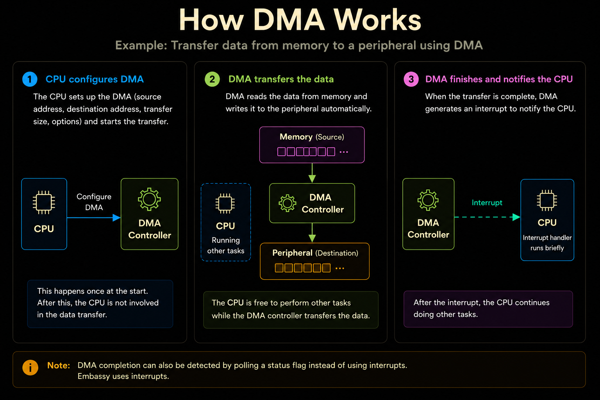

# Direct Memory Access (DMA)

Many embedded applications need to transfer data between memory and peripherals. For example, a sensor may continuously produce measurements, a display may need pixel data, or a communication peripheral may receive and transmit streams of bytes.

The CPU can perform these transfers itself by reading data from one location and writing it to another. While this works well for small or occasional transfers, repeatedly moving large amounts of data keeps the CPU busy performing a task that requires little processing.

> To make these transfers more efficient, many microcontrollers include a Direct Memory Access (DMA) controller. DMA is dedicated hardware that transfers data between memory and peripherals without requiring the CPU to copy every byte.

The CPU simply configures the DMA controller by specifying where to read the data, where to write it, and how much data to transfer. Once the transfer begins, the DMA controller performs the work independently while the CPU is free to perform other tasks.

<div class="image-with-caption" style="text-align:center;">
    
    <div class="caption" style="font-size:0.9em; color:#555; margin-top:6px;">Example: Transfer data from memory to a peripheral using DMA</div>
</div>

In the above example, the CPU configures the DMA controller by specifying the source, destination, and transfer size. Once the transfer begins, the DMA controller moves the data automatically while the CPU is free to perform other tasks. When the transfer is complete, the DMA controller notifies the CPU, typically by generating an interrupt.

Although this example shows a memory-to-peripheral transfer, DMA is not limited to this direction. It can also transfer data from a peripheral to memory, such as storing ADC samples or received UART data into a buffer. Some DMA controllers also support memory-to-memory transfers.

## DMA in Embassy

Most of the time, you won't interact with the DMA controller directly. Instead, Embassy drivers use DMA internally whenever it improves performance. In many cases, all you need to do is provide a DMA channel when creating the driver.

For example, the PioWs2812 driver introduced in the next chapter accepts a DMA channel during initialization.

```rust
let mut ws2812 = PioWs2812::new(
    &mut common,
    sm0,
    p.DMA_CH0, // <-- DMA Channel
    Irqs,
    p.PIN_16,
    &program,
);
```

The DMA_CH0 parameter tells the driver which DMA channel to use. The driver configures the DMA controller internally and transfers the pixel data automatically. Your application never needs to configure DMA registers or manually move the pixel data.

The same idea appears again later when working with the Pico W. The Wi-Fi driver also uses DMA internally to transfer data efficiently, allowing the CPU to perform other tasks while the transfer is in progress.
