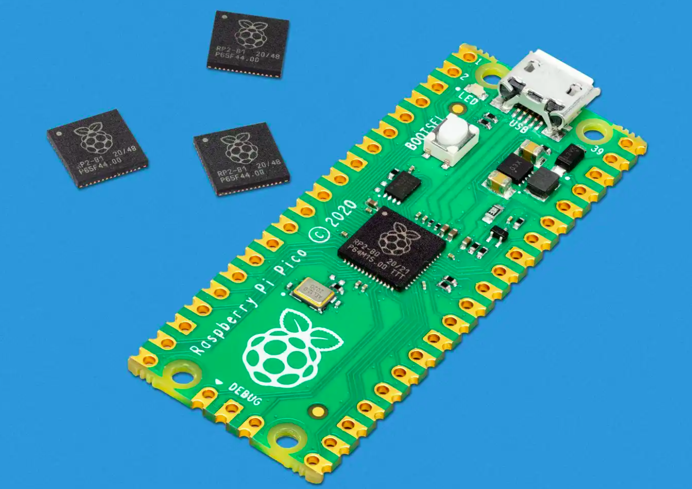

# Intro

In this book, we use the Raspberry Pi Pico and program it in Rust to explore various exciting projects. You will work on exercises like dimming an LED, controlling a servo motor, measuring distance with a sonic sensor, displaying the Ferris (🦀) image on an OLED display, using an RFID reader, playing songs on a buzzer, turning on an LED when the room light is off, measuring temperature, and much more.

## Meet the hardware - Pico

We will be using the Raspberry Pi Pico, which is part of the Raspberry Pi Pico series built around the RP2040 microcontroller. The RP2040 is designed by Raspberry Pi in the UK and features a dual-core Arm Cortex-M0+ processor with 264 KB of on-chip SRAM and support for external flash memory. 

You find more details from the [official website](https://www.raspberrypi.com/products/raspberry-pi-pico/).

    
    
Raspberry Pi Pico

## Variants

When I started the Pico book, I originally targeted the Raspberry Pi Pico 2 with the RP2350 chip. I noticed that many people still use the older Raspberry Pi Pico based on the RP2040.

If you have previously purchased an RP2040 board and have been using it with another language such as MicroPython, you may want to try Rust on the same board without purchasing new hardware. This book is meant for that use case.

If you are buying a board now, I recommend buying the newer Pico 2 instead of the RP2040-based Pico. If you are using the newer version, you can refer to the corresponding book here: [https://pico.implrust.com/](https://pico.implrust.com/)

> [!NOTE]
> There is also a variant called Pico W. It is based on the RP2040 and includes a CYW43439 wireless chip that provides Wi-Fi and Bluetooth support.

## Datasheets

For detailed technical information, specifications, and guidelines, refer to the official datasheets:

- [Pico Datasheet](https://datasheets.raspberrypi.com/pico/pico-datasheet.pdf)
- [RP2040 chip Datasheet](https://datasheets.raspberrypi.com/rp2040/rp2040-datasheet.pdf)
- [Pico W Datasheet](https://datasheets.raspberrypi.com/picow/pico-w-datasheet.pdf)

## License

The impl Rust for Pico book(this project) is distributed under the following licenses:

* The code samples and free-standing Cargo projects contained within this book are licensed under the terms of both the [MIT License] and the [Apache License v2.0].
* The written prose contained within this book is licensed under the terms of the Creative Commons [CC-BY-SA v4.0] license.
* Circuit diagrams in this book were created with Fritzing.

[MIT License]: https://opensource.org/licenses/MIT
[Apache License v2.0]: http://www.apache.org/licenses/LICENSE-2.0
[CC-BY-SA v4.0]: https://creativecommons.org/licenses/by-sa/4.0/legalcode

## Support this project

You can support this book by starring this project on [GitHub](https://github.com/ImplFerris/rp2040-book) or sharing this book with others 😊

### Disclaimer

The experiments and projects shared in this book have worked for me, but results may vary. I'm not responsible for any issues or damage that may occur while you're experimenting. Please proceed with caution and take necessary safety precautions.
