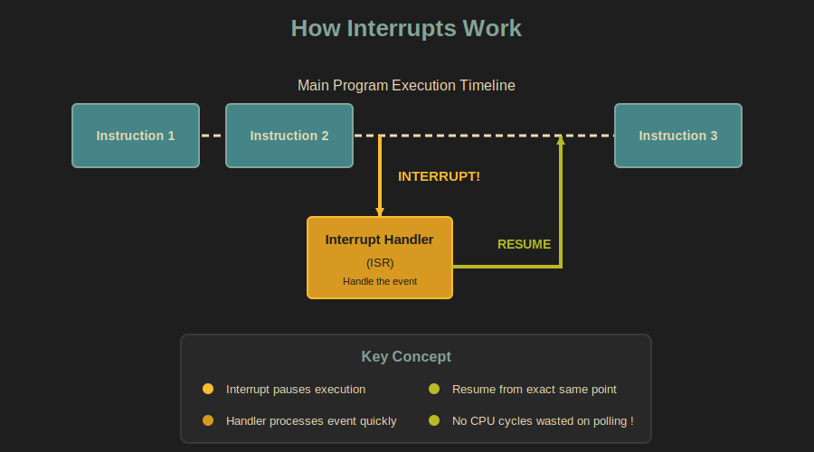
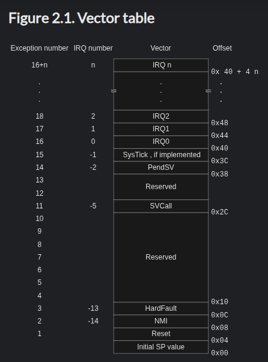
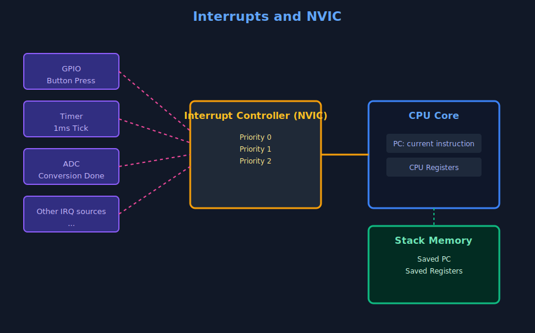

# Interrupts

<style>
.interrupt-demo-container {
    background-color: #282828;
    border: 2px solid #3c3836;
    border-radius: 8px;
    padding: 32px;
    max-width: 80%;
    box-shadow: 0 8px 24px rgba(0, 0, 0, 0.4);
    margin: 20px auto;
    font-family: 'Segoe UI', Tahoma, Geneva, Verdana, sans-serif;
}

.interrupt-demo-explain {
    color: #83a598;
    font-weight: 500;
    line-height: 1.6;
}

.interrupt-demo-interrupt {
    color: #fabd2f;
    line-height: 1.6;
}

.interrupt-demo-comment {
    color: #a89984;
    line-height: 1.6;
}

.interrupt-demo-container br {
    display: block;
    content: "";
    margin-top: 8px;
}
</style>

<div class="interrupt-demo-container">
    <span class="interrupt-demo-explain">
        In this section, I am going to explain what an interrupt is.
    </span><br/><br/>
    <span class="interrupt-demo-interrupt">
        Just give me a minute, my partner is calling.
    </span><br/>
    <span class="interrupt-demo-interrupt">
        Yes honey. Sure, I will do.
    </span><br/><br/>
    <span class="interrupt-demo-comment">
        Ok, I am back. So, where was I?
    </span><br/><br/>
    <span class="interrupt-demo-explain">
        When an interrupt occurs, the processor pauses its current execution.
    </span><br/><br/>
    <span class="interrupt-demo-interrupt">
        Just a moment, someone is ringing the doorbell.
    </span><br/>
    <span class="interrupt-demo-interrupt">
        Nice, the Pico W arrived.
    </span><br/><br/>
    <span class="interrupt-demo-comment">
        Anyway, let me get back to the explanation.
    </span><br/><br/>
    <span class="interrupt-demo-explain">
        It continues from the exact instruction where it was interrupted.
    </span><br/><br/>
    <span class="interrupt-demo-comment">
        That phone call and the doorbell were interrupts.<br/>
        I (acting as the processor) paused my explanation, handled those interrupts, and then continued.
    </span>
</div>

That was a simple attempt to explain interrupts using an analogy. I hope you get the idea. An interrupt is a signal that causes the processor to pause normal execution so an event can be handled. The idea is inspired by a great explanation by Patrick on YouTube. The [original video](https://www.youtube.com/watch?v=cKBqA7IDNpA) is even more fun and very educational. It is worth watching.

## Why We Need Interrupts

In a simple program, the processor executes instructions one after another in a straight line. This works fine if your program is simple. But embedded systems often need to respond to external events: a button press, data from a sensor, a timer expiring.

Without interrupts, the only way to detect these events is through polling: continuously checking a status register or input pin in a loop to see if something has happened. It's like repeatedly asking:

"Did a button change?"

"Did the timer expire?"

"Is new data available?"

Most of the time, the answer is no. The processor wastes CPU time checking again and again, even when nothing is happening. This makes the system inefficient and less responsive.

Instead, peripherals can raise an interrupt to get the processor's attention. When an interrupt occurs, the processor temporarily pauses the current code, jumps to a specific piece of code called an interrupt handler, handles the event, and then resumes execution from the exact place where it was interrupted.

> [!Tip]
> Think of it like the difference between standing in front of the washing machine checking every minute if it's done versus doing other things while it runs and having it beep when the cycle finishes.

With interrupts, the processor runs its main code freely and only stops when something actually needs attention. 

<div class="image-with-caption" style="text-align:center; ">
    
</div>

## How the processor remembers what it was doing

When an interrupt happens, the processor must be able to resume execution later without losing its place.

To do this, the processor saves its current state. This includes information such as the program counter and important registers.

On most microcontrollers, this state is pushed onto the stack automatically by the hardware. The interrupt handler then runs. When the handler finishes, the saved state is restored from the stack and execution continues as if nothing happened.

## Interrupt Service Routines

The code that runs in response to an interrupt is called an Interrupt Service Routine (ISR).

An ISR should be short and fast. While an ISR is running, normal program execution is paused. Long or blocking operations inside an ISR can cause missed events and timing problems. 

## The Interrupt Vector Table

When an interrupt occurs, how does the processor know which interrupt service routine (ISR) to run? The answer is the interrupt vector table.

The interrupt vector table is a table stored in memory that contains the addresses of interrupt handler functions. Each interrupt source is assigned a fixed position in this table, called a vector number. When an interrupt fires, the processor uses that number to look up the corresponding entry in the table and jumps to the handler address stored there.

The vector table is not limited to peripheral interrupts. It also contains entries for system exceptions such as reset, hardware faults, and system timers. From the processor point of view, these events are handled in the same way as interrupts, by jumping to the address listed in the vector table.

On ARM Cortex-M processors such as the RP2040, the vector table is typically located at the start of flash memory at boot. The first entry contains the initial stack pointer, and the second entry contains the reset handler, which is the first code executed when the processor starts.

<div class="image-with-caption" style="text-align:center; ">
    
    <div class="caption" style="font-size:0.9em; color:#555; margin-top:6px;">Vector table for Cortex-M0 - source: <a href="https://developer.arm.com/documentation/dui0497/a/BABIFJFG">Arm</a></div>
</div>

## Interrupt priority levels

Microcontrollers allow interrupts to have priority levels. A higher-priority interrupt can preempt a lower-priority one. This ensures that time-critical events are handled first.

## The NVIC: Interrupt Controller

The Nested Vectored Interrupt Controller (NVIC) is the hardware component in ARM Cortex-M processors that manages interrupts.

The NVIC is responsible for enabling and disabling individual interrupts, enforcing priority levels, and handling situations where multiple interrupts occur at once. When a higher-priority interrupt arrives, the NVIC can pause a lower-priority handler to deal with the more urgent event first.

<div class="image-with-caption" style="text-align:center; ">
    
    <div class="caption" style="font-size:0.9em; color:#555; margin-top:6px;">NVIC</div>
</div>

Priority numbers in ARM Cortex-M work in reverse order: lower numbers mean higher priority. Among configurable interrupts, Priority 0 is the most urgent, while higher numbers like Priority 15 are less urgent. This means a Priority 0 interrupt can preempt a Priority 2 handler, but not the other way around.

## Critical Sections

A critical section is a small sequence of code that must not be interrupted, in order to preserve the consistency of data or hardware state.

Consider a situation where the main code is updating a shared variable or configuring a peripheral using multiple steps. If an interrupt occurs in the middle of that sequence, and the interrupt handler accesses the same data or hardware, the system can end up in an inconsistent state.

In embedded systems, this is usually handled by temporarily disabling interrupts before entering the critical section and re-enabling them immediately after.

The goal is not to block interrupts for long periods of time, but to protect very small and sensitive pieces of code where consistency matters.

In the embedded Rust ecosystem, the [`critical-section`](https://docs.rs/critical-section/latest/critical_section/) crate provides a universal, portable API for entering critical sections across many platforms and environments. It defines functions like `acquire`, `release`, and `with` that libraries and applications can use to run code with interrupts disabled or otherwise protected. 

Example: 

```rust
use core::cell::Cell;
use critical_section::Mutex;

static MY_VALUE: Mutex<Cell<u32>> = Mutex::new(Cell::new(0));

critical_section::with(|cs| {
    // This code runs within a critical section.

    // `cs` is a token that you can use to "prove" that to some API,
    // for example to a `Mutex`:
    MY_VALUE.borrow(cs).set(42);
});
```

## Types of interrupts

In microcontrollers, interrupts usually come from a few common sources.

### External interrupts

These are triggered by external signals, such as a button press or a change on a GPIO pin. They are often used for user input or reacting to external hardware events.

### Timer interrupts

Timers can generate interrupts at fixed intervals. These are widely used for delays, scheduling tasks, blinking LEDs, or keeping time. Yup, we have actually been using timer interrupts already. Whenever we call `Timer::after_millis(100).await` in Embassy, that's exactly what happens behind the scenes. The timer peripheral is configured to fire an interrupt after 100 milliseconds. Our task goes to sleep, and when the timer interrupt fires, it wakes the task back up. The CPU doesn't sit there counting, it's free to do other things or sleep while waiting.

### Peripheral interrupts

Many peripherals can generate interrupts. For example:

- SPI and I2C peripherals can raise interrupts to signal transfer completion or error conditions.
- ADC peripherals can generate interrupts when a conversion finishes.

### System exceptions

Some interrupts are generated by the processor itself, such as faults or system timers. These are usually reserved for system-level tasks.
