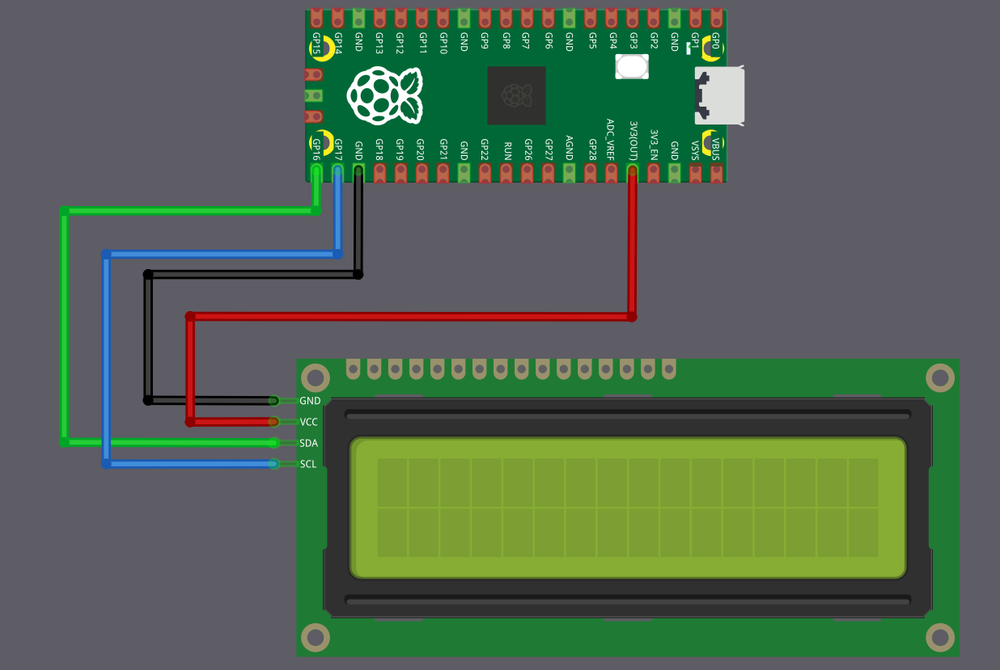
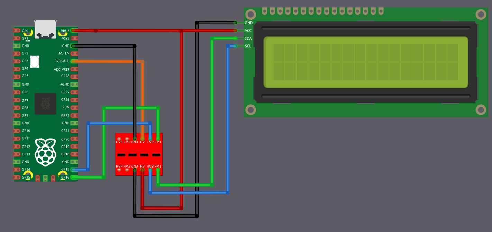

# Connecting LCD Display (LCD1602) to the Raspberry Pi Pico

We are going to connect an LCD1602 character display fitted with an I2C adapter to the Raspberry Pi Pico. From a wiring point of view, the setup looks simple because only four connections are required: power, ground, SDA, and SCL.  However, even though the wiring count is small, there is an important voltage detail that we must handle correctly before making any connections.

## Voltage compatibility problem

The Raspberry Pi Pico's GPIO pins are 3.3V tolerant. Anything significantly above 3.3 V on SDA or SCL can damage the Pico, either immediately or gradually over time.

Most LCD1602 modules with an I2C backpack are designed to run at 5 V. The I2C backpack usually has pull-up resistors connected to its supply voltage. When powered at 5 V, this means SDA and SCL idle at 5 V.

If SDA and SCL from such a module are connected directly to the Pico, the Pico GPIO pins will be exposed to 5 V. This is the core problem we must address.

## A commonly suggested shortcut you will see online

Many online tutorials suggest powering the LCD1602 and its I2C backpack from 5 V and connecting SDA and SCL directly to the Pico.  I have tested this setup myself, and it does work. However, it is electrically unsafe, and long-term use can damage the Pico GPIO pins.

For this reason, even though it functions, this wiring method should not be considered safe or recommended.

## The lazy but reasonably safe approach: power everything at 3.3 V

For demos, experiments, and learning projects, the simplest and safest approach is to power the LCD1602 I2C module from the Pico 3.3 V rail instead of 5 V.

When the LCD backpack is powered at 3.3 V, its I2C pull-up resistors pull SDA and SCL to 3.3 V instead of 5 V. This immediately removes the voltage compatibility problem, and SDA and SCL can be connected directly to the Pico.

The trade-off is that the LCD contrast and backlight brightness will be reduced. In most indoor environments, the display remains readable and is usually more than adequate for demonstrations and testing.

This approach avoids extra components, and avoids stressing the Pico GPIO pins.

<table>
  <thead>
    <tr>
      <th style="width: 250px;">LCD Pin</th>
      <th style="width: 250px; text-align: center;">Wire</th>
      <th>Pico Pin</th>
      <th>Notes</th>
    </tr>
  </thead>
  <tbody>
    <tr>
      <td>GND</td>
      <td style="text-align: center; vertical-align: middle; padding: 0;">
        

          

          

        

      </td>
      <td>GND</td>
      <td>Common ground</td>
    </tr>
    <tr>
      <td>VCC</td>
      <td style="text-align: center; vertical-align: middle; padding: 0;">
        

          

          

        

      </td>
      <td>3.3V</td>
      <td>3.3 power supply for the LCD</td>
    </tr>
    <tr>
      <td>SCL</td>
      <td style="text-align: center; vertical-align: middle; padding: 0;">
        

          

          

        

      </td>
      <td>GPIO 17</td>
      <td>I2C clock line (I2C0 SCL)</td>
    </tr>
    <tr>
      <td>SDA</td>
      <td style="text-align: center; vertical-align: middle; padding: 0;">
        

          

          

        

      </td>
      <td>GPIO 16</td>
      <td>I2C data line (I2C0 SDA)</td>
    </tr>
  </tbody>
</table>

 

## Best approach: Using a level shifter

If you need full backlight brightness, or if your LCD module does not work reliably at 3.3 V, then you must power it at 5 V. But this means you need to protect your Pico from the 5V signals.

The solution is a bidirectional logic level converter (also called a level shifter). This small module converts signals between 3.3 volts and 5 volts in both directions. You can find these as "2-Channel" or "4-Channel I2C/SPI Logic Level Converter" modules.

The Pico connects to the 3.3V side of the level shifter, the LCD connects to the 5V side. The level shifter makes sure the Pico only ever sees 3.3V signals, while the LCD gets the 5V signals it needs.

This is the electrically correct and safe method, but it adds a few extra wires and requires an additional module.

 

The circuit diagram may look a little confusing at first glance, but the idea is simple once you break it down.

<h3>Power Connections (Connect These First)</h3>

First, connect the Pico 3.3 V output to the pin marked LV(Low Voltage) on the level shifter. Connect the Pico VBUS (5 V) to the pin marked HV(High Voltage) on the level shifter. The LCD VCC pin is also powered directly from the Pico VBUS pin. Ground must be common, so connect Pico GND, the level shifter GND, and the LCD GND together.

<table>
  <thead>
    <tr>
      <th style="width: 180px;">From</th>
      <th style="width: 120px;">Pin</th>
      <th style="width: 160px; text-align: center;">Wire</th>
      <th style="width: 180px;">To</th>
      <th style="width: 120px;">Pin</th>
      <th>Purpose</th>
    </tr>
  </thead>
  <tbody>
    <tr>
      <td>Raspberry Pi Pico</td>
      <td>GND</td>
      <td style="text-align: center; vertical-align: middle; padding: 0;">
        

          

          

        

      </td>
      <td>Level Shifter</td>
      <td>GND</td>
      <td>Common ground</td>
    </tr>
    <tr>
      <td>Level Shifter</td>
      <td>GND</td>
      <td style="text-align: center; vertical-align: middle; padding: 0;">
        

          

          

        

      </td>
      <td>LCD Display</td>
      <td>GND</td>
      <td>Common ground</td>
    </tr>
    <tr>
      <td>Raspberry Pi Pico</td>
      <td>3.3V</td>
      <td style="text-align: center; vertical-align: middle; padding: 0;">
        

          

          

        

      </td>
      <td>Level Shifter</td>
      <td>LV</td>
      <td>Low voltage power (3.3V side)</td>
    </tr>
    <tr>
      <td>Raspberry Pi Pico</td>
      <td>VBUS (5V)</td>
      <td style="text-align: center; vertical-align: middle; padding: 0;">
        

          

          

        

      </td>
      <td>Level Shifter</td>
      <td>HV</td>
      <td>High voltage power (5V side)</td>
    </tr>
    <tr>
      <td>Raspberry Pi Pico</td>
      <td>VBUS (5V)</td>
      <td style="text-align: center; vertical-align: middle; padding: 0;">
        

          

          

        

      </td>
      <td>LCD Display</td>
      <td>VCC</td>
      <td>5V power supply for the LCD</td>
    </tr>
  </tbody>
</table>

<h3>Data Connections (I2C Communication)</h3>

Now coming to the I2C lines. The Pico pins must always connect to the pins on the level shifter marked LVx, and the LCD pins must always connect to the corresponding pins marked HVx. Pico GPIO 16 (SDA) connects to LV1, and the LCD SDA pin connects to HV1. Pico GPIO 17 (SCL) connects to LV2, and the LCD SCL pin connects to HV2.

<table>
  <thead>
    <tr>
      <th style="width: 180px;">From</th>
      <th style="width: 120px;">Pin</th>
      <th style="width: 160px; text-align: center;">Wire</th>
      <th style="width: 180px;">To</th>
      <th style="width: 120px;">Pin</th>
      <th>Purpose</th>
    </tr>
  </thead>
  <tbody>
    <tr>
      <td>Raspberry Pi Pico</td>
      <td>GPIO 16</td>
      <td style="text-align: center; vertical-align: middle; padding: 0;">
        

          

          

        

      </td>
      <td>Level Shifter</td>
      <td>LV1</td>
      <td>SDA (Data) - Pico side</td>
    </tr>
    <tr>
      <td>Level Shifter</td>
      <td>HV1</td>
      <td style="text-align: center; vertical-align: middle; padding: 0;">
        

          

          

        

      </td>
      <td>LCD Display</td>
      <td>SDA</td>
      <td>SDA (Data) - LCD side</td>
    </tr>
    <tr>
      <td>Raspberry Pi Pico</td>
      <td>GPIO 17</td>
      <td style="text-align: center; vertical-align: middle; padding: 0;">
        

          

          

        

      </td>
      <td>Level Shifter</td>
      <td>LV2</td>
      <td>SCL (Clock) - Pico side</td>
    </tr>
    <tr>
      <td>Level Shifter</td>
      <td>HV2</td>
      <td style="text-align: center; vertical-align: middle; padding: 0;">
        

          

          

        

      </td>
      <td>LCD Display</td>
      <td>SCL</td>
      <td>SCL (Clock) - LCD side</td>
    </tr>
  </tbody>
</table>

### How it works?

In simple terms, when the Pico communicates over an I2C line, the LVx side operates at 3.3 V, and the level shifter presents a 5 V signal on the matching HVx side for the LCD. When the LCD communicates at 5 V, the level shifter translates that signal back so the Pico only ever sees 3.3 V on the LVx side. This way, both devices operate at their required voltages without stressing the Pico GPIO pins.
