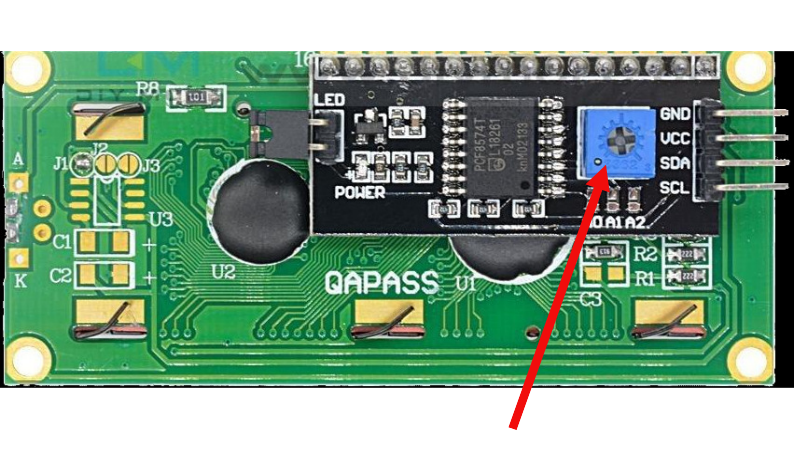

# How it works?

A Liquid Crystal Display (LCD) works by using liquid crystals to control how light passes through the screen. When we apply electricity, the liquid crystals change their orientation. This change either allows light to pass through or blocks it. By controlling which areas allow light and which block it, the LCD can display characters and symbols.

The screen itself does not emit light. Instead, a backlight behind the display provides illumination. The liquid crystals selectively block this backlight to create dark areas, which form the visible characters on the screen.

### 16x2 LCD Display and 5x8 Pixel Matrix

A 16x2 LCD has 2 rows and 16 columns, so it can display a total of 32 characters at once. Each character on the screen is built from a 5x8 pixel matrix. That means every character is formed using 5 vertical columns and 8 horizontal rows of tiny dots.

These dots turn on and off to form letters, numbers, and symbols. 

### Displaying Text and Custom Characters on 16x2 LCD

We do not need to draw individual pixels when displaying normal text. This is handled automatically by the HD44780 controller. When we send an ASCII character, the controller looks up the corresponding 5x8 pattern and displays it on the screen.

If we want to display custom symbols, such as icons or special characters, we can define our own 5x8 pixel patterns. These patterns are stored in the LCD memory, and once defined, we can display them like regular characters. One important limitation is that the LCD can store only 8 custom characters at a time.

### Data Transfer Mode

The HD44780 controller supports two data transfer modes: 8-bit mode and 4-bit mode.

When using the parallel interface, 8-bit mode sends a full byte at once using all data pins. This is faster, but it requires many GPIO pins. In 4-bit mode, the same data is sent in two steps using only four data pins. This reduces wiring at the cost of a small performance penalty.

When using an I2C adapter, the adapter board drives the LCD using the 4-bit parallel interface internally. We do not need to configure this ourselves, because the adapter handles it automatically.

To keep wiring simple and practical, we will use 4-bit mode.
 
## Adjust the contrast

When we power on the LCD, we should see the dot matrix on the screen. If the text is not clearly visible after running the program, the contrast needs adjustment.

When using an I2C LCD module, we can adjust the small potentiometer on the I2C adapter board to set the contrast.

Turning this potentiometer slowly will make the characters clearer or darker until they are easy to read.
