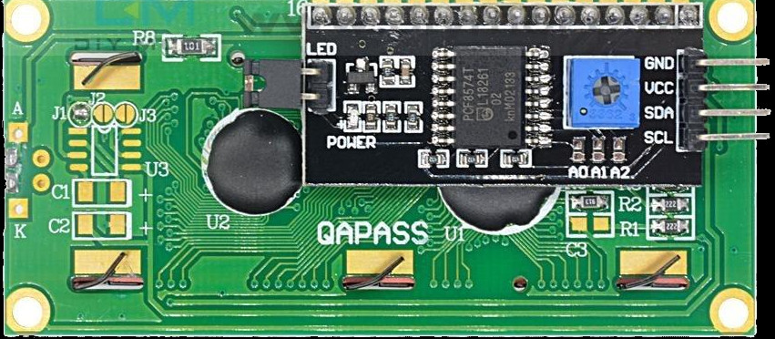

## Pin Layout

When using the parallel interface, the LCD exposes a total of 16 pins. These pins provide power, contrast control, control signals, data lines, and backlight connections.

In the I2C interface, these signals are simplified and exposed through fewer pins. We will first look at the I2C variant, followed by the parallel interface.

## I2C Pin Layout

The I2C adapter simplifies the connection by converting I2C commands into parallel signals internally. From the microcontroller side, we only need power and the two I2C lines.

 
<table border="1" style="border-collapse: collapse; width: 100%; text-align: center;">
  <thead>
    <tr>
      <th>Pin</th>
      <th>Label</th>
      <th>Description</th>
    </tr>
  </thead>
  <tbody>
    <tr>
      <td>1</td>
      <td>VCC</td>
      <td>Power supply (typically 5V)</td>
    </tr>
    <tr>
      <td>2</td>
      <td>GND</td>
      <td>Ground</td>
    </tr>
    <tr>
      <td>3</td>
      <td>SDA</td>
      <td>Serial Data Line for I2C communication</td>
    </tr>
    <tr>
      <td>4</td>
      <td>SCL</td>
      <td>Serial Clock Line for I2C communication</td>
    </tr>
  </tbody>
</table>

## Parallel Interface Pin Layout

In the parallel interface, the microcontroller talks directly to the HD44780 controller. This gives more control but requires more wiring and careful timing.

 

<table border="1" style="border-collapse: collapse; width: 100%;">
  <thead>
    <tr>
      <th>Pin Position</th>
      <th style="width:14%">LCD Pin</th>
      <th>Details</th>
    </tr>
  </thead>
  <tbody>
    <tr>
      <td>1</td>
      <td>VSS</td>
      <td>
        Ground (GND).
      </td>
    </tr>
    <tr>
      <td>2</td>
      <td>VDD</td>
      <td>
        Power supply for the LCD logic, typically 5V.
      </td>
    </tr>
    <tr>
      <td>3</td>
      <td>Vo</td>
      <td>
        Contrast control pin. 
        - This pin expects an analog voltage between GND and VDD. 
        - Recommended: Use a 10k potentiometer as a voltage divider, with the wiper connected to Vo and the other two pins to VDD and GND. 
        - Alternative: Use fixed resistors as a voltage divider between VDD and GND, with the midpoint connected to Vo.
      </td>
    </tr>
    <tr>
      <td>4</td>
      <td>RS</td>
      <td>
        Register Select: 
        - LOW (RS = 0): Instruction or command register. 
        - HIGH (RS = 1): Data register.
      </td>
    </tr>
    <tr>
      <td>5</td>
      <td>RW</td>
      <td>
        Read or Write control: 
        - LOW (RW = 0): Write to LCD. 
        - HIGH (RW = 1): Read from LCD. 
        - Commonly tied to GND for write-only operation.
      </td>
    </tr>
    <tr>
      <td>6</td>
      <td>E</td>
      <td>
        Enable pin. Data or commands are latched on the HIGH to LOW transition of this pin.
      </td>
    </tr>
    <tr>
      <td>7–10</td>
      <td>D0–D3</td>
      <td>
        Lower data bits. Used only in 8-bit mode.
        Leave unconnected when using 4-bit mode.
      </td>
    </tr>
    <tr>
      <td>11–14</td>
      <td>D4–D7</td>
      <td>
        Higher data bits. Used for data transfer in both 4-bit and 8-bit modes.
        In 4-bit mode, all data is sent using only these pins.
      </td>
    </tr>
    <tr>
      <td>15</td>
      <td>A</td>
      <td>
        Backlight anode.
        Often connected to 5V.
        Some modules include an onboard current-limiting resistor.
      </td>
    </tr>
    <tr>
      <td>16</td>
      <td>K</td>
      <td>
        Backlight cathode. Connect to GND.
      </td>
    </tr>
  </tbody>
</table>

## Contrast Adjustment

The Vo pin controls the contrast of the LCD by setting the voltage difference between VDD and Vo.  
Lower Vo values increase contrast, while higher values reduce it.

The recommended approach is to use a potentiometer connected between VDD and GND, with the wiper connected to Vo. This allows easy adjustment while the LCD is powered.

If a potentiometer is not available, fixed resistors can be used as a voltage divider between VDD and GND, with the midpoint connected to Vo.

## Register Select Pin (RS)

The RS pin selects whether the LCD interprets incoming values as commands or as character data.

- RS = LOW: command mode  
- RS = HIGH: data mode  

## Enable Pin (E)

The Enable pin controls when data is latched into the LCD.

To send data or a command, place the value on the data pins, set RS appropriately, then pulse E HIGH and bring it back LOW. The LCD reads the data on the HIGH to LOW transition.

