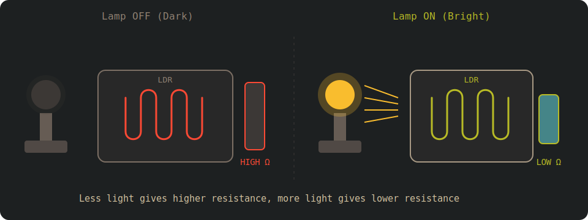

# Light Dependent Resistors (LDRs)

Light Dependent Resistors (LDRs), also known as photoresistors, are among the simplest sensors you can use with a microcontroller. Their resistance changes based on the amount of light falling on them. More light results in lower resistance, while less light results in higher resistance.

Because of this behavior, LDRs are commonly used in projects such as automatic street lights, screen brightness control, light meters, and basic day night detection.

    

## How an LDR Works

An LDR is made from a photosensitive semiconductor material. When light hits its surface, photons transfer energy to the material and free up charge carriers. As a result, the resistance of the LDR decreases.

> [!TIP]
> Think of the LDR as Dracula. In sunlight, he gets weaker, just like the resistance gets lower. In darkness, he gets stronger, just like the resistance gets higher.

The resistance change is not linear, and the exact values vary between different LDRs. For most embedded applications, this is not a problem. We usually care about relative light levels rather than precise measurements.

We will not go into the details of the semiconductor materials used in LDRs or the physics behind them. If you are curious and want to explore this further, you can read this article and do additional research: [https://www.elprocus.com/ldr-light-dependent-resistor-circuit-and-working/](https://www.elprocus.com/ldr-light-dependent-resistor-circuit-and-working/)

## Components Needed:

    
    
LDR

You will need the following components:
- LDR (Light Dependent Resistor)
- Resistor (typically 10kΩ); needed to create voltage divider
- Jumper wires (as usual)

## Prerequisite

Before working with an LDR, you should already understand what a voltage divider is and how it works, as well as what an ADC is and how it converts an analog voltage into a digital value.

If you need a quick refresher, you can refer to these sections:

- [Voltage divider section](../core-concepts/voltage-divider.md).
- [ADC](../adc/index.md)
