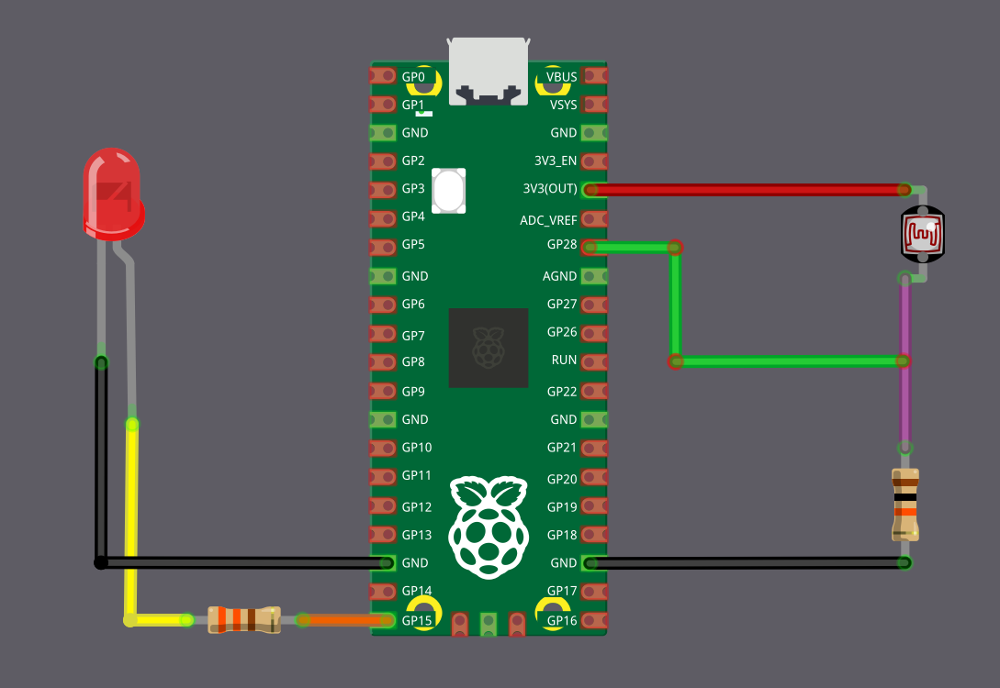

# Turn on LED in low Light with Raspberry Pi Pico 

In this exercise, we will build a small but practical project using an LDR. The Pico will automatically turn on an LED when the ambient light level drops below a certain point, meaning the LED turns on as it gets darker. You can extend this idea to control a real lamp, but that is outside the scope of this exercise and requires proper safety precautions.

You can try this in a closed room by switching the room light on and off. When the light is turned off and the room becomes dark enough, the LED should turn on, and it should turn off again when the room light is switched back on. Alternatively, you can adjust the sensitivity threshold or cover the LDR with your hand or another object to simulate different light levels.

> [!Tip]
> You may need to adjust the ADC threshold based on your room's lighting conditions and the specific LDR you are using.

## Hardware Requirements

You are going to need the following components for this exercise:

- LED
- LDR
- **Resistors**
  - 330 ohm: This is used with the LED to limit the current and protect it. You may need to choose a different value depending on the LED you are using.
  - 10 k ohm: This is used with the LDR to form the voltage divider. You may need to adjust this value depending on the characteristics of your LDR.
- Jumper wires:    These are used to connect everything together on a breadboard or directly to the microcontroller.

## Circuit to Connect LED and LDR with Pico

### LDR (ADC) Connection

We are going to connect the LDR as a voltage divider and feed the divider output into an ADC pin on the Pico. Here, the LDR acts as R1 and is connected to the 3.3 V supply, which means the ADC value decreases as the light level drops.

<table>
  <thead>
    <tr>
      <th>Pico Pin</th>
      <th style="width: 250px; margin: 0 auto;">Wire</th>
      <th>Component</th>
    </tr>
  </thead>
  <tbody>
    <tr>
      <td>3.3&nbsp;V</td>
      <td style="text-align: center; vertical-align: middle; padding: 0;">
        

          

          

        

      </td>
      <td>One end of the LDR</td>
    </tr>
    <tr>
      <td>GPIO&nbsp;28 (ADC2)</td>
      <td style="text-align: center; vertical-align: middle; padding: 0;">
        

          

          

        

      </td>
      <td>Junction between LDR and 10&nbsp;kΩ resistor</td>
    </tr>
    <tr>
      <td>10&nbsp;kΩ resistor</td>
      <td style="text-align: center; vertical-align: middle; padding: 0;">
        

          

          

        

      </td>
      <td>Other end of the LDR</td>
    </tr>
    <tr>
      <td>GND</td>
      <td style="text-align: center; vertical-align: middle; padding: 0;">
        

          

          

        

      </td>
      <td>Other end of the 10&nbsp;kΩ resistor</td>
    </tr>
  </tbody>
</table>

### LED Connection

The LED will be connected to a GPIO pin 15 and will turn on automatically when the light level drops.

<table>
<thead>
  <tr>
    <th>Pico Pin</th>
    <th style="width: 250px; margin: 0 auto;">Wire</th>
    <th>Component</th>
  </tr>
</thead>
<tbody>
  <tr>
    <td>GPIO 15</td>
    <td style="text-align: center; vertical-align: middle; padding: 0;">
      

        

        

      

    </td>
    <td>330&nbsp;Ω resistor</td>
  </tr>
  <tr>
    <td>330&nbsp;Ω resistor</td>
    <td style="text-align: center; vertical-align: middle; padding: 0;">
      

        

        

      

    </td>
    <td>Anode (long leg) of LED</td>
  </tr>
  <tr>
    <td>GND</td>
    <td style="text-align: center; vertical-align: middle; padding: 0;">
      

        

        

      

    </td>
    <td>Cathode (short leg) of LED</td>
  </tr>
</tbody>
</table>

