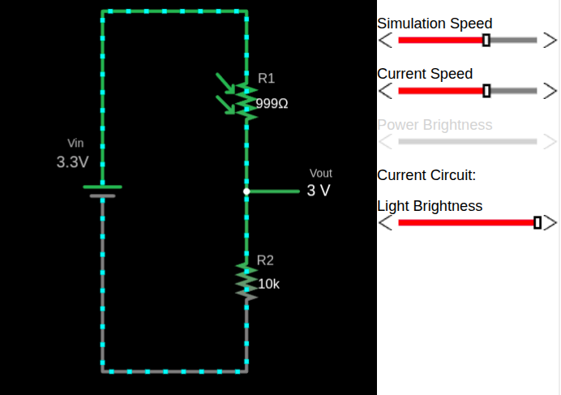
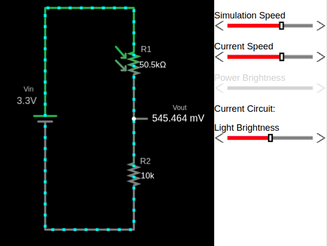
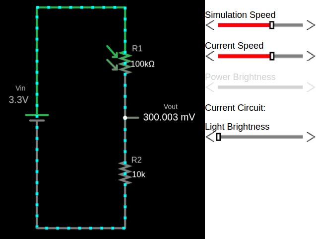

# Simulation of LDR in Voltage Divider 

To understand how an LDR behaves in a voltage divider, I created a simple simulation using Falstad. In the circuit, the LDR is shown as a resistor symbol with arrows pointing toward it, indicating incident light.

You can import the circuit file I created, [`voltage-divider-ldr.circuitjs.txt`](./voltage-divider-ldr.circuitjs.txt), import into the [Falstad site](https://www.falstad.com/circuit/e-voltdivide.html) and play around. I have also embedded a small simulator at the bottom of this page, so you can use either option.

In this configuration, the LDR is placed on the top of the voltage divider (i.e as R1), with a fixed resistor(as R2) at the bottom. This arrangement is commonly used because increasing light results in an increasing output voltage, which is intuitive when reading the value using an ADC.

Once the circuit is loaded, adjust the brightness slider and observe how the resistance of the LDR changes. At the same time, you can see how the output voltage \\( V_{out} \\) responds to those changes.

> [!Important]
> Swapping the LDR and the fixed resistor will invert the behavior of the output voltage.
> If you place the LDR as R2 (the bottom resistor) in the voltage divider, the relationship between light level and Vout is inverted because the equation changes.

### Example output for full brightness

When the LDR is exposed to strong light, its resistance is low. This causes a larger portion of the supply voltage to appear at the output, resulting in a higher

### Example output for low light

As the light level decreases, the resistance of the LDR increases. This reduces the output voltage.

### Example output for full darkness

In darkness, the LDR resistance becomes very high, causing the output voltage

## LDR Voltage Divider Simulator

    
⚡ LDR Voltage Divider Simulator

    <canvas id="ldrSimCanvas" class="ldr-sim-canvas" width="350" height="500"></canvas>
    

    <label class="ldr-sim-label">💡 Light Brightness</label>
    

        <input type="range" class="ldr-sim-slider" id="ldrSimBrightness" min="0" max="100" value="50">
        50%
    

    

    

  
  
