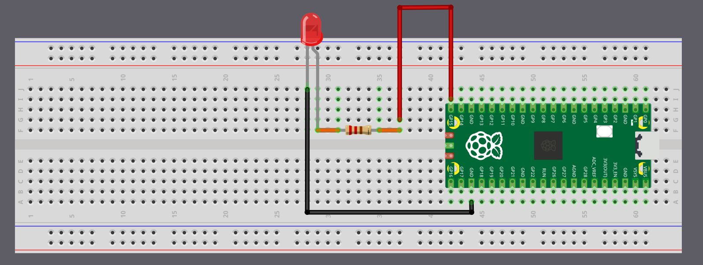

# Blinking an External LED

From now on, we'll use more external parts with the Pico. Before we get there, it helps to get comfortable with simple circuits and how to connect components to the Pico's pins. In this chapter, we'll start with something basic: blinking an LED that's connected outside the board.

## Hardware Requirements

- LED
- Resistor
- Jumper wires

## Components Overview

1. LED: An LED (Light Emitting Diode) lights up when current flows through it. The longer leg (anode) connects to positive, and the shorter leg (cathode) connects to ground. We'll connect the anode to GP15 (with a resistor) and the cathode to GND.

2. Resistors: A resistor limits the current in a circuit to protect components like LEDs. Its value is measured in Ohms (Ω). We'll use a 330 ohm resistor to safely power the LED.

<table>
  <thead>
    <tr>
      <th>Pico Pin</th>
      <th style="width: 250px; margin: 0 auto;">Wire</th>
      <th>Component</th>
    </tr>
  </thead>
  <tbody>
    <tr>
      <td>GPIO 15</td>
      <td style="text-align: center; vertical-align: middle; padding: 0;">
        

          

          

        

      </td>
      <td>Resistor</td>
    </tr>
    <tr>
      <td>Resistor</td>
      <td style="text-align: center; vertical-align: middle; padding: 0;">
        

          

          

        

      </td>
      <td>Anode (long leg) of LED</td>
    </tr>
    <tr>
      <td>GND</td>
      <td style="text-align: center; vertical-align: middle; padding: 0;">
        

          

          

        

      </td>
      <td>Cathode (short leg) of LED</td>
    </tr>
  </tbody>
</table>

You can connect the Pico to the LED using jumper wires directly, or you can place everything on a breadboard. If you're unsure about the hardware setup, you can also refer the [Raspberry pi guide](https://projects.raspberrypi.org/en/projects/introduction-to-the-pico/7).

    
    
Circuit with Breadboard

> [!TIP]
> On the Pico, the pin labels are on the back of the board, which can feel inconvenient when plugging in wires. I often had to check the pinout diagram whenever I wanted to use a GPIO pin. Use the Raspberry Pi logo on the front as a reference point and match it with the [pinout diagram](../pico-pinout.md) to find the correct pins. Pin positions 2 and 39 are also printed on the front and can serve as additional guides.

## LED Blink - Simulation

In this simulation I set the default delay to 5000 milliseconds so the animation is calmer and easier to follow. You can lower it to something like 500 milliseconds to see the LED blink more quickly. When we run the actual code on the Pico, we will use a 500 millisecond delay.

  

    

      

      
<strong id="led-state">LOW</strong>

    

    

      

        

1

let mut led = Output::new(p.PIN_13, Level::Low);

        

2

loop {

        

3

    led.set_high(); // Turn on the LED

        

4

    Timer::after_millis(5000).await;

        

5

    led.set_low(); // Turn off the LED

        

6

    Timer::after_millis(5000).await;

        

7

}

      

        

        

Idle

0 ms

      

      

        <label>Interval (ms): <input id="interval" type="number" value="5000" min="50" step="50"></label>
        <button id="restart">Restart</button>
        <button id="pause">Pause</button>
        <button id="resume" style="display:none">Resume</button>
      

    

  

