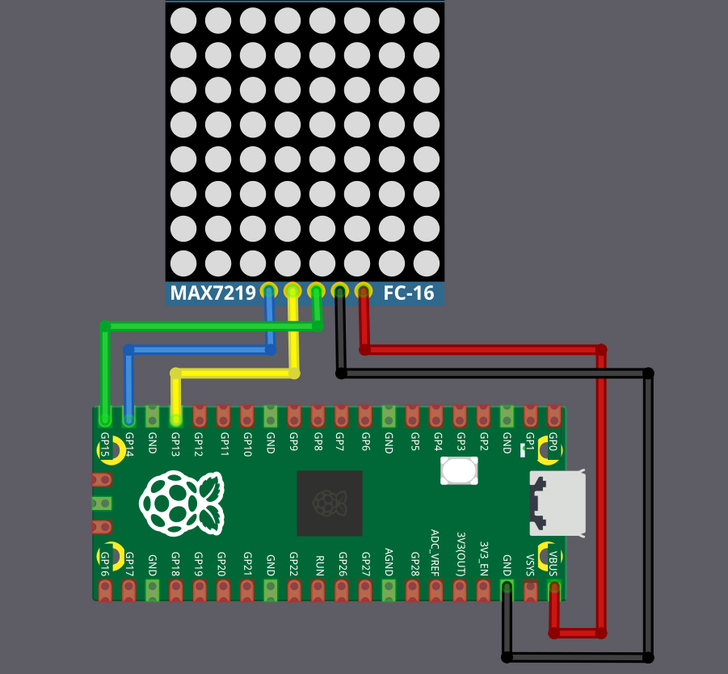

# Circuit

The MAX7219 display requires five connections to the Raspberry Pi Pico. This example uses SPI1 with GPIO 13, 14, and 15, but you can use any valid SPI pin set on your Pico.

<table>
  <thead>
    <tr>
      <th>Pico Pin</th>
      <th style="width: 250px; margin: 0 auto;">Wire</th>
      <th>MAX7219 Pin</th>
    </tr>
  </thead>
  <tbody>
    <tr>
      <td>GPIO 13 (SPI1 CS)</td>
      <td style="text-align: center; vertical-align: middle; padding: 0;">
        

          

          

        

      </td>
      <td>CS / LOAD</td>
    </tr>
    <tr>
      <td>GPIO 14 (SPI1 SCK)</td>
      <td style="text-align: center; vertical-align: middle; padding: 0;">
        

          

          

        

      </td>
      <td>CLK</td>
    </tr>
    <tr>
      <td>GPIO 15 (SPI1 MOSI)</td>
      <td style="text-align: center; vertical-align: middle; padding: 0;">
        

          

          

        

      </td>
      <td>DIN</td>
    </tr>
    <tr>
      <td>VBUS (5V)</td>
      <td style="text-align: center; vertical-align: middle; padding: 0;">
        

          

          

        

      </td>
      <td>VCC</td>
    </tr>
    <tr>
      <td>GND</td>
      <td style="text-align: center; vertical-align: middle; padding: 0;">
        

          

          

        

      </td>
      <td>GND</td>
    </tr>
  </tbody>
</table>
 

