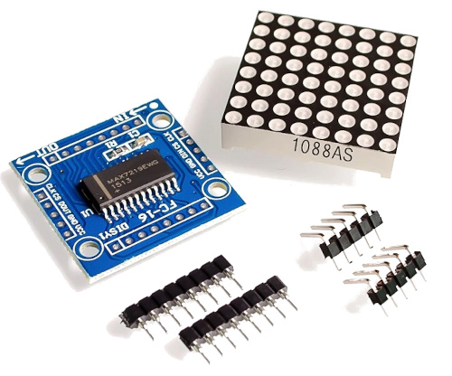
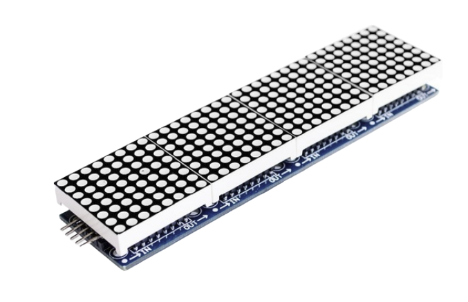
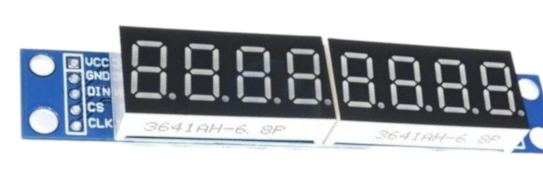

# MAX7219 8X8 Dot LED Matrix Display Module

In this chapter, we are going to work with one of the interesting display modules. It is an 8×8 Dot LED Matrix. An LED Dot Matrix is basically a grid of LEDs arranged in rows and columns that lets you display patterns, numbers, text, and simple graphics. The module we are working with is an 8×8 matrix, which gives us 64 individual LEDs to control.

Dot matrix displays are commonly used in everyday places. You can see them in buses and trains for route numbers and arrival messages, in elevators for floor numbers and direction arrows, and in digital clocks for time and basic symbols. They are also used on industrial machines and control panels to show operating status, warnings, or error messages, and in mall and arcade games.

## Meet the Hardware

Now we are going to look at the hardware itself. The module is built around a chip called the MAX7219. This chip is responsible for driving all 64 LEDs in the 8x8 matrix.

    
    
MAX7219 8X8 Dot LED Matrix

Without this chip, you would need many GPIO pins because each row and column of the LED matrix would have to be connected and controlled directly by the microcontroller. The MAX7219 takes care of that internally, so the microcontroller only needs to send high level commands instead of managing every LED.

> [!Tip]
> In this book, we will not look at the internal working of the MAX7219. We will use an existing driver and focus on controlling the display. If you want to learn how to build a MAX7219 driver from scratch, including implementing the embedded-graphics trait, you can find that in the [RED (Rust Embedded Drivers)](https://red.implrust.com/max7219/index.html) book.

### Daisy Chaining 

One useful feature of the MAX7219 is that modules can be daisy chained. This means you can connect multiple identical modules together to form a larger display. For example, you can connect 4 or 8 modules side by side to create a wider dot matrix.

    MAX7219 Daisy Chained LED Matrix Display" style="height:auto; display:block; margin:0 auto;"/>
    
MAX7219 Daisy Chained LED Matrix Display

Some modules come with headers already soldered to make chaining easier. When using multiple modules, you need to be careful with wiring and power, since more LEDs means higher current draw. We will start with a single module and keep things simple.

### 7-Segment Displays

The same MAX7219 chip is also commonly used with 7-segment LED displays. The internal working and communication method are the same. In this chapter, we will focus only on the 8x8 LED matrix. Once you understand this, working with 7-segment displays will feel very similar.

    8 Digit 7 Segment Display Module" style="height:auto; display:block; margin:0 auto;"/>
    
8 Digit 7 Segment Display Module

## Communication

The MAX7219 uses a serial interface that is similar to SPI. It needs three control signals. DIN is the data line used to send information to the chip. CLK is the clock signal that tells the chip when to read each bit. CS, sometimes labeled LOAD, is used to latch the data into the chip.

On the microcontroller side, we use the SPI peripheral in a write only manner to send data to the MAX7219. The chip does not send any data back. It only receives commands and updates the display based on what we send.

