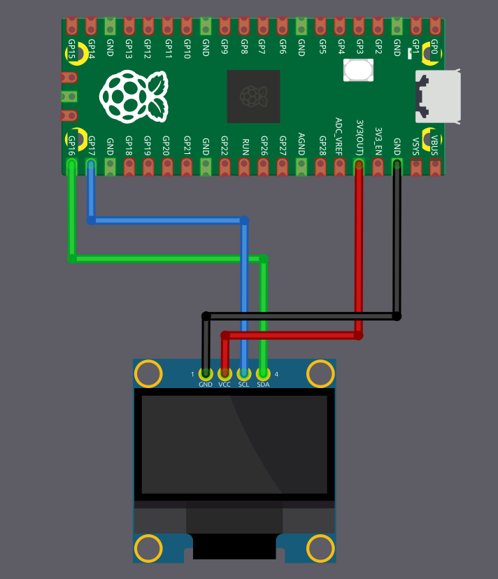

# Circuit

The OLED display requires four connections to the Raspberry Pi Pico. This example uses I2C0 with GPIO 16 and 17, but you can use any valid I2C pin pair on your Pico.

<table>
  <thead>
    <tr>
      <th>Pico Pin</th>
      <th style="width: 250px; margin: 0 auto;">Wire</th>
      <th>OLED Pin</th>
    </tr>
  </thead>
  <tbody>
    <tr>
      <td>GPIO 16</td>
      <td style="text-align: center; vertical-align: middle; padding: 0;">
        

          

          

        

      </td>
      <td>SDA</td>
    </tr>
    <tr>
      <td>GPIO 17</td>
      <td style="text-align: center; vertical-align: middle; padding: 0;">
        

          

          

        

      </td>
      <td>SCL</td>
    </tr>
    <tr>
      <td>3.3V</td>
      <td style="text-align: center; vertical-align: middle; padding: 0;">
        

          

          

        

      </td>
      <td>VCC</td>
    </tr>
    <tr>
      <td>GND</td>
      <td style="text-align: center; vertical-align: middle; padding: 0;">
        

          

          

        

      </td>
      <td>GND</td>
    </tr>
  </tbody>
</table>

