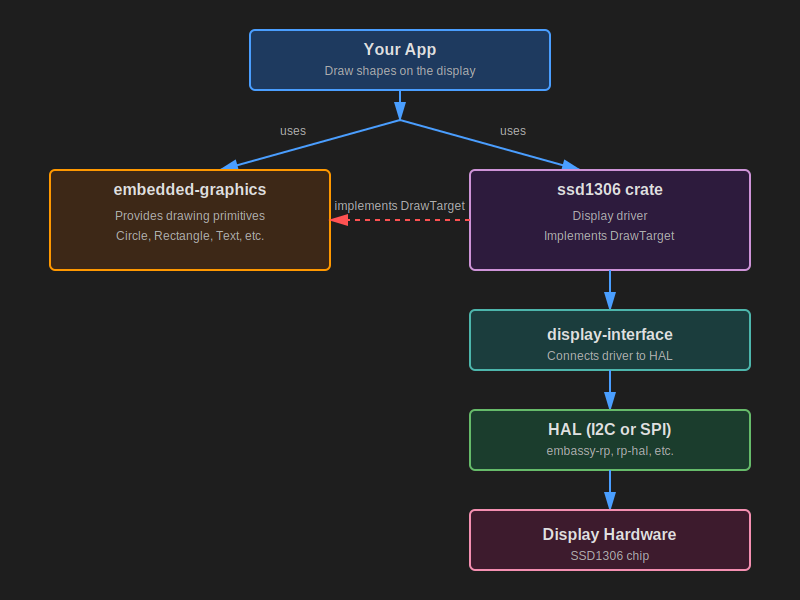

# Crates You Will Use

Now that you understand what the SSD1306 is and how I2C communication works, let's explore how we actually draw graphics on the display. You might wonder if you need to send raw commands for every pixel. The good news is that you do not. The Rust ecosystem provides us with great tools that make this much easier.

## Drawing on the Display

When working with the SSD1306 display in Rust, you'll use two main crates that work together:

1. embedded-graphics - A drawing library that lets you create shapes, text, and images
2. ssd1306 - A driver that controls the actual hardware



## What is embedded-graphics?

embedded graphics is a lightweight 2D drawing library made for memory limited embedded systems. Instead of setting individual pixels yourself, you use high level drawing commands. For example:

```rust
Circle::new(Point::new(20, 20), 30)
    .into_styled(PrimitiveStyle::with_stroke(BinaryColor::On, 1))
    .draw(&mut display)?; // display implements DrawTarget
```

This draws a circle without you needing to calculate any pixel positions or understand how the display stores its data internally.

What embedded-graphics provides:

- Drawing primitives such as circles, rectangles, lines, and triangles
- Text rendering - display text with different fonts
- Image and icon support through compatible image crates
- Style options for color, stroke width, and fill

### The Key Design Principle

embedded-graphics is completely display-independent. It doesn't know anything about your specific hardware (whether it's an SSD1306, ST7789, or any other display). It simply knows how to describe what should be drawn. The actual display driver then handles the hardware-specific details of turning those instructions into real pixels.

This design means you can write drawing code once and use it with many different displays, just by changing the driver.

You can explore more in the official documentation:
[https://docs.rs/embedded-graphics/latest/embedded_graphics/](https://docs.rs/embedded-graphics/latest/embedded_graphics/)

## What is the ssd1306 Crate?

The ssd1306 crate is a hardware driver for displays that use the SSD1306 controller chip. It handles all the low-level work needed to communicate with your display. This includes initializing the screen, sending the correct I2C or SPI commands, managing an internal buffer when required, and updating the pixels on the hardware.

### Graphics Mode

The ssd1306 driver supports multiple modes, but for drawing graphics, you'll use BufferedGraphicsMode. You enter this mode by calling:

```rust
let display = ssd1306::Ssd1306::new(i2c, size, rotation)
    .into_buffered_graphics_mode();
```

In this mode, the driver maintains an internal buffer in RAM and implements the DrawTarget trait from embedded-graphics-core. This is what allows the two crates to work together.

## How They Work Together: The DrawTarget Trait

If you are here, you probably already understand Rust traits. A trait basically describes what something can do, and the implementation decides how it actually does it.

DrawTarget is the trait that allows embedded graphics to send drawing commands to a display driver. When the ssd1306 driver implements this trait, it is essentially saying:

"I can accept the pixels that embedded graphics produces, and I know how to put those pixels onto an SSD1306 screen."

Here is what actually happens when you draw something:

1. You create shapes, text, or images using embedded-graphics primitives.
2. You call .draw(&mut display) to render them.
3. embedded graphics generates the pixels that need to be drawn.
4. The ssd1306 driver takes those pixels and stores them in its internal buffer.
5. When you call display.flush(), the driver sends the updated pixels to the OLED hardware.

Here's a simple example:

```rust
// Create a circle using embedded-graphics
let circle = Circle::new(Point::new(64, 32), 20)
    .into_styled(PrimitiveStyle::with_fill(BinaryColor::On));

// Draw it onto the display driver
circle.draw(&mut display)?; // Write pixel data into the driver's buffer

display.flush()?; // Send buffer to the actual screen
```

## Async mode

The ssd1306 crate also supports async operation when you enable the `async` feature. This is useful if you're using Embassy.

To use async mode, add the feature to your `Cargo.toml`:
```toml
ssd1306 = { version = "0.10.0", features = ["async"] }
```

When the `async` feature is enabled, the driver uses `embedded-hal-async` traits instead of the regular blocking `embedded-hal` traits. This allows the I2C/SPI communication to happen asynchronously, which is helpful when you want to do other tasks while waiting for display updates.

The main difference is that methods like `.init()` and `.flush()` become async and need to be `.await`ed:

```rust
// Async version
let mut display = Ssd1306Async::new(interface, DisplaySize128x64, DisplayRotation::Rotate0)
    .into_buffered_graphics_mode();

display.init().await?;  // Note the .await

// Drawing still works the same way
circle.draw(&mut display)?;

display.flush().await?;  // This is now async too
```
