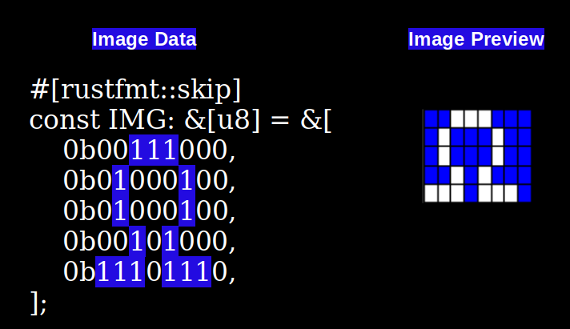
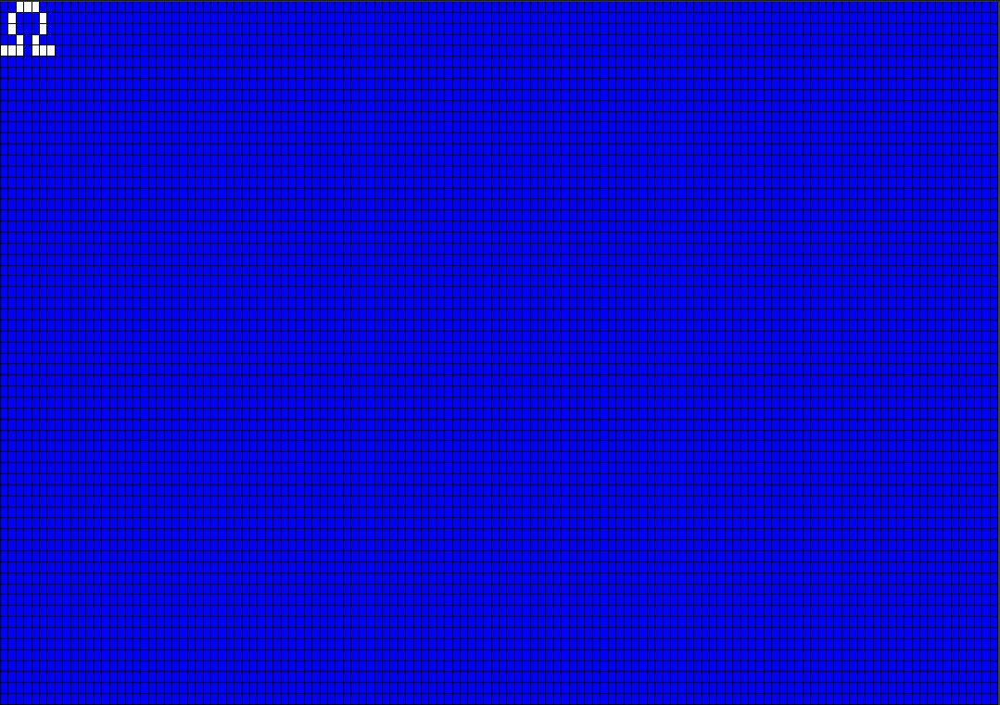

# Draw Raw Image on OLED Display with Raspberry Pi Pico

In this exercise, we will draw a raw image using only byte arrays. We will create the Ohm (Ω) symbol in a 1BPP (1 Bit Per Pixel) format.

## 1BPP Image

The 1BPP (1 bit per pixel) format uses a single bit for each pixel. It can represent only two colors, typically black and white. If the bit value is 0, it will typically be full black. If the bit value is 1, it will typically be full white.

We will create the ohm symbol using an 8x5 pixel grid in 1bpp format. I have highlighted the 1's in the byte array to show how they turn on the pixels to form the ohm symbol.

I chose 8 as the width to keep the example simple. This makes it easy to represent the 8 pixels width using a single byte (8 bits). But if you increase the width, it won't fit in one byte anymore, so it will need to be spread across multiple elements in the byte array. I will explain this in later chapters. For now, let's keep it simple.

## Ohm symbol on the OLED Display (128x64)

Let me show you how it looks when the Ohm symbol is positioned on the OLED display (128x64 resolution) at position zero(x is 0 and y is also 0). 

This is an enlarged illustration. When you see the symbol on the actual display module, it will be small.

## Reference

- [Embedded Graphics' ImageRaw Documentation](https://docs.rs/embedded-graphics/latest/embedded_graphics/image/struct.ImageRaw.html) 
- [Image2Bytes](https://implferris.github.io/image2bytes/): Convert image to Hex byte array
