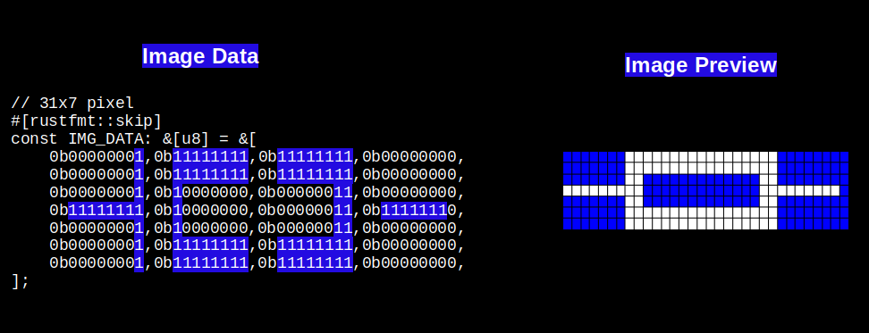

## Using Multiple Bytes to Represent Wider Pixel Widths

In the previous example, we kept it simple by using an 8-pixel wide image. This made things easy because each row fit perfectly into a single byte. However, real images often need more pixels. So how do we represent them when one byte isn't enough? The answer is simple: we use multiple bytes. But this creates a problem. If we're using multiple bytes, how does the system know where one row ends and the next one begins?

This is exactly why we need to tell the embedded graphics crate the exact width of our image. When we specify the width, the system knows how many bytes to use for each row. Once it knows the width and the image format, it can figure out the height automatically.

## Understanding the Math

Let's look at an example with an image that's 31 pixels wide and 7 pixels tall. The width is 31 pixels, and each pixel takes up 1 bit of space. To figure out how many bytes we need for each row, we do some simple math. Since a byte holds 8 bits, we divide 31 by 8. This gives us 3 complete bytes, which covers 24 pixels. But we still have 7 pixels left over, so we need one more byte to hold them. In total, we need 4 bytes to represent each row of 31 pixels. If the image has 7 rows then the total data length is 4 times 7, which is 28 bytes.



## How the System Calculates Height

The embedded graphics crate uses code like this internally to calculate the height. You don't need to add this to your own code. I'm showing it here just so you can see how it works behind the scenes:

```rust
let height = data.len() / bytes_per_row(width, C::Raw::BITS_PER_PIXEL);
//...
//...
const fn bytes_per_row(width: u32, bits_per_pixel: usize) -> usize {
    (width as usize * bits_per_pixel + 7) / 8
}
```

In our example, the data array has 28 entries, each pixel uses 1 bit, and the image width is 31. When you run this calculation, you get 4 bytes per row and a height of 7 pixels.

## Try It Yourself

You can run this code right here or in the Rust Playground to see how the calculation works:

```rust
// 31x7 pixel
#[rustfmt::skip]
const IMG_DATA: &[u8] = &[
    // 1st row
    0b00000001,0b11111111,0b11111111,0b00000000,
    // 2nd row
    0b00000001,0b11111111,0b11111111,0b00000000,
    //3rd row
    0b00000001,0b10000000,0b00000011,0b00000000,
    //4th row
    0b11111111,0b10000000,0b00000011,0b11111110,
    //5th row
    0b00000001,0b10000000,0b00000011,0b00000000,
    //6th row
    0b00000001,0b11111111,0b11111111,0b00000000,
    //7th row
    0b00000001,0b11111111,0b11111111,0b00000000,
];

const fn bytes_per_row(width: u32, bits_per_pixel: usize) -> usize {
    (width as usize * bits_per_pixel + 7) / 8
}

fn main(){
    const BITS_PER_PIXEL: usize = 1;
    let width = 31;
    let data = IMG_DATA;
    
    println!("Bytes Per Row:{}", bytes_per_row(width,BITS_PER_PIXEL));
    let height = data.len() / bytes_per_row(width, BITS_PER_PIXEL);
    println!("Height: {}", height);
}
```

You dont need to manually create these byte array, you can use an online tool like [imag2bytes](https://implferris.github.io/image2bytes/) to generate the byte array for you.


