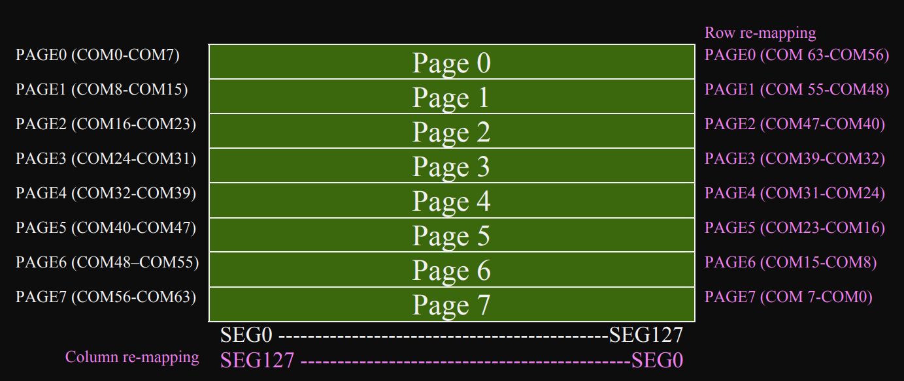
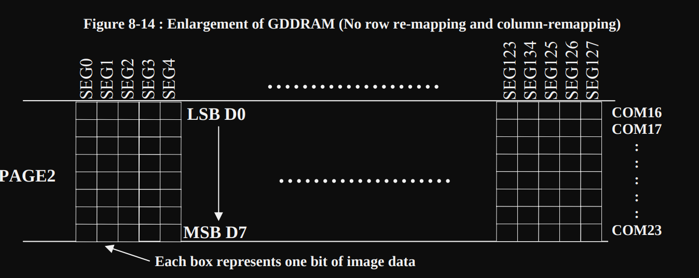
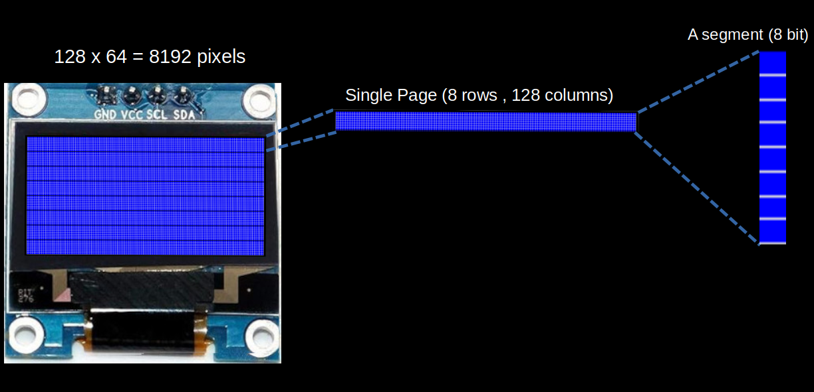

# How OLED module works?

We won't dive into the details of how OLED technology works; instead, we'll focus on what's relevant for our exercises. The module has a resolution of 128x64, giving it a total of 128 × 64 = 8192 pixels. Each pixel can be turned on or off independently.

Don't worry if these concepts are unclear for now - you can always research them later. These details are more relevant if you plan to write your own driver for the SSD1306 or work on more advanced tasks. For now, we already have a good crates that handles these aspects and simplifies the process.

In the datasheet, the 128 columns are referred to as segments, while the 64 rows are called commons (be careful not to confuse "commons" with "columns" due to their similar spelling).

## Memory

The OLED display's pixels are arranged in a page structure within GDDRAM (Graphics Display DRAM). GDDRAM is divided into 8 pages (From Page 0 to Page 7), each consisting of 128 columns (segments) and 8 rows(commons).

(This image is taken from the datasheet)

A segment is 8 bits of data (one byte), with each bit representing a single pixel. When writing data, you will write an entire segment, meaning the entire byte is written at once.

(This image is taken from the datasheet)

We can re-map both segments and commons through software for mechanical flexibility.  You can find more details on page 25 of the ssd1306 datasheet.

## Pages and Segments

I created an image to show how 128x64 pixels are divided into 8 pages. I then focused on a single page, which contains 128 segments (columns) and 8 rows. Finally, I zoomed in on a single segment to demonstrate how it represents 8 vertically stacked pixels, with each pixel corresponding to one bit.

