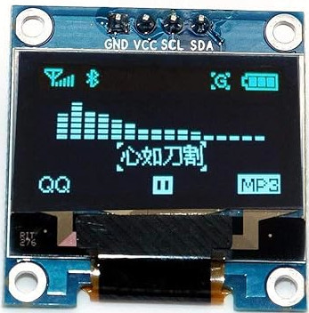

## OLED Display

In this section, we'll learn how to connect an OLED display module to the Raspberry Pi Pico. OLED displays are one of the most fun components to work with because they open up so many creative possibilities. You can build games, create dashboards, or display sensor readings in a visual way.

To give you an idea of what is possible, I have built a few games using an OLED display. One of them is Pico Rex, a tiny dinosaur jumping game inspired by Chrome's offline dino. You can check it out [here](https://github.com/ImplFerris/pico-rex).

I have also made a small flappy-style game and a shooter game, which you can find along with other examples [here](https://github.com/implferris#embedded-rust-games).

As you learn how to use the display, feel free to experiment and build your own ideas. Even simple animations or text updates can be surprisingly fun to create.

In next few chapters, we'll create simple projects like displaying text and an image (display Ferris 🦀 image) on the OLED. We'll use the I2C protocol to connect the OLED display to the Pico.

## Meet the Hardware

OLED, short for Organic Light-Emitting Diode, is a popular display module. These displays come in various sizes and can support different colors. They communicate using either the I²C or SPI protocol.

For this exercise, we'll use a 0.96-inch OLED monochrome module with a resolution of 128 x 64. It operates at 3.3V. We can communicate using I2C communication protocol.

> [!TIP]
> Most of the time, OLED displays come with pin headers included but not soldered. Soldering is a valuable skill to learn, but it requires care and preparation. Before attempting it, watch plenty of tutorials and do your research. It may feel challenging at first, but with practice, it gets easier. If you're not comfortable soldering yet, consider looking for a pre-soldered version of the display, though it may cost slightly more.

### SSD1306

The SSD1306 is the integrated controller chip that powers many small OLED displays including the module we are going to use(0.96-inch 128x64 module).  This controller handles the communication between the Pico and the OLED panel, enabling the display to show text, graphics, and more.

**DataSheet:**  You can find the datasheet for SSD1306 [here](https://cdn-shop.adafruit.com/datasheets/SSD1306.pdf).
