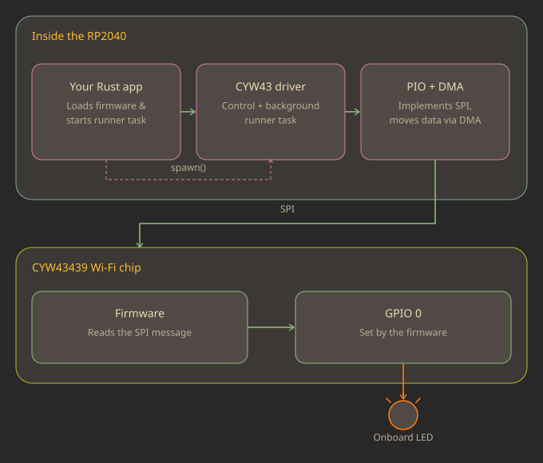

{{#title How the Raspberry Pi Pico W Controls the Onboard LED}}

# How the Raspberry Pi Pico W Controls the Onboard LED

By this point in the book, we have built much more than a simple LED blinker. We have explored GPIO, PWM, interrupts, communication protocols, DMA, and even the Programmable I/O (PIO) subsystem. Compared to those topics, blinking an LED might seem like a step backward.

However, there is a good reason for revisiting the good old blinky program.

In the quick start chapter, we flashed a small program to [blink the Pico W's onboard LED](../quick-start-pico-w.md). The goal was simply to verify that our development environment was working correctly and that we could successfully build, flash, and run a Rust program on the board. At that stage, it was more important to get something running than to understand every line of code, so we intentionally skipped the details.

Now that we have covered the underlying concepts, we can finally understand what that program is really doing behind the scenes.

<div class="image-with-caption" style="text-align:center;">
    
    <div class="caption">
        How the Raspberry Pi Pico W controls its onboard LED
    </div>
</div>

As we learned earlier, the onboard LED on the Pico W is not connected directly to GPIO 25 like it is on the original Raspberry Pi Pico. Instead, GPIO 25 is connected to the CYW43439 and serves as the chip select (CS) pin for communication between the RP2040 and the wireless chip. As a result, the RP2040 cannot control the onboard LED directly. Instead, it sends requests to the CYW43439, whose firmware controls GPIO 0 to turn the LED on or off.

Although this example only blinks an LED, it introduces many of the building blocks used by every Pico W application. As we walk through the code, we will see how the CYW43439 driver is created, how the RP2040 communicates with the wireless chip over a PIO-based SPI interface.

## The Full Code

The following is the same program we used in the Pico W quick start. This time, instead of simply running it, we will examine it line by line and understand how each piece contributes to controlling the onboard LED.  By now, you should already be familiar with most of the concepts used in this program, including interrupts, PIO, and SPI.

```rust
#![no_std]
#![no_main]

use cyw43_pio::{DEFAULT_CLOCK_DIVIDER, PioSpi};
use defmt::*;
use embassy_executor::Spawner;
use embassy_rp::bind_interrupts;
use embassy_rp::gpio::{Level, Output};
use embassy_rp::peripherals::{DMA_CH0, PIO0};
use embassy_rp::pio::{InterruptHandler, Pio};
use embassy_time::{Duration, Timer};
use static_cell::StaticCell;
use {defmt_rtt as _, panic_probe as _};

bind_interrupts!(struct Irqs {
    PIO0_IRQ_0 => InterruptHandler<PIO0>;
});

#[embassy_executor::task]
async fn cyw43_task(
    runner: cyw43::Runner<'static, Output<'static>, PioSpi<'static, PIO0, 0, DMA_CH0>>,
) -> ! {
    runner.run().await
}

#[embassy_executor::main]
async fn main(spawner: Spawner) {
    let p = embassy_rp::init(Default::default());

    let fw: &[u8] = include_bytes!("../firmware/43439A0.bin");
    let clm: &[u8] = include_bytes!("../firmware/43439A0_clm.bin");

    // To make flashing faster for development, you may want to flash the firmwares independently
    // at hardcoded addresses, instead of baking them into the program with `include_bytes!`:
    //     probe-rs download ../../cyw43-firmware/43439A0.bin --binary-format bin --chip RP2040 --base-address 0x10100000
    //     probe-rs download ../../cyw43-firmware/43439A0_clm.bin --binary-format bin --chip RP2040 --base-address 0x10140000
    //let fw = unsafe { core::slice::from_raw_parts(0x10100000 as *const u8, 230321) };
    //let clm = unsafe { core::slice::from_raw_parts(0x10140000 as *const u8, 4752) };

    let pwr = Output::new(p.PIN_23, Level::Low);
    let cs = Output::new(p.PIN_25, Level::High);
    let mut pio = Pio::new(p.PIO0, Irqs);
    let spi = PioSpi::new(
        &mut pio.common,
        pio.sm0,
        DEFAULT_CLOCK_DIVIDER,
        pio.irq0,
        cs,
        p.PIN_24,
        p.PIN_29,
        p.DMA_CH0,
    );

    static STATE: StaticCell<cyw43::State> = StaticCell::new();
    let state = STATE.init(cyw43::State::new());
    let (_net_device, mut control, runner) = cyw43::new(state, pwr, spi, fw).await;

    unwrap!(spawner.spawn(cyw43_task(runner)));

    control.init(clm).await;
    control
        .set_power_management(cyw43::PowerManagementMode::PowerSave)
        .await;

    let delay = Duration::from_secs(1);
    loop {
        info!("led on!");
        control.gpio_set(0, true).await;
        Timer::after(delay).await;

        info!("led off!");
        control.gpio_set(0, false).await;
        Timer::after(delay).await;
    }
}
```
