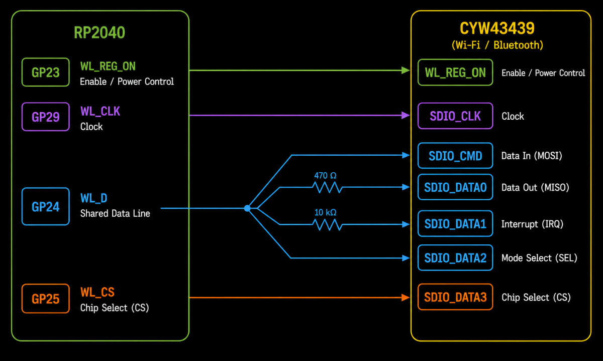

{{#title How the Raspberry Pi Pico W Communicates with the CYW43439}}

# Raspberry Pi Pico W SPI Interface with the CYW43439

The RP2040 and the CYW43439 constantly communicate with each other. Whenever your application connects to a Wi-Fi network, sends data, receives data, or performs any wireless operation, commands and data are exchanged between these two chips.

This communication takes place over a half-duplex SPI interface that uses a single shared data line to carry commands, outgoing data, incoming data, and interrupt signaling.

The official Pico W schematic shows that the RP2040 communicates with the CYW43439 using four GPIO connections. Three of these implement the SPI interface, while the fourth is used to enable and power the wireless chip.

    
    

        Simplified communication connections between the RP2040 and the CYW43439.
    

The diagram above shows the GPIO connections between the RP2040 and the CYW43439.

At first glance, this looks like a normal SPI connection. However, the GPIO assignments do not match the supported SPI pin mappings described in the [RP2040 SPI Chapter](../spi/spi-in-raspberry-pi-pico.md).

The RP2040 hardware SPI peripherals can only be used with specific GPIO pins. For example, **GP29** cannot be used as the clock pin for either SPI0 or SPI1. Since the CYW43439 is connected using GPIO pins that are not supported by the hardware SPI peripherals, SPI0 and SPI1 cannot be used to communicate with it.

## SPI Through PIO

The official Pico SDK contains a dedicated driver named `cyw43_bus_pio_spi.c` together with a PIO program named `cyw43_bus_pio_spi.pio`. Together, these files implement the SPI interface between the RP2040 and the CYW43439.

This shows that the official Pico SDK implements the SPI interface using the RP2040's Programmable I/O (PIO) subsystem instead of the hardware SPI peripherals.

## Further Reading

For a much deeper look at how the RP2040 communicates with the CYW43439, see:

- PicoWi Part 1: Low-Level Interface: [https://iosoft.blog/2022/12/06/picowi_part1/](https://iosoft.blog/2022/12/06/picowi_part1/)
