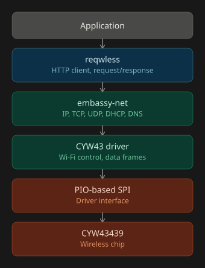

{{#title Connecting the Raspberry Pi Pico W to Wi-Fi Using Embassy}}

# Connecting the Raspberry Pi Pico W to Wi-Fi Using Embassy

In the previous chapter, we learned how to communicate with the CYW43439 wireless chip. We uploaded its firmware, created the CYW43 driver, and used it to control the onboard LED.

Now it's time to put the wireless chip to work. In this chapter, we will connect the Pico W to your home Wi-Fi network. You can also use your phone's mobile hotspot if you prefer.

Once connected, we will obtain an IP address using DHCP, send an HTTP GET request to `http://httpbin.org/json`, parse the JSON response, and print the extracted information to the console.

The CYW43 driver is only one part of the networking software. To communicate with other devices over the network, we also need a TCP/IP networking stack. Embassy provides this through the `embassy-net` crate. On top of `embassy-net`, we will use the `reqwless` crate to send HTTP requests.

<div class="image-with-caption" style="text-align:center;">
    
    <div class="caption" style="font-size:0.9em; color:#555; margin-top:6px;">Pico W Networking Stack</div>
</div>

The CYW43439 wireless chip sits at the bottom of the stack. The RP2040 communicates with it through a PIO-based SPI interface, which is used by the CYW43 driver to control the wireless chip and exchange network frames.

The `embassy-net` crate sits on top of the CYW43 driver and implements networking protocols such as IP, TCP, UDP, DHCP. The `reqwless` crate sits on top of `embassy-net` and provides an HTTP client that our application uses to communicate with web servers.


## Project Reference

If you run into any issues, you can compare your code with the completed project:

```sh
git clone https://github.com/ImplFerris/pico-w-projects
cd pico-w-projects/embassy/http-request
```
