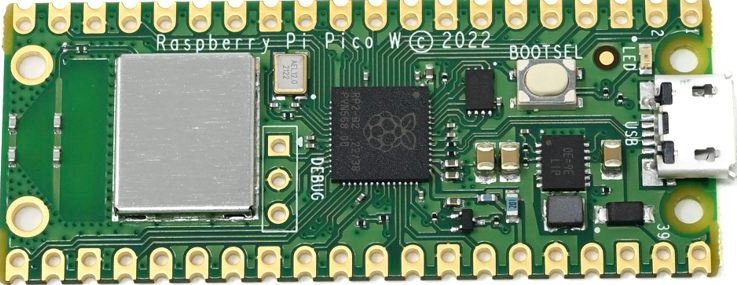

# Pico W Introduction

So far, we have seen examples that work on both the Pico and Pico W boards, since both are based on the RP2040 chip. Most of the exercises we have covered run the same way on either board. As mentioned earlier, the Pico W includes an additional chip, the CYW43439, which provides wireless connectivity. From this point onward, the exercises will apply only to the Pico W and not to the standard Pico board.

    
    
Raspberry Pi Pico W

## Wireless Hardware Overview

Raspberry Pi Pico W adds an on-board single-band 2.4 GHz wireless interface (802.11n) using the Infineon CYW43439. The wireless interface supports the following features:

- Wireless networking (802.11n), single-band 2.4 GHz  
- WPA3 security  
- Soft access point mode supporting up to four clients  
- Bluetooth 5.2  
- Bluetooth Low Energy Central and Peripheral roles  
- Bluetooth Classic support  

## Pin Sharing and Interface Constraints

Due to pin limitations on the RP2040, several wireless interface signals are shared. The clock signal is shared with the VSYS monitor. As a result, VSYS can only be read using the ADC when no SPI transaction is in progress. The CYW43439 DIN, DOUT, and IRQ signals all share a single RP2040 pin. IRQs should only be checked when an SPI transaction is not active. The wireless SPI interface typically operates at 33 MHz.

## Debug (SWD) Pin Location

On the Pico W, the SWD debug pins are not located at the bottom edge of the board. Instead, they are provided near the center of the board.
