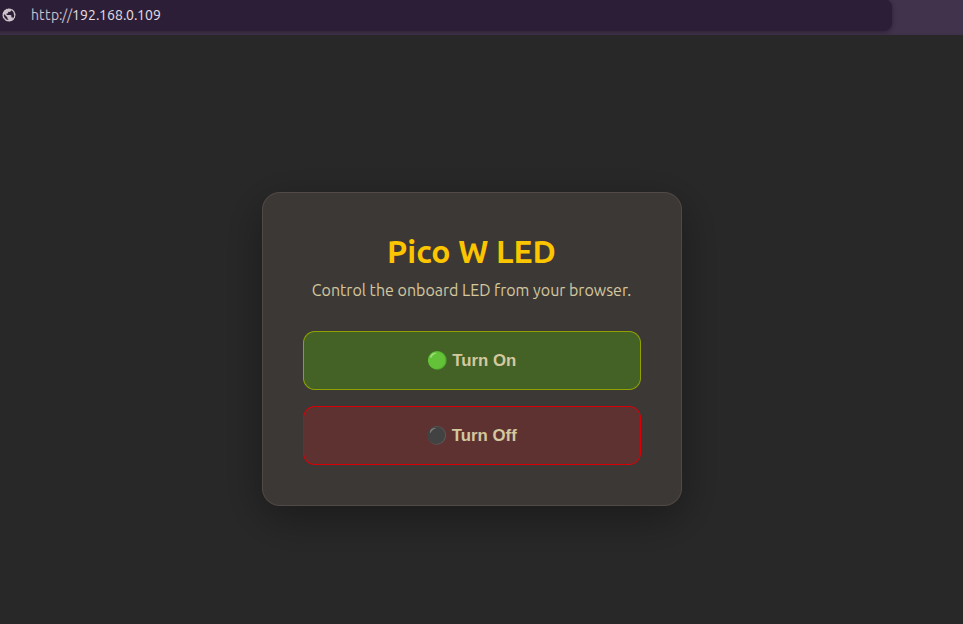

{{#title Creating a Web Server with Embedded Rust and the Raspberry Pi Pico W}}

# Creating a Web Server with Embedded Rust and the Raspberry Pi Pico W

In the previous chapter, we learned how to connect the Raspberry Pi Pico W to a Wi-Fi network. We also used the `reqwless` crate as an HTTP client to send requests to a web server and process the responses.

In this chapter, we will reverse the roles. Instead of acting as an HTTP client, the Raspberry Pi Pico W will become the web server.

To make things more interesting, we will build a simple web page with two buttons. One button will turn the onboard LED on, while the other will turn it off. By the end of this chapter, you will be able to control the LED directly from your web browser over your Wi-Fi network.

    
    
Preview of the web page

To achieve this, we will use a new crate called `picoserve`. It is an asynchronous, `no_std` HTTP server designed for bare-metal embedded systems. It is heavily inspired by the popular `axum` web framework.

The web server you build in this chapter will run on your local Wi-Fi network, so any device connected to the same network can access it using the Pico W's IP address. Accessing it from the Internet requires additional network configuration and may not be supported by every ISP. That is beyond the scope of this chapter.

## Complete Project

If you would like to compare your code or refer to the finished implementation, you can find the complete project here:

[https://github.com/ImplFerris/pico-w-projects/tree/main/embassy/web-server](https://github.com/ImplFerris/pico-w-projects/tree/main/embassy/web-server)
