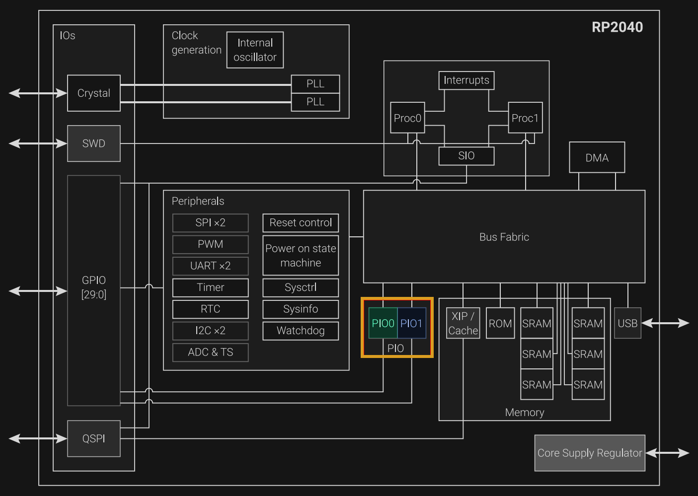
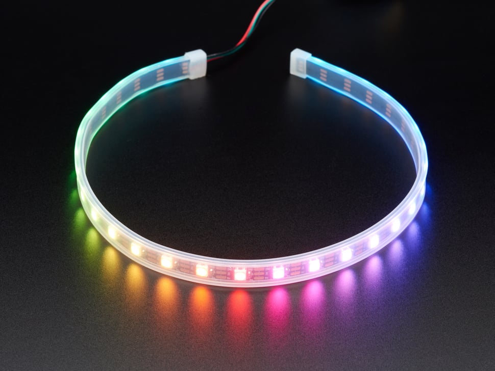

# PIO on Raspberry Pi Pico

This is one of the features I avoided for a long time on the Raspberry Pi Pico, yet it is one of the most powerful and unique features of the chip. Not because it was difficult to understand, but because it was not clear where it actually fit.

The Pico already has SPI, I2C, UART. So the first question that comes up is: why would you need something else? The answer is not about replacing those things. It is about what happens when they are not enough.

> [!Tip]
> The diagram below is taken from the RP2040 datasheet. Do not let the size of the diagram or the amount of detail intimidate you. I have highlighted the PIO blocks. I included the image only to give you a high-level view of where the PIO blocks sit inside the chip. The RP2040 contains two PIO blocks, named PIO0 and PIO1. Proc0 and Proc1 are the two Cortex-M0+ processor cores.

    
    
PIO Block in RP2040 - From the datasheet

## What Is PIO

PIO stands for Programmable Input/Output. It is a set of small processors built into the RP2040 chip itself. They are not the main CPU. They run on their own, at the same time as the main CPU, and they do one thing: move data in and out of the GPIO pins with exact timing.

On most microcontrollers, if you need to talk to a device that does not use a standard protocol, you have to do it on the main CPU. You write code that turns pins on and off at the right times. This is called bit-banging. It works. But if something interrupts the CPU, even for a short time, the timing can break. The device on the other side does not care why. It just stops working.

PIO fixes this. The state machines inside PIO run their own small programs, completely separate from the main CPU. The timing stays the same no matter how busy the rest of the system is.

The RP2040 has two PIO blocks. Each block has four state machines. That gives you eight in total. Each one can run its own program. Each one can control pins on its own.

## Use cases

PIO is not something you need for every project. If your parts use I2C, SPI, or UART, and you have enough ports, just use those. PIO is for when that is not enough.

**NeoPixel LEDs.** These LEDs use a single-wire protocol with very tight timing. A 1 bit and a 0 bit are both just short pulses, and the difference between them is a few hundred nanoseconds. If the timing drifts, the LEDs glitch. Bit-banging this on the CPU means the CPU does nothing else, and even then, one interrupt can break everything. PIO handles it without any load on the main CPU.

    
    
NeoPixel LED - image credits : <a href="https://www.adafruit.com/product/3919">adafruit</a>

In a later chapter, we will look at how to control a WS2812 12-bit RGB LED (round).

**Video output.** Generating a VGA or DPI signal needs pins toggling at very precise, high-speed intervals, frame after frame. PIO does this on its own while the CPU is free to do other things.

**More serial ports.** The RP2040 has two UART ports, two SPI ports, two I2C ports. Sometimes that is not enough. PIO can make more. You write a small program that does the same thing the hardware port does, and now you have a third port, or a fourth.

**Anything unusual.** Sometimes a device uses a protocol no one has heard of. PIO does not care what the protocol is. If you can describe the timing and the pin states, you can write a program for it.

The pattern is the same in all of these cases. Either the timing is too tight for the CPU to handle reliably, or the protocol is something the chip does not support on its own. PIO solves both.
