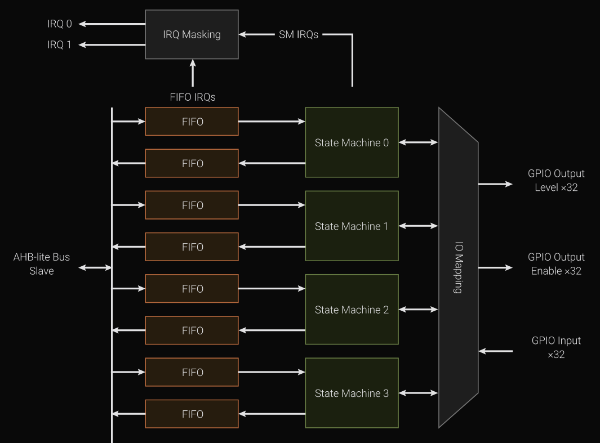

# FIFO: Moving Data Between the CPU and PIO

So far, we have seen PIO state machines execute instructions and manipulate GPIO pins. These examples used fixed patterns, where everything was hardcoded inside the PIO program.

Real applications are different. Consider driving a WS2812 NeoPixel strip. The timing rules stay the same, but the color data changes every frame.

We cannot hardcode changing data inside the PIO program. The program only has a small instruction memory, and rewriting it every frame would defeat the purpose of using PIO.

Instead, the PIO program handles the timing, and the CPU provides the changing data while it runs. That's where FIFO comes in. FIFO allows the CPU to send data to the PIO state machine and receive data back from it.

## What is FIFO?

As you probably already know, FIFO stands for First In, First Out. It is a simple queue structure where data is read in the same order it was written.

In PIO, FIFO acts as a small buffer between the CPU and the state machine. The CPU can place data into this buffer, and the state machine can read it. Likewise, the state machine can place data into a buffer that the CPU can later read.

At a high level, FIFO is simply a way to pass values back and forth without modifying the PIO program itself.

    

## FIFO in PIO State Machines

Each PIO state machine has two separate FIFO queues:

- TX FIFO (Transmit): The CPU writes data here, and the state machine reads it.
- RX FIFO (Receive): The state machine writes data here, and the CPU reads it.

By default, each FIFO can hold four 32-bit values.

    
    
FIFOs and State Machines

The CPU can write multiple values into the TX FIFO when convenient, and the state machine pulls them as needed. Likewise, the state machine can push multiple values into the RX FIFO, and the CPU can read them later.

The FIFO configuration is flexible. If your program only needs to send data in one direction, both FIFOs can be joined together. This effectively creates a single FIFO with double the depth, providing more buffer space for either transmit or receive.

The state machine interacts with the FIFOs using two instructions:

- `PULL`: Reads a value from the TX FIFO into the output shift register.
- `PUSH`: Writes a value from the input shift register into the RX FIFO.

## Shift Registers and Data Movement

When the state machine executes a `PULL` instruction, a 32-bit value from the TX FIFO is loaded into the Output Shift Register (OSR).

The `OUT` instruction shifts bits from the OSR into a destination, such as a general-purpose register or GPIO pins.

PIO also has an Input Shift Register (ISR). The `IN` instruction shifts bits into the ISR, and the `PUSH` instruction moves the accumulated value into the RX FIFO.

In both directions, shift registers act as temporary staging areas between the FIFO and the PIO instructions.

