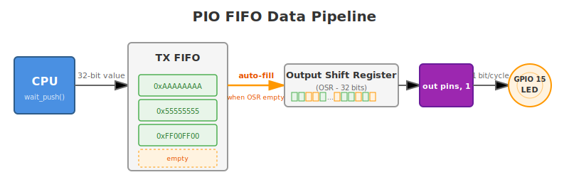

# Single LED with FIFO

I know you are eager to try NeoPixel and use PIO with it. So am I. But before we do that, we will use a simple LED with FIFO.

It may feel boring, but this is a better way to build the foundation. NeoPixel adds extra complexity, and unless you have already worked with it, we would need to explain both the protocol and the PIO behavior at the same time.

Using a single LED keeps the focus on FIFO and data movement. Once that is clear, moving to NeoPixel becomes much easier. We are going to use the same external LED circuit connected to GPIO 15 that we used earlier. 

## Sending Bit Sequences Through FIFO

In this example, we will send five simple 32-bit patterns made of 1s and 0s. The LED will switch ON and OFF rapidly according to each pattern. The transitions happen quickly, but you can still observe the difference visually.

The important part is not the LED itself. The goal is to understand what is happening internally. The CPU writes a 32-bit value into the TX FIFO. We will be using the `OUT` instruction to shift one bit at a time from the output shift register (OSR) to the GPIO pin. When all 32 bits have been shifted out, the OSR is automatically refilled from the FIFO.

We are not explicitly using the `PULL` instruction inside the PIO program. Instead, we enable automatic refill in the configuration so that the state machine fetches new data from the FIFO whenever it runs out of bits to shift. This keeps the PIO program simple while clearly demonstrating how data flows from the CPU to the pin.

    

