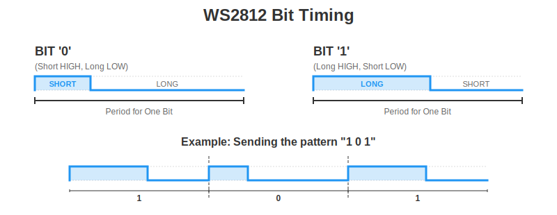
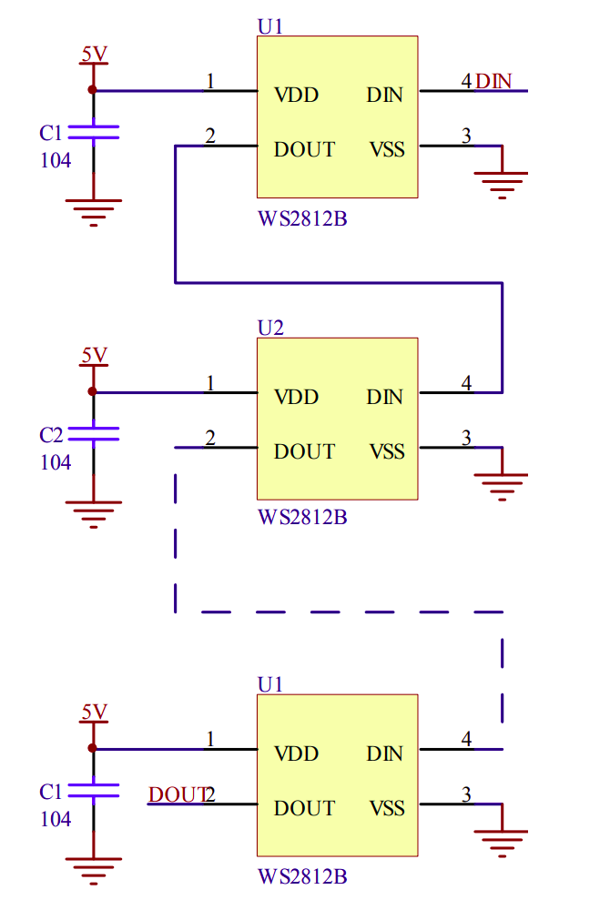

# How WS2812 Works?

The WS2812 uses a single data line and encodes information entirely in timing. There is no clock signal. The duration of the HIGH pulse determines whether the bit represents 0 or 1.

## Data Format Per LED

Each WS2812 LED expects 24 bits of data. Those 24 bits represent 8 bits for Green, 8 bits for Red, and 8 bits for Blue. The order is GRB, not RGB. If the order is wrong, the colors will not match what you expect.

Each color channel is 8-bit, so values range from 0 to 255.

For a 12 LED ring, we must send `12 × 24` bits, which means 288 bits in one continuous stream. Each LED consumes the first 24 bits meant for it and forwards the remaining bits to the next LED in the chain.

### Example: Sending Pure Red

To display pure red:

- Green = 0
- Red = 255
- Blue = 0

Because the order is GRB, the 24-bit sequence must be:

Green  -> 00000000  
Red    -> 11111111  
Blue   -> 00000000  

So the full 24-bit stream becomes:

00000000 11111111 00000000

## Bit Timing

The WS2812 protocol operates at roughly 800 kHz. This means each bit occupies about 1.25 microseconds. Every bit must fit within this time window.

    

The difference between a `0` and a `1` is determined by how long the signal stays HIGH within that 1.25 µs bit period. A logical `0` is encoded as a shorter HIGH pulse followed by a longer LOW period. A logical `1` is encoded as a longer HIGH pulse followed by a shorter LOW period.

The table below shows the typical HIGH and LOW pulse widths from the datasheets, along with the ±150 ns tolerance range for each case.
<table>
  <thead>
    <tr>
      <th>Variant</th>
      <th>Bit</th>
      <th>HIGH Time</th>
      <th>LOW Time</th>
    </tr>
  </thead>
  <tbody>
    <tr>
      <td>WS2812</td>
      <td>0</td>
      <td>350 ns ±150 ns</td>
      <td>800 ns ±150 ns</td>
    </tr>
    <tr>
      <td>WS2812</td>
      <td>1</td>
      <td>700 ns ±150 ns</td>
      <td>600 ns ±150 ns</td>
    </tr>
    <tr>
      <td colspan="4" style="border-top: 3px solid #333;"></td>
    </tr>
    <tr>
      <td>WS2812B</td>
      <td>0</td>
      <td>400 ns ±150 ns</td>
      <td>850 ns ±150 ns</td>
    </tr>
    <tr>
      <td>WS2812B</td>
      <td>1</td>
      <td>850 ns ±150 ns</td>
      <td>400 ns ±150 ns</td>
    </tr>
  </tbody>
</table>

±150 ns means the pulse width can vary 150 ns above or below the typical value.  In both variants, the total bit time is specified as 1.25 µs ±600 ns.

The exact numbers can vary slightly between variants and manufacturers, but the key rule remains the same: a shorter HIGH pulse represents `0`, and a longer HIGH pulse represents `1`.

## Frame Structure and Reset

To update the entire ring, we send the data for all LEDs back-to-back without gaps. It is a continuous stream of bits.

After all bits have been transmitted, the data line must be held LOW for at least 50 microseconds. This LOW period signals the end of the frame. Each LED then latches its 24-bit value and updates its color.

## Basic Wiring and Daisy Chaining

The diagram below shows how the multiple LEDs are connected in series.

    
    
WS2812B LED Circuit - From Datasheet

Each LED has four pins:

- VDD connected to 5V  
- VSS connected to GND  
- DIN for incoming data  
- DOUT for outgoing data  

All LEDs share the same 5V supply and ground. The ground of the LED chain must also be connected to the ground of the microcontroller. Without a common ground reference, the data signal will not be interpreted correctly.

The first LED receives its data on the DIN pin from the microcontroller. Its DOUT pin connects to the DIN pin of the next LED. The second LED forwards any remaining data to the third, and this continues down the chain. This is how a single data line can control many LEDs.

## Datasheets

Related datasheets

- [WS2812 Datasheet](https://cdn-shop.adafruit.com/datasheets/WS2812.pdf)
- [WS2812B Datasheet](https://cdn.sparkfun.com/assets/e/6/1/f/4/WS2812B-LED-datasheet.pdf)
