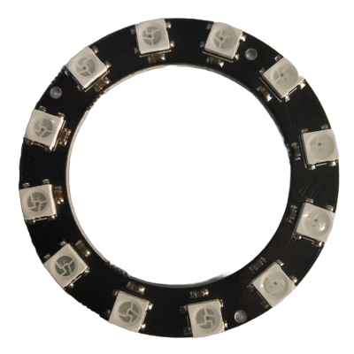

# WS2812 (NeoPixel) with PIO on Raspberry Pi Pico in Embedded Rust

In the previous chapter, we learned how data moves from the CPU to the PIO state machine using the TX FIFO. We shifted simple bit sequences to an LED. Now we will use the same concept to drive a WS2812 LED ring.

WS2812 LEDs are commonly sold under the name NeoPixel. Each LED contains a tiny controller that expects a very precise serial data protocol. The timing is strict. That is exactly where PIO becomes useful.

We will use PIO to generate the required waveform accurately while the CPU simply feeds color data through the FIFO.

## Meet the hardware

The WS2812 is an addressable RGB LED that integrates red, green, and blue LEDs along with a small controller inside a single package.

These LEDs are available in many physical formats. You can find them as LED strips, circular rings, square matrices, flexible panels, and individual breakout boards. Electrically, they behave the same way. The difference is only in the number of LEDs and the physical arrangement.

    

> [!Important]
> Most WS2812 rings do not come with pre-soldered wires. You will need to solder header pins or wires yourself to the VCC, GND, DIN, and DOUT pads. 

The module I am using is a circular ring with 12 LEDs arranged evenly around the board. I bought it for around 60 INR, which is approximately 0.66 USD. Rings are commonly available in 8, 12, 16, and 24 LED variants. If you want to follow along, any small ring such as 8, 12, or 16 LEDs will work. The exact number does not affect the implementation.

You may see modules labeled as WS2812 or WS2812B. WS2812B is a revised version of the original WS2812 with small hardware improvements. No matter which variant you get, the communication protocol remains the same.
