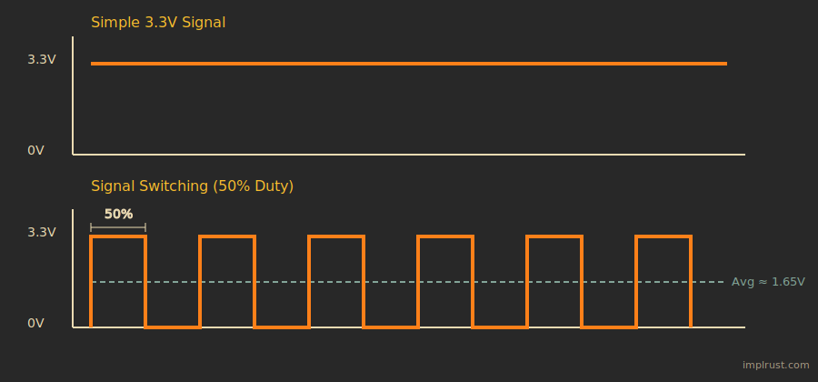

# Pulse Width Modulation (PWM)

PWM stands for Pulse Width Modulation. It is a technique that uses a digital signal switching rapidly between HIGH and LOW to produce an output that behaves like an analog voltage.

In the image above, the first chart shows a simple 3.3 V signal. This is what we normally use on a GPIO pin, for example to turn an LED fully on or fully off, which creates a blinking effect.

To produce a voltage between 0 V and 3.3 V, we do not keep the signal HIGH all the time. Instead, we repeatedly switch the pin between 0 V and 3.3 V.

When this switching happens very quickly, the connected device cannot follow each individual change. It does not see a clean 0 V or a clean 3.3 V. What it responds to is how long the signal stays at 3.3 V compared to how long it stays at 0 V.

In this example, the signal is at 3.3 V for half the time and at 0 V for the other half. Because of this, the device receives about half the voltage on average, which behaves like approximately 1.65 V.

## Pulse Width & Duty Cycle

Pulse width is simply how long a signal stays ON before it turns OFF. It is measured in time, such as microseconds or milliseconds.

For example, if a pulse has a width of 1 millisecond, the signal stays HIGH for 1 millisecond and then turns LOW for the rest of the cycle.

The duty cycle describes the same idea, but in a different way. Instead of using time, it describes how much of the cycle the signal stays ON, written as a percentage.

So instead of saying the signal is ON for 1 millisecond, we can say it is ON for 50% of the time.

For example:
- A 0% duty cycle means the signal is always LOW (0V average). 
- A 50% duty cycle means the signal is HIGH and LOW for equal amounts of time (1.65V average on a 3.3V system). 
- A 75% duty cycle means the signal is HIGH for 75% of the time and LOW for 25% of the time. 
- A 100% duty cycle means the signal is always HIGH (3.3V).

Changing the duty cycle changes how much power is delivered to the load, which is why an LED appears dim, medium bright, or fully bright in the image above.

## Example Usage 1: Dimming an LED

An LED flashes so quickly that your eyes can't see individual ON and OFF pulses, so you perceive only the average brightness. A low duty cycle makes it look dim, a higher one makes it look brighter, even though the LED is always switching between full voltage and zero.  In the next chapter, we will do this.

## Example Usage 2: Controlling a Servo Motor

A servo reads the width of a pulse to decide its angle. It expects a pulse every 20 milliseconds, and the pulse width - about 1ms for 0°, 1.5ms for 90°, and 2ms for 180° - tells the servo where to move.
