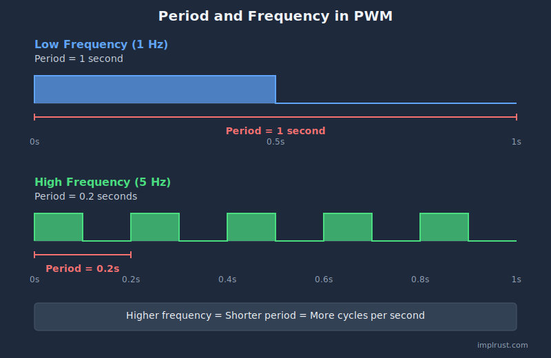

# Period and Frequency

By now, you should have a basic idea of pulse width and duty cycle. Next, we will look at two more important concepts used in PWM: period and frequency.

These two ideas describe how fast the PWM signal repeats.

## Period

The period is the total time it takes for one complete ON-OFF cycle to finish. In other words, it is the time from one point in the signal until that same point appears again in the next cycle.

For example: 

- In the top part of the diagram, one complete cycle takes 1 second, so the period is 1 second. This is a slow-changing signal.
- In the bottom part of the diagram, one complete cycle takes 0.2 seconds, so the period is 0.2 seconds. This is a faster-changing signal.

## Frequency

Frequency tells us how many complete cycles happen in one second. It's measured in Hertz (Hz).

For example:
- 1 Hz = 1 cycle per second (like the top part of the diagram)
- 5 Hz = 5 cycles per second (like the bottom part of the diagram)

## Relationship

The frequency of a signal and its period are inversely related.

\\[
\text{Frequency (Hz)} = \\frac{1}{\text{Period (s)}}
\\]

This means: 
- When the period gets shorter, the frequency gets higher
- When the period gets longer, the frequency gets lower

**Still Confusing? Think of It Like This:**

Imagine you and your friend are counting from 0 to 99, over and over again.

You count fast and finish one round quickly. Your friend counts slowly and takes much longer to finish the same round. You both count the same numbers. Only the speed is different.

The time it takes to finish one round is the period. How fast you repeat the rounds is the frequency. Counting faster means a shorter period and a higher frequency. Counting slower means a longer period and a lower frequency.

### Examples

So if the period is 1 second, then the frequency will be 1Hz.

\\[
1 \text{Hz} = \\frac{1 \text{ cycle}}{1 \text{ second}} = \\frac{1}{1 \text{ s}}
\\]

For example, if the period is 20ms (0.02s), the frequency will be 50Hz.

\\[
\text{Frequency} = \\frac{1}{20 \text{ ms}} = \\frac{1}{0.02 \text{ s}} = 50 \text{ Hz}
\\]
 