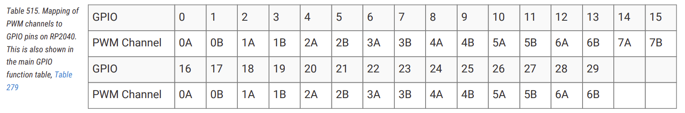

# PWM Peripheral in RP2040

The RP2040 has a PWM peripheral with 8 PWM generators called slices. Each slice contains two output channels (A and B), giving you a total of 16 PWM output channels at the slice level, which can be routed to GPIO pins. For detailed specifications, see page 521 of the [RP2040 Datasheet](https://datasheets.raspberrypi.com/rp2040/rp2040-datasheet.pdf#page=522).

Let's have a quick look at some of the key concepts.

## PWM Generator (Slice)

A slice is the hardware block that generates PWM signals. Each of the 8 slices (PWM0-PWM7) is an independent timing unit with its own 16-bit counter, compare registers, control settings, and clock divider. This independence means you can configure each slice with different frequencies and resolutions.

## Channel

Each slice contains two output channels: **Channel A** and **Channel B**. Both channels share the same counter, so they run at the same frequency and are synchronized. However, each channel has its own compare register, allowing independent duty cycle control. This lets you generate two related but distinct PWM signals from a single slice.


## Mapping of PWM channels to GPIO Pins

Each GPIO pin connects to a specific slice and channel, and the same slice output can be routed to more than one GPIO pin. You'll find the complete mapping table on page 522 of the [RP2040 Datasheet](https://datasheets.raspberrypi.com/rp2040/rp2040-datasheet.pdf#page=523). For example, GPIO Pin 15 to PWM slice 7, channel B, labeled as **7B**.



### Initialize PWM

You create a PWM output by binding a specific PWM slice, channel, and GPIO pin at construction time. For example, GPIO pin 15 maps to PWM slice 7, channel B. You can create a PWM output for this pin using `Pwm::new_output_b`, which selects the slice, channel, and output pin in a single step.

```rust
let mut pwm = Pwm::new_output_b(p.PWM_SLICE7, p.PIN_15, Default::default());
```

### GPIO to PWM

I have created a small form that helps you figure out which GPIO pin maps to which PWM channel and also generates sample code.

<div class="pwm-mapper">
    <label for="gpio-select"><strong>Select GPIO Pin:</strong></label>
    <select id="gpio-select">
        <option value="">-- Select GPIO --</option>
    </select>
    <div id="result-container" style="display: none;">
        <div class="pwm-info">
            <strong>GPIO:</strong> <span id="gpio-value"></span> | 
            <strong>PWM Slice:</strong> <span id="slice-value"></span> | 
            <strong>Channel:</strong> <span id="channel-value"></span>
        </div>
        <div class="code-header">Embassy</div>
        <pre><code class="rust" id="embassy-code"></code></pre>
    </div>
    <div id="placeholder" class="placeholder">
        Select a GPIO pin to see PWM mapping and generated code.
    </div>
</div>

## Phase-Correct Mode

In standard PWM (fast PWM), the counter counts up from 0 to TOP, then immediately resets to 0. This creates asymmetric edges where the output changes at different points in the cycle.

Phase-correct PWM counts up to TOP, then counts back down to 0, creating a triangular waveform. The output switches symmetrically - once going up and once coming down. This produces centered pulses with edges that mirror each other, reducing electromagnetic interference and creating smoother transitions. The trade-off is that, with the same clock divider and TOP value, phase-correct mode runs at half the frequency of standard PWM.

Configure PWM slice 7 to operate in phase-correct mode for smoother output transitions.

```rust
pwm.set_phase_correct(true);
```

<style>
.pwm-mapper {
    margin: 20px 0;
    background: linear-gradient(135deg, #ad6f5315 0%, #5c3b2e15 100%);
    border: 1px solid #e0e0e0;
    border-radius: 8px;
    padding: 20px;
}

.pwm-mapper label {
    display: block;
    font-weight: 600;
    margin-bottom: 8px;
}

.pwm-mapper select {
    padding: 10px 14px;
    border: 2px solid #ddd;
    border-radius: 6px;
    font-size: 14px;
    margin-bottom: 20px;
    min-width: 200px;
    transition: border-color 0.2s;
}

.pwm-mapper select:focus {
    outline: none;
    border-color: #667eea;
}

.pwm-info {
    background: linear-gradient(135deg, #8a3a1015 0%, #30120715 100%);
    /* color: white; */
    padding: 14px 16px;
    border-radius: 6px;
    margin-bottom: 20px;
    font-size: 14px;
    box-shadow: 0 2px 8px rgba(102, 126, 234, 0.3);
}

.pwm-info strong {
    /* color: white; */
    font-weight: 600;
}

.code-header {
    font-weight: 600;
    margin-bottom: 8px;
    margin-top: 15px;
    /* color: #667eea; */
    font-size: 14px;
}

.code-header:first-of-type {
    margin-top: 0;
}

.placeholder {
    font-style: italic;
    padding: 30px 0;
    text-align: center;
    border-radius: 6px;
    border: 2px dashed #ddd;
}
</style>


<script>
const pwmMapping = {
    0:  { slice: 0, channel: 'A' },
    1:  { slice: 0, channel: 'B' },

    2:  { slice: 1, channel: 'A' },
    3:  { slice: 1, channel: 'B' },

    4:  { slice: 2, channel: 'A' },
    5:  { slice: 2, channel: 'B' },

    6:  { slice: 3, channel: 'A' },
    7:  { slice: 3, channel: 'B' },

    8:  { slice: 4, channel: 'A' },
    9:  { slice: 4, channel: 'B' },

    10: { slice: 5, channel: 'A' },
    11: { slice: 5, channel: 'B' },

    12: { slice: 6, channel: 'A' },
    13: { slice: 6, channel: 'B' },

    14: { slice: 7, channel: 'A' },
    15: { slice: 7, channel: 'B' },

    16: { slice: 0, channel: 'A' },
    17: { slice: 0, channel: 'B' },

    18: { slice: 1, channel: 'A' },
    19: { slice: 1, channel: 'B' },

    20: { slice: 2, channel: 'A' },
    21: { slice: 2, channel: 'B' },

    22: { slice: 3, channel: 'A' },
    23: { slice: 3, channel: 'B' },

    24: { slice: 4, channel: 'A' },
    25: { slice: 4, channel: 'B' },

    26: { slice: 5, channel: 'A' },
    27: { slice: 5, channel: 'B' },

    28: { slice: 6, channel: 'A' },
    29: { slice: 6, channel: 'B' }
};


const gpioSelect = document.getElementById('gpio-select');
for (let i = 0; i <= 29; i++) {
    const option = document.createElement('option');
    option.value = i;
    option.textContent = `GPIO ${i}`;
    if (i === 15) {
        option.selected = true;
    }
    gpioSelect.appendChild(option);
}

function generateEmbassyCode(gpio, slice, channel) {
    const ch = channel.toLowerCase();
    return `let mut pwm_pin = Pwm::new_output_${ch}(p.PWM_SLICE${slice}, p.PIN_${gpio}, Default::default());`;
}

gpioSelect.addEventListener('change', function() {
    const gpio = this.value;
    if (!gpio) {
        document.getElementById('result-container').style.display = 'none';
        document.getElementById('placeholder').style.display = 'block';
        return;
    }

    const { slice, channel } = pwmMapping[gpio];

    document.getElementById('gpio-value').textContent = gpio;
    document.getElementById('slice-value').textContent = slice;
    document.getElementById('channel-value').textContent = channel;

    document.getElementById('embassy-code').textContent = generateEmbassyCode(gpio, slice, channel);

    document.getElementById('result-container').style.display = 'block';
    document.getElementById('placeholder').style.display = 'none';
});

// Trigger change event on page load to show GPIO 15 by default
gpioSelect.dispatchEvent(new Event('change'));
</script>
