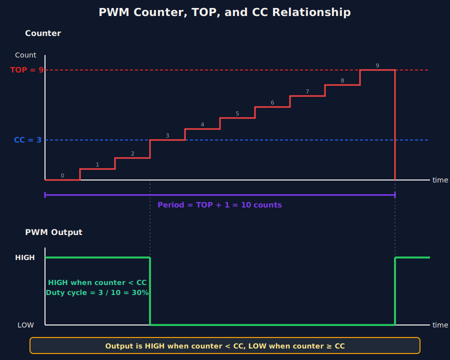
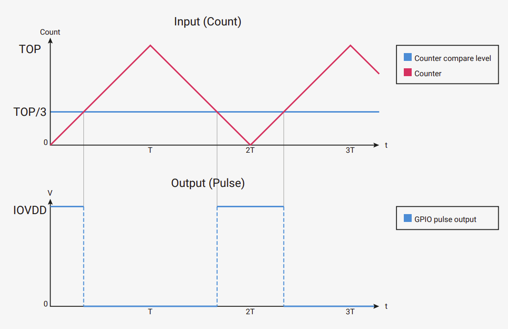

# PWM's Top and Divider

Sometimes you need to specify a precise frequency for PWM output. For example, hobby servos typically operate at 50Hz. However, neither embassy-rp nor rp-hal provide a straightforward method to set the frequency directly (at least to my knowledge). Instead, we need to work with the underlying PWM hardware configuration. The embassy-rp crate allows you to configure PWM through a `Config` struct that has various fields, with our focus being on the top and divider parameters. Let's explore how these work.

## How PWM Works Inside the RP2040

The RP2040 PWM slice is driven by clk_sys, which is divided by the PWM clock divider before driving the PWM counter. This clock is much faster than the PWM signal you actually want on the pin. The PWM hardware uses a counter that repeatedly counts from 0 up to TOP, then wraps back to 0. The TOP register controls how high the counter goes before wrapping.

Each time the counter reaches the top value, it wraps back to zero and starts again. One full count from zero to top is one PWM period.

If the counter increases very quickly, the PWM frequency will be high. If it increases more slowly, the PWM frequency will be lower. This is where the divider comes in.

The RP2040 uses two main 16-bit registers for PWM generation: the Capture/Compare (CC) register and the TOP register. The CC register controls how long the output pulse stays high within each cycle (the duty cycle). The TOP register controls how long each complete cycle takes (the period).

For simple explanation, let's say the TOP value is 9 and CC value is 3. It will count from 0 to 9 as illustrated in the digram. The signal stay high until it reaches CC value. After that, it remains low in that cycle. Take your own time and try to understand the above diagram. In the diagram, each count, we have drawn as steps(red colored). The pulse stays in high (colored in green) until the count matches CC value. As you can see, after 3 till 9, the pulse becomes low.

## How TOP Controls Frequency

The PWM counter counts from 0 up to the TOP value, then wraps back to 0. One complete count cycle (0 to TOP) produces one PWM period. The frequency is simply how many of these complete cycles happen per second.

The system clock of the RP2040 is configurable.  On Raspberry Pi Pico boards, clk_sys is typically configured to 125 MHz (125 million cycles per second) by default. If we ignore the divider for now and keep it at 1, the counter increments once per system clock cycle. Understanding how TOP affects frequency is crucial:

- Higher TOP value => Counter takes more steps to complete one cycle => Lower PWM frequency
- Lower TOP value => Counter takes fewer steps to complete one cycle => Higher PWM frequency

Let's look at some concrete examples to make this clear:

### Example 1: TOP = 124

The counter counts: 0, 1, 2, 3, ... 123, 124, then wraps to 0.

That's 125 total counts per cycle (counting from 0 through 124 inclusive).

At 125MHz system clock, the PWM frequency is:

> [!NOTE]
> Don't rely on this simplified formula yet. It's not accurate enough because there's one more factor to add (the clock divider). We're showing it here just to understand the basic TOP-frequency relationship.

\\[
f_{PWM} = \frac{125,000,000}{125} = 1,000,000 \text{ Hz (1 MHz)}
\\]

Example 2: TOP = 1,249

The counter counts through 1,250 values (0 through 1,249)

PWM frequency:

\\[
f_{PWM} = \frac{125,000,000}{1,250} = 100,000 \text{ Hz (100 kHz)}
\\]

### Why TOP Alone Is Not Enough

The TOP register is 16 bits wide, so the maximum value it can hold is 65,535. This means the counter goes through 65,536 steps before wrapping back to zero. If we apply this maximum TOP value to the same calculation we used in the examples above, the resulting PWM frequency comes out to about 1,907 Hz.

That is the lowest frequency we can reach using TOP alone with the system clock running at 125 MHz.

This is still far too high for many real-world uses. For example, hobby servo motors require a PWM frequency of around 50 Hz. With TOP alone, there is simply no way to slow the PWM down enough to reach that range.

To solve this, the RP2040 provides an additional control: the PWM clock divider. By dividing down the clock that feeds the PWM counter, we can generate much lower frequencies, including the 50 Hz required by servos.

## The Clock Divider

The clock divider slows down the clock that drives the PWM counter. Instead of counting at the full 125 MHz system clock speed, the counter increments more slowly based on the divider value.

When the divider is increased, each count takes longer. This means the counter needs more time to go from 0 to TOP, so the PWM frequency becomes lower. This is what allows us to reach low frequencies like 50 Hz, which are impossible using TOP alone.

Let's look at one more simplified example before introducing the actual formula from the RP2040's datasheet. 

Suppose we set TOP to 1249, so the counter goes through 1,250 steps (0 through 1249). Now, if we set the clock divider to 10, each step takes 10 system clock cycles instead of 1.

\\[
f_{PWM} = \frac{125{,}000{,}000}{1{,}250 \times 10} = 10{,}000\ \text{Hz (10 kHz)}
\\]

Without the divider, we got 100 kHz for the same TOP value. Now with a divider of 10, we get 10 kHz; ten times slower. This shows how the divider gives us control over slowing down the PWM frequency.

## Phase Correct Mode

Bear with me for a moment. Before introducing the actual formula, there is one more important concept we need to understand. 

So far, we have assumed that the PWM counter counts in one direction, from 0 up to TOP, and then immediately wraps back to 0. This is not the only way PWM can work. In phase correct mode, the counter behaves differently, and that has a direct effect on the PWM frequency.

In phase correct mode, the PWM counter does not jump back to zero when it reaches TOP. Instead, it counts up from 0 to TOP, then counts back down from TOP to 0. This creates a symmetric, up-and-down counting pattern.

    
    
Image from the RP2040 Datasheet

Because of this, one full PWM cycle now includes both the upward count and the downward count. In other words, the counter takes roughly twice as long to complete a full cycle compared to the normal up-counting mode.

The important takeaway is simple: enabling phase-correct mode doubles the PWM period, resulting in approximately half the PWM frequency for the same TOP and divider values. 

This mode is often used when you want cleaner, more symmetric PWM signals, especially for things like motor control.

## The PWM Frequency Formula

The RP2040 datasheet defines exactly how the PWM period is calculated. The period tells you how many system clock cycles are needed for one full PWM cycle.

Calculate the period in clock cycles with the following equation:

\\[
\text{period} = (\text{TOP} + 1) \times (\text{CSR\_PH\_CORRECT} + 1) \times \left( \text{DIV\_INT} + \frac{\text{DIV\_FRAC}}{16} \right)
\\]

To determine the output frequency based on the system clock frequency, use the following equation:

\\[
f_{PWM} = \frac{f_{sys}}{\text{period}} = \frac{f_{sys}}{(\text{TOP} + 1) \times (\text{CSR\_PH\_CORRECT} + 1) \times \left( \text{DIV\_INT} + \frac{\text{DIV\_FRAC}}{16} \right)}
\\]

Where:
- \\( f_{PWM} \\) is the PWM output frequency.
- \\( f_{sys} \\) is the system clock frequency. For Raspberry Pi Pico boards, it is typically 125 MHz.

### Divider and Fraction 

In the formula we discussed earlier, there is one important part we have not explained yet: DIV_FRAC. This controls the fractional part of the clock divider in the RP2040.

The RP2040 clock divider is split into two parts. DIV_INT is the integer part and sets the whole number division. DIV_FRAC is the fractional part and allows finer control over the division ratio. Together, they let you slow down the PWM counter more precisely than using an integer divider alone.  One important rule is that when DIV_INT is set to 0, you must not set any DIV_FRAC bits.        
