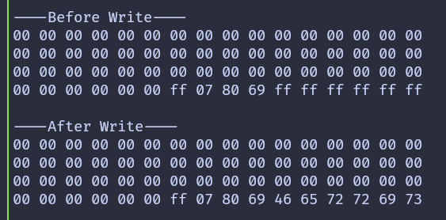

## Changing the Authentication Key

In this chapter, we change the authentication key for a sector. Specifically, we update Key A of sector 1. By default, both Key A and Key B on a MIFARE Classic 1K card are set to FF FF FF FF FF FF. We will replace Key A with the value 52 75 73 74 65 64, which is the hex representation of the ASCII string "Rusted".

To change the key, we must write to the sector trailer, which is block 3 of the sector. The rest of the sector data must remain untouched. Writing to the trailer block is a sensitive operation, so it is important to be careful.

Before making any changes, it is strongly recommended to inspect the current contents of the sector trailer. You can do this by running the [Dump Memory](./dump-memory.md) or [Read Data](./read-data.md) program from the earlier chapters.

> [!NOTE]
> **Default Keys:** On a MIFARE Classic 1K card, both Key A and Key B are initially set to FF FF FF FF FF FF. When reading a trailer block, Key A is not returned and appears as 00 00 00 00 00 00, while Key B is returned as stored.

In this example, we also update Key B so that it is easy to confirm that the write operation succeeded. Key B is set to the hex bytes for the ASCII string "Ferris", which is 46 65 72 72 69 73.

The program prints the contents of the sector before and after writing. After the key is changed, attempting to authenticate again with the old key will fail. This is expected behavior and confirms that the new key is now active.

## Key and Trailer Data

The data written to the trailer block contains three parts. The first six bytes are the new Key A value, followed by the access bits and trailer byte, and finally the six bytes for Key B.

The current authentication key is set to the default value. The new key is extracted from the first six bytes of the data array so that it can be reused when reading the sector after the update.

```rust
let target_sector = 1;
let rel_block = 3;
const DATA: [u8; 16] = [
    0x52, 0x75, 0x73, 0x74, 0x65, 0x64, // Key A: "Rusted"
    0xFF, 0x07, 0x80, 0x69, // Access bits and trailer byte
    0x46, 0x65, 0x72, 0x72, 0x69, 0x73, // Key B: "Ferris"
];
let current_key = &[0xFF, 0xFF, 0xFF, 0xFF, 0xFF, 0xFF];
let new_key: &[u8; 6] = &DATA[..6].try_into().expect("have enough data");
```

## Writing the Trailer Block

The write function is slightly modified to accept the authentication key as an argument. This allows us to authenticate with the old key before writing and then authenticate with the new key afterward.

```rust
fn write_block<E, COMM>(
    uid: &mfrc522::Uid,
    sector: u8,
    rel_block: u8,
    data: [u8; 16],
    key: &[u8; 6],
    rfid: &mut Mfrc522<COMM, mfrc522::Initialized>,
) -> Result<(), &'static str>
where
    COMM: mfrc522::comm::Interface<Error = E>,
{
    let block_offset = sector * 4;
    let abs_block = block_offset + rel_block;

    rfid.mf_authenticate(uid, block_offset, key)
        .map_err(|_| "Auth failed")?;

    rfid.mf_write(abs_block, data).map_err(|_| "Write failed")?;

    Ok(())
}
```

## Reading a Sector with a Custom Key

The read function is updated in the same way. It now accepts the key as an argument and uses it during authentication.

```rust
fn read_sector<E, COMM>(
    uid: &mfrc522::Uid,
    sector: u8,
    key: &[u8; 6],
    rfid: &mut Mfrc522<COMM, mfrc522::Initialized>,
) -> Result<(), &'static str>
where
    COMM: mfrc522::comm::Interface<Error = E>,
{
    let block_offset = sector * 4;
    rfid.mf_authenticate(uid, block_offset, key)
        .map_err(|_| "Auth failed")?;

    for abs_block in block_offset..block_offset + 4 {
        let data = rfid.mf_read(abs_block).map_err(|_| "Read failed")?;
        print_hex(&data);
    }
    Ok(())
}
```

## The main loop

The main loop follows the same structure as earlier chapters. First, the sector is read using the current key. Then the trailer block is written with the new key. Finally, the sector is read again using the new key to confirm the change.

If you are using USB serial instead of a debug probe, replace defmt::println! and defmt::error! with log::info! and log::error!.

```rust
loop {
    if let Ok(atqa) = rfid.reqa() {
        if let Ok(uid) = rfid.select(&atqa) {
            defmt::println!("\r\n----Before Write----\r\n");
            if let Err(e) = read_sector(&uid, target_sector, current_key, &mut rfid) {
                error!("Error reading sector: {:?}", e);
            }
            Timer::after_millis(200).await;

            if let Err(e) =
                write_block(&uid, target_sector, rel_block, DATA, current_key, &mut rfid)
            {
                error!("Error writing block: {:?}", e);
            }
            Timer::after_millis(200).await;

            defmt::println!("\r\n----After Write----\r\n");
            if let Err(e) = read_sector(&uid, target_sector, new_key, &mut rfid) {
                error!("Error reading sector: {:?}", e);
            }

            let _ = rfid.hlta();
            let _ = rfid.stop_crypto1();
            Timer::after_millis(500).await;
        }
    }

    Timer::after_millis(200).await;
}
```


## Clone the existing project

You can clone (or refer) project I created and navigate to the `change-key` folder.

```sh
git clone https://github.com/ImplFerris/rp2040-projects
cd rp2040-projects/embassy/change-key/
```

## Output

When the program runs, the sector contents are printed before and after the write. After the key is changed, bringing the tag back to the reader will result in an authentication failure when using the old key. This confirms that the new key 52 75 73 74 65 64 (Rusted) is now active.
 
> [!NOTE]
> After the key update, if you bring the tag close to the reader again, authentication will fail because the program will be still using the old hardcoded current_key.



You can further verify this by updating the read-data program to use the new key and running it again.
