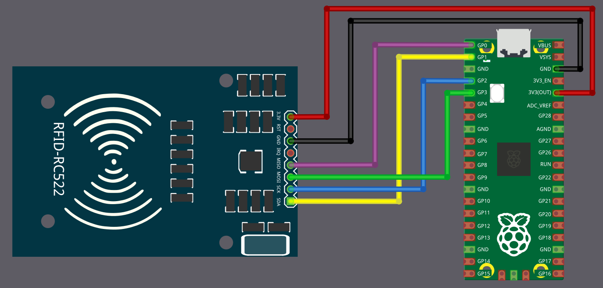

# Connecting RC522 with Raspberry Pi Pico

We will see how to connect the RFID Reader to Pico. Before that, we will have a quick look at the pinout of the RC522 module.

## Pinout diagram of RC522

The RC522 RFID module exposes 8 pins. Some pins have different functions depending on whether the module is used with SPI, I2C, or UART. The diagram below shows all available functions for each pin. In our setup, we will later use SPI, but it is useful to understand the full pinout first.

<table style="border-collapse: collapse; width: 100%; border: 1px solid black;">
  <tr style="border: 1px solid black;">
    <th style="background-color: #009B77; border: 1px solid black;">Pin</th>
    <th style="border: 1px solid black;">SPI Function</th>
    <th style="border: 1px solid black;">I²C Function</th>
    <th style="border: 1px solid black;">UART Function</th>
    <th style="border: 1px solid black;">Description</th>
  </tr>
  <tr style="border: 1px solid black;">
    <td style="background-color: #ff0000; color: white; border: 1px solid black;">3.3V</td>
    <td style="border: 1px solid black;">Power</td>
    <td style="border: 1px solid black;">Power</td>
    <td style="border: 1px solid black;">Power</td>
    <td style="border: 1px solid black;">Power supply (3.3V).</td>
  </tr>
  <tr style="border: 1px solid black;">
    <td style="background-color: #000; color: white; border: 1px solid black;">GND</td>
    <td style="border: 1px solid black;">Ground</td>
    <td style="border: 1px solid black;">Ground</td>
    <td style="border: 1px solid black;">Ground</td>
    <td style="border: 1px solid black;">Ground connection.</td>
  </tr>
  <tr style="border: 1px solid black;">
    <td style="background-color: #7B3F00; color: white; border: 1px solid black;">RST</td>
    <td style="border: 1px solid black;">Reset</td>
    <td style="border: 1px solid black;">Reset</td>
    <td style="border: 1px solid black;">Reset</td>
    <td style="border: 1px solid black;">Reset the module.</td>
  </tr>
  <tr style="border: 1px solid black;">
    <td style="background-color: #EFEFEF; border: 1px solid black;color:black;">IRQ</td>
    <td style="border: 1px solid black;">Interrupt (optional)</td>
    <td style="border: 1px solid black;">Interrupt (optional)</td>
    <td style="border: 1px solid black;">Interrupt (optional)</td>
    <td style="border: 1px solid black;">Interrupt Request (IRQ) informs the microcontroller when an RFID tag is detected. Without using IRQ, the microcontroller would need to constantly poll the module.</td>
  </tr>
  <tr style="border: 1px solid black;">
    <td style="background-color: #FFC000; color: black; border: 1px solid black;">MISO</td>
    <td style="border: 1px solid black;">Master-In-Slave-Out</td>
    <td style="border: 1px solid black;">SCL</td>
    <td style="border: 1px solid black;">TX</td>
    <td style="border: 1px solid black;">In SPI mode, it acts as Master-In-Slave-Out (MISO). In I²C mode, it functions as the clock line (SCL). In UART mode, it acts as the transmit pin (TX).</td>
  </tr>
  <tr style="border: 1px solid black;">
    <td style="background-color: #008000; color: white; border: 1px solid black;">MOSI</td>
    <td style="border: 1px solid black;">Master-Out-Slave-In</td>
    <td style="border: 1px solid black;">-</td>
    <td style="border: 1px solid black;">-</td>
    <td style="border: 1px solid black;">In SPI mode, it acts as Master-Out-Slave-In (MOSI).</td>
  </tr>
  <tr style="border: 1px solid black;">
    <td style="background-color: #0F52BA; color: white; border: 1px solid black;">SCK</td>
    <td style="border: 1px solid black;">Serial Clock</td>
    <td style="border: 1px solid black;">-</td>
    <td style="border: 1px solid black;">-</td>
    <td style="border: 1px solid black;">In SPI mode, it acts as the clock line that synchronizes data transfer.</td>
  </tr>
  <tr style="border: 1px solid black;">
    <td style="background-color: #FF5F1F; color: white; border: 1px solid black;">SDA</td>
    <td style="border: 1px solid black;">Chip Select (CS)</td>
    <td style="border: 1px solid black;">SDA</td>
    <td style="border: 1px solid black;">RX</td>
    <td style="border: 1px solid black;">In SPI mode, it acts as the Chip select (CS/SS, also referred as Slave Select). In I²C mode, it serves as the data line (SDA). In UART mode, it acts as the receive pin (RX).</td>
  </tr>
</table>

## Connecting the RFID Reader to the Raspberry Pi Pico

To establish communication between the Raspberry Pi Pico and the RFID reader, we will use the SPI protocol. In this setup, we will use SPI0 on the Pico. For now, we are not using the RST and IRQ pins.

The table below shows how to connect the RC522 module to the Pico using SPI.

<table>
  <thead>
    <tr>
      <th>Pico Pin</th>
      <th style="width: 250px; margin: 0 auto;">Wire</th>
      <th>RFID Reader Pin</th>
    </tr>
  </thead>
  <tbody>
    <tr>
      <td>3.3V</td>
      <td style="text-align: center; vertical-align: middle; padding: 0;">
        

          

          

        

      </td>
      <td>3.3V</td>
    </tr>
    <tr>
      <td>GND</td>
      <td style="text-align: center; vertical-align: middle; padding: 0;">
        

          

          

        

      </td>
      <td>GND</td>
    </tr>
    <!-- <tr>
      <td>GPIO 22</td>
      <td style="text-align: center; vertical-align: middle; padding: 0;">
        

          

          

        

      </td>
      <td>RST</td>
    </tr> -->
    <tr>
      <td>GPIO 0</td>
      <td style="text-align: center; vertical-align: middle; padding: 0;">
        

          

          

        

      </td>
      <td>MISO</td>
    </tr>
    <tr>
      <td>GPIO 1</td>
      <td style="text-align: center; vertical-align: middle; padding: 0;">
        

          

          

        

      </td>
      <td>SDA (CS)</td>
    </tr>
    <tr>
      <td>GPIO 2</td>
      <td style="text-align: center; vertical-align: middle; padding: 0;">
        

          

          

        

      </td>
      <td>SCK</td>
    </tr>
    <tr>
      <td>GPIO 3</td>
      <td style="text-align: center; vertical-align: middle; padding: 0;">
        

          

          

        

      </td>
      <td>MOSI</td>
    </tr>
  </tbody>
</table>
 

