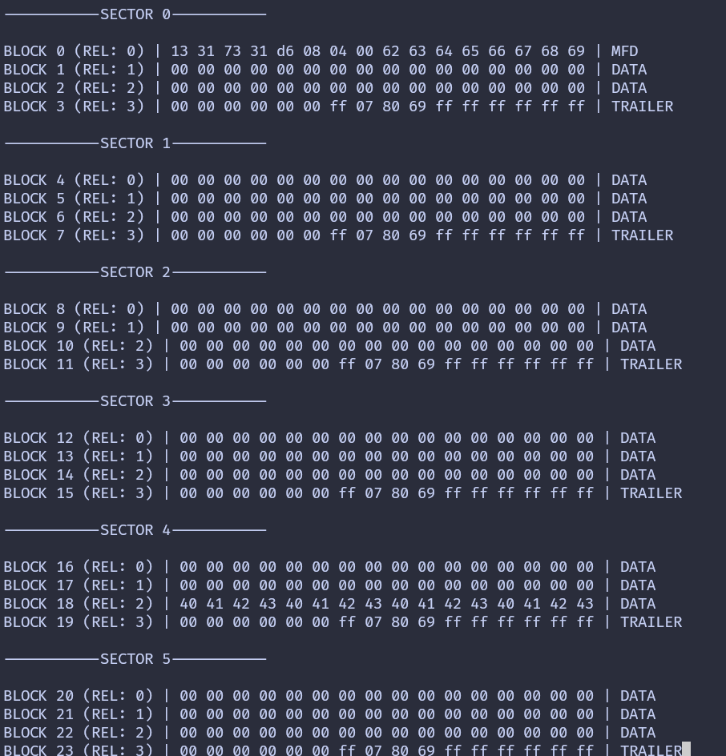

## Dump Entire Memory

So far, you have learned how to authenticate a sector and read the blocks inside it. In the previous chapter, we limited ourselves to sector 0. In this chapter, we extend that approach to dump the entire memory of the tag.

We will loop through all sectors on the tag, authenticate each sector, and read every block inside it. Since authentication is valid only for a single sector, we must authenticate again whenever we move to the next sector.

For each sector, we will read all four blocks and print their 16 byte contents. To make the output easier to understand, we will add labels that show:

- The sector number
- The absolute block number
- The block number relative to the sector
- Whether the block is manufacturer data, a sector trailer, or normal data

To keep this chapter focused, we will not repeat the project creation or dependency setup steps. By now, you should already be comfortable with the required crates and project structure.

## Select Your Output Method

As before, the core logic is the same for both setups. Only the logging output differs slightly.

Select the tab that matches how you are printing the output.
{{#tabs global="log-method" }}
{{#tab name="Debug Probe" }}
In this setup, we use defmt over RTT to print the block data.
{{#endtab }}
{{#tab name="USB Serial" }}
In this setup, we use USB serial to print the block data.
{{#endtab }}
{{#endtabs }}

## Loop through the sector

We start by creating a helper function that iterates through all sectors on the tag. For a MIFARE Classic 1K tag, this means sectors 0 through 15.

For each sector, we print a header and then call read_sector to authenticate and read its blocks.

{{#tabs global="log-method" }}
{{#tab name="Debug Probe" }}
```rust
fn dump_memory<E, COMM>(
    uid: &mfrc522::Uid,
    rfid: &mut Mfrc522<COMM, mfrc522::Initialized>,
) -> Result<(), &'static str>
where
    COMM: mfrc522::comm::Interface<Error = E>,
{
    let mut buff: String<64> = String::new();
    for sector in 0..16 {
        // Printing the Sector number
        write!(buff, "-----------SECTOR {}-----------", sector)
            .expect("failed to write into heapless buff");
        defmt::println!("{}", buff);
        buff.clear();

        read_sector(uid, sector, rfid)?;
    }
    Ok(())
}
```
{{#endtab }}
{{#tab name="USB Serial" }}
```rust
fn dump_memory<E, COMM>(
    uid: &mfrc522::Uid,
    rfid: &mut Mfrc522<COMM, mfrc522::Initialized>,
) -> Result<(), &'static str>
where
    COMM: mfrc522::comm::Interface<Error = E>,
{
    let mut buff: String<64> = String::new();
    for sector in 0..16 {
        // Printing the Sector number
        write!(buff, "-----------SECTOR {}-----------", sector)
            .expect("failed to write into heapless buff");
        log::info!("{}", buff);
        buff.clear();

        read_sector(uid, sector, rfid)?;
    }
    Ok(())
}
```

## Increase Log Buffer

Dumping the entire memory produces a lot of output. Increase the log buffer size to avoid truncated output.

```rust
#[embassy_executor::task]
async fn logger_task(usb: embassy_rp::Peri<'static, embassy_rp::peripherals::USB>) {
    let driver = embassy_rp::usb::Driver::new(usb, Irqs);

    embassy_usb_logger::run!(8192, log::LevelFilter::Info, driver);
}
```
{{#endtab }}
{{#endtabs }}


## Identify Block Type

Next, we add a small helper function that determines the type of a block based on its position within a sector.

```rust
fn get_block_type(sector: u8, rel_block: u8) -> &'static str {
    match rel_block {
        0 if sector == 0 => "MFD",
        3 => "TRAILER",
        _ => "DATA",
    }
}
```

## Reading a Sector with Labels

The read_sector function is similar to what you used earlier, but now it adds more context to the output.

{{#tabs global="log-method" }}
{{#tab name="Debug Probe" }}

```rust
fn read_sector<E, COMM>(
    uid: &mfrc522::Uid,
    sector: u8,
    rfid: &mut Mfrc522<COMM, mfrc522::Initialized>,
) -> Result<(), &'static str>
where
    COMM: mfrc522::comm::Interface<Error = E>,
{
    const AUTH_KEY: [u8; 6] = [0xFF; 6];

    let mut buff: String<64> = String::new();

    let block_offset = sector * 4;
    rfid.mf_authenticate(uid, block_offset, &AUTH_KEY)
        .map_err(|_| "Auth failed")?;

    for abs_block in block_offset..block_offset + 4 {
        let rel_block = abs_block - block_offset;
        let data = rfid.mf_read(abs_block).map_err(|_| "Read failed")?;

        // Printing the block data
        for &d in data.iter() {
            write!(buff, "{:02x} ", d).expect("failed to write byte into buffer");
        }

        // Printing block type
        let block_type = get_block_type(sector, rel_block);

        defmt::println!(
            "BLOCK {} (REL: {}) | {} | {}",
            abs_block,
            rel_block,
            buff,
            block_type
        );

        buff.clear();
    }
    defmt::println!("");
    Ok(())
}
```
{{#endtab }}
{{#tab name="USB Serial" }}
```rust
fn read_sector<E, COMM>(
    uid: &mfrc522::Uid,
    sector: u8,
    rfid: &mut Mfrc522<COMM, mfrc522::Initialized>,
) -> Result<(), &'static str>
where
    COMM: mfrc522::comm::Interface<Error = E>,
{
    const AUTH_KEY: [u8; 6] = [0xFF; 6];

    let mut buff: String<64> = String::new();

    let block_offset = sector * 4;
    rfid.mf_authenticate(uid, block_offset, &AUTH_KEY)
        .map_err(|_| "Auth failed")?;

    for abs_block in block_offset..block_offset + 4 {
        let rel_block = abs_block - block_offset;
        let data = rfid.mf_read(abs_block).map_err(|_| "Read failed")?;

        // Printing the block data
        for &d in data.iter() {
            write!(buff, "{:02x} ", d).expect("failed to write byte into buffer");
        }

        // Printing block type
        let block_type = get_block_type(sector, rel_block);

        log::info!(
            "BLOCK {} (REL: {}) | {} | {}",
            abs_block,
            rel_block,
            buff,
            block_type
        );

        buff.clear();
    }
    log::info!("");
    Ok(())
}
```
{{#endtab }}
{{#endtabs }}


## The main loop 

The main loop stays mostly the same. The only difference is that we now call dump_memory instead of reading a single sector.

```rust
loop {
    if let Ok(atqa) = rfid.reqa() {
        if let Ok(uid) = rfid.select(&atqa) {
            if let Err(e) = dump_memory(&uid, &mut rfid) {
                // import the error macro from defmt::error or log::error
                error!("Error reading sector: {:?}", e);
            }
            let _ = rfid.hlta();
            let _ = rfid.stop_crypto1();
            Timer::after_millis(500).await;
        }
    }

    Timer::after_millis(200).await;
}
```


## Clone the existing project

{{#tabs global="log-method" }}
{{#tab name="Debug Probe" }}
You can clone (or refer) project I created and navigate to the `memory-dump` folder.

```sh
git clone https://github.com/ImplFerris/rp2040-projects
cd rp2040-projects/embassy/rfid/memory-dump/
```
{{#endtab }}
{{#tab name="USB Serial" }}
You can clone (or refer) project I created and navigate to the `memory-dump-usb` folder.

```sh
git clone https://github.com/ImplFerris/rp2040-projects
cd rp2040-projects/embassy/rfid/memory-dump-usb/
```
{{#endtab }}
{{#endtabs }}

## Dump

When you run the program and bring your tag or key fob close, you should see output like this. If you notice the 0x40..0x43 bytes in the block 18 (the block 2 of the sector 4) and wonder why it's there; good catch! That's the custom data I wrote to the tag.


