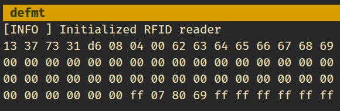
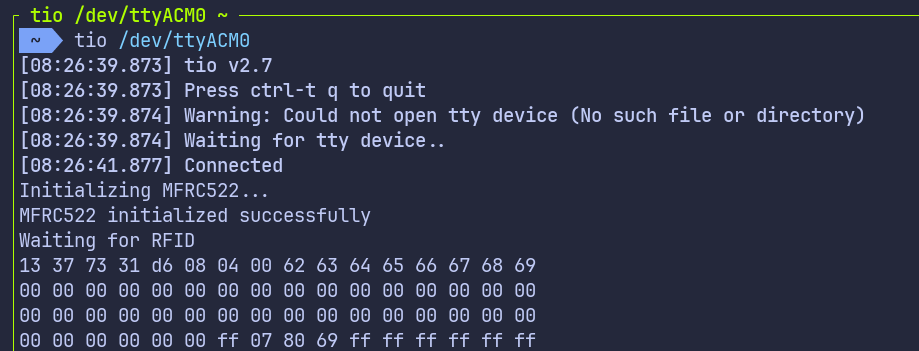

# Reading RFID Tag Data on Raspberry Pi Pico with Embedded Rust

In this chapter, we move beyond just reading the UID and start reading actual data stored on the RFID tag. We will read all the blocks from the first sector, which is sector 0.

As mentioned earlier, reading or writing data on an RFID tag is not possible directly. Before accessing a block, we must first authenticate with the sector that contains that block. Once authentication succeeds, the reader is allowed to read or write the blocks in that sector.

## Select Your Output Method

In this chapter, the instructions and code differ slightly depending on how you are printing the output. Select the appropriate tab based on whether you are using a debug probe or USB serial.

{{#tabs global="log-method" }}
{{#tab name="Debug Probe" }}
In this setup, we use defmt over RTT to print the block data.
{{#endtab }}
{{#tab name="USB Serial" }}
In this setup, we use USB serial to print the block data.
{{#endtab }}
{{#endtabs }}


## Project from Template

We will start by creating a new project using the template. 

```sh
cargo generate --git https://github.com/ImplFerris/rp2040-embassy-template.git --tag v0.1.4
```

{{#tabs global="log-method" }}
{{#tab name="Debug Probe" }}
When prompted, enter a project name, for example "read-blocks". Ensure to enable "defmt" for logging.
{{#endtab }}
{{#tab name="USB Serial" }}
When prompted, enter a project name, for example "read-blocks". Do not enable defmt for this setup.
{{#endtab }}
{{#endtabs }}

## Additional Crates Required

Update your Cargo.toml to add the required crates along with the existing dependencies. 

{{#tabs global="log-method" }}
{{#tab name="Debug Probe" }}
```toml
mfrc522 = "0.8.0"
embedded-hal-bus = "0.3.0"
heapless = { version = "0.9.2", features = ["defmt"] }
```
{{#endtab }}
{{#tab name="USB Serial" }}
```toml
mfrc522 = "0.8.0"
embedded-hal-bus = "0.3.0"

embassy-usb-logger = "0.5.1"
log = "0.4"
heapless = "0.9.2"
```
{{#endtab }}
{{#endtabs }}

## Additional Imports

{{#tabs global="log-method" }}
{{#tab name="Debug Probe" }}
```rust
// For SPI
use embassy_rp::spi::Spi;
use embassy_rp::spi;
use embassy_time::Delay;
use embedded_hal_bus::spi::ExclusiveDevice;

// For CS Pin
use embassy_rp::gpio::{Level, Output};

// Driver for the MFRC522
use mfrc522::{Mfrc522, comm::blocking::spi::SpiInterface};

// to prepare buffer with data before logging
use core::fmt::Write;
use heapless::String;
```
{{#endtab }}
{{#tab name="USB Serial" }}
```rust
// For USB
use embassy_rp::{peripherals::USB, usb};

// For SPI
use embassy_rp::spi;
use embassy_rp::spi::Spi;
use embassy_time::Delay;
use embedded_hal_bus::spi::ExclusiveDevice;

// For CS Pin
use embassy_rp::gpio::{Level, Output};

// Driver for the MFRC522
use mfrc522::{Mfrc522, comm::blocking::spi::SpiInterface};

// to prepare a buffer for formatted output
use core::fmt::Write;
use heapless::String;
```
{{#endtab }}
{{#endtabs }}

## Reusing the existing setup

The remaining SPI and RFID reader initialization is the same as in the previous chapter. You can reuse that setup here without any changes. In this chapter, we only add a few helper functions and modify the main loop to read blocks and print their contents.

## Authentication

Most MIFARE Classic tags ship with a default sector key. The most common default key is six bytes of 0xFF. If authentication fails, you may need to check the tag documentation or try a different key.

For authentication, we need three things:

- The tag UID, which we already obtain using the REQA and select steps
- The absolute block number we want to authenticate against
- The key used for authentication, which is hardcoded in this example

## Helper function to print bytes as hex dump

This helper converts raw bytes into a hexadecimal format and prints them.

{{#tabs global="log-method" }}
{{#tab name="Debug Probe" }}
```rust
fn print_hex(data: &[u8]) {
    let mut buff: String<64> = String::new();
    for &d in data.iter() {
        write!(buff, "{:02x} ", d).expect("failed to write byte into buffer");
    }
    defmt::println!("{}", buff);
}
```
{{#endtab }}
{{#tab name="USB Serial" }}
```rust
fn print_hex(data: &[u8]) {
    let mut buff: String<64> = String::new();
    for &d in data.iter() {
        write!(buff, "{:02x} ", d).expect("failed to write byte into buffer");
    }
    log::info!("{}", buff);
}
```
{{#endtab }}
{{#endtabs }}


## Read the block

Once authentication with a sector succeeds, the RFID reader is allowed to access the blocks that belong to that sector. From this point on, the reader can issue read commands for those blocks.

Each block on a MIFARE Classic tag stores exactly 16 bytes of data. The mf_read function provided by the mfrc522 crate reads one block at a time and returns these 16 bytes when the operation succeeds. If the read fails, an error is returned.

In this chapter, we focus on sector 0. Sector 0 contains four blocks. Authentication is performed once for the sector, and all four blocks are read in sequence. As long as we stay within the same sector, authentication does not need to be repeated.

```rust
fn read_sector<E, COMM>(
    uid: &mfrc522::Uid,
    sector: u8,
    rfid: &mut Mfrc522<COMM, mfrc522::Initialized>,
) -> Result<(), &'static str>
where
    COMM: mfrc522::comm::Interface<Error = E>,
{
    const AUTH_KEY: [u8; 6] = [0xFF; 6];

    let block_offset = sector * 4;
    rfid.mf_authenticate(uid, block_offset, &AUTH_KEY)
        .map_err(|_| "Auth failed")?;

    for abs_block in block_offset..block_offset + 4 {
        let data = rfid.mf_read(abs_block).map_err(|_| "Read failed")?;
        print_hex(&data);
    }
    Ok(())
}
```

When accessing memory on the tag, we have to refer to blocks using absolute block numbers. The tag treats all blocks as part of one continuous sequence rather than using sector local numbering. For example, sector 0 uses blocks 0 to 3, sector 1 uses blocks 4 to 7, and sector 2 uses blocks 8 to 11.

To convert a sector number into the correct block number, we calculate an offset. Since each sector contains four blocks, multiplying the sector number by 4 gives the first block of that sector. This value is stored in block_offset and is then used as the starting point to read all blocks that belong to the selected sector.

For the first sector, which is sector 0, the calculation is straightforward. The offset is 0 * 4, which gives block 0. This means sector 0 starts at block 0 and includes blocks 0, 1, 2, and 3. These are the blocks we read when we authenticate and access the first sector.

## Initialize the RFID

The same steps we followed in the earlier chapter.

```rust
let miso = p.PIN_0;
let cs_pin = Output::new(p.PIN_1, Level::High);
let clk = p.PIN_2;
let mosi = p.PIN_3;

let mut config = spi::Config::default();
config.frequency = 1000_000;

let spi_bus = Spi::new_blocking(p.SPI0, clk, mosi, miso, config);
let spi = ExclusiveDevice::new(spi_bus, cs_pin, Delay).expect("Failed to get exclusive device");
let itf = SpiInterface::new(spi);
let mut rfid = Mfrc522::new(itf)
    .init()
    .expect("failed to initialize the RFID reader");
```

## The main loop

The main loop operates similarly to what we covered in the previous chapter. After selecting a tag, we proceed to read its blocks. Once the block data is read, the loop sends the HLTA and stop_crypto1 commands to put the card in HALT state.

{{#tabs global="log-method" }}
{{#tab name="Debug Probe" }}
```rust
loop {
    if let Ok(atqa) = rfid.reqa() {
        if let Ok(uid) = rfid.select(&atqa) {
            if let Err(e) = read_sector(&uid, 0, &mut rfid) {
                defmt::error!("Error reading sector: {:?}", e);
            }
            let _ = rfid.hlta();
            let _ = rfid.stop_crypto1();
            Timer::after_millis(100).await;
        }
    }

    Timer::after_millis(100).await;
}
```
{{#endtab }}
{{#tab name="USB Serial" }}
```rust
loop {
    if let Ok(atqa) = rfid.reqa() {
        if let Ok(uid) = rfid.select(&atqa) {
            if let Err(e) = read_sector(&uid, 0, &mut rfid) {
                log::error!("Error reading sector: {:?}", e);
            }
            let _ = rfid.hlta();
            let _ = rfid.stop_crypto1();
            Timer::after_millis(100).await;
        }
    }

    Timer::after_millis(100).await;
}
```
{{#endtab }}
{{#endtabs }}


## Clone the existing project

{{#tabs global="log-method" }}
{{#tab name="Debug Probe" }}
You can clone (or refer) project I created and navigate to the `read-blocks` folder.

```sh
git clone https://github.com/ImplFerris/rp2040-projects
cd rp2040-projects/embassy/rfid/read-blocks/
```
{{#endtab }}
{{#tab name="USB Serial" }}
You can clone (or refer) project I created and navigate to the `blocks-over-usb` folder.

```sh
git clone https://github.com/ImplFerris/rp2040-projects
cd rp2040-projects/embassy/rfid/blocks-over-usb/
```
{{#endtab }}
{{#endtabs }}


## How to Run?

{{#tabs global="log-method" }}
{{#tab name="Debug Probe" }}
Use `cargo embed` to flash and run the program, since the template already configures RTT and defmt and the output appears in the terminal after flashing completes.
```sh
cargo embed --release
``` 
{{#endtab }}
{{#tab name="USB Serial" }}

Flashing the Pico works the same way as usual. In addition, we need a serial terminal to view the output over USB.
  
### Connecting to the Serial Port

Open a terminal and connect to the Pico using:

```sh
tio /dev/ttyACM0
```

This will open a terminal session for communicating with the Pico.

### Flashing and Running the Code

Open another terminal, navigate to the project folder, and flash the code onto the Pico as usual:
```sh
cargo run --release
```
If everything is set up correctly, you should see a "Connected" message in the tio terminal.

{{#endtab }}
{{#endtabs }}

## Reading the Block Data

{{#tabs global="log-method" }}
{{#tab name="Debug Probe" }}

Bring the RFID tag close to the reader, and the system console will display the data bytes read from all blocks in the first sector (sector 0).



{{#endtab }}
{{#tab name="USB Serial" }}

Bring the RFID tag close to the reader, and the USB serial terminal will display the data bytes read from the blocks of the first sector (sector 0).
 


{{#endtab }}
{{#endtabs }}
