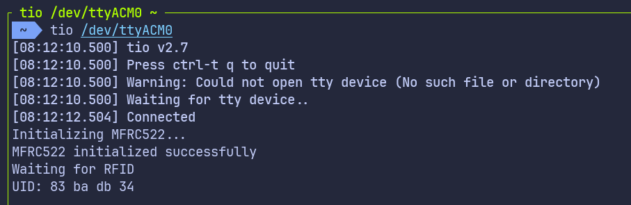

# Read RFID Card UID Using USB Serial

Before we begin, make sure to check out the [USB serial](../usb-serial/index.md) tutorial for setting up USB serial on the Pico. We will not go over the USB setup again here to keep things simple.

In this section, we will read the UID of an RFID card and print it using USB serial. This approach is useful when you do not have a debug probe and want the Pico to appear as a serial device on your computer.

The RFID logic remains the same as the previous section. The only difference is how we print the UID.

## mfrc522 Driver

We will continue using the mfrc522 crate to communicate with the RC522 RFID reader. The driver handles card detection and UID reading. No changes are required on the RFID side.

## Project from template

Generate a new project using the custom Embassy template.

```sh
cargo generate --git https://github.com/ImplFerris/rp2040-embassy-template.git --tag v0.1.4
```

When prompted, enter a project name, for example "uid-over-usb". Do not enable defmt for this setup.

## Additional Crates required

Update your Cargo.toml and add the following crates along with the existing dependencies:

```toml
mfrc522 = "0.8.0"
embedded-hal-bus = "0.3.0"

embassy-usb-logger = "0.5.1"
log = "0.4"
heapless = "0.9.2"
```

The embassy-usb-logger crate provides logging support over USB. The log crate is used for logging macros such as log::info!. The heapless crate is used to format the UID without heap allocation.


## Additional imports

```rust
// For USB
use embassy_rp::{peripherals::USB, usb};

// For SPI
use embassy_rp::spi;
use embassy_rp::spi::Spi;
use embassy_time::Delay;
use embedded_hal_bus::spi::ExclusiveDevice;

// For CS Pin
use embassy_rp::gpio::{Level, Output};

// Driver for the MFRC522
use mfrc522::{Mfrc522, comm::blocking::spi::SpiInterface};

// to prepare buffer with data before writing into USB serial
use core::fmt::Write;
use heapless::String;
```

## USB Logger Setup

First, we need to bind the USB interrupt handler. This tells Embassy which interrupt handler to use for USB communication:

```rust
embassy_rp::bind_interrupts!(struct Irqs {
    USBCTRL_IRQ => usb::InterruptHandler<USB>;
});
```

Next, we create an async task that will handle the USB logging. This task runs in the background and manages all USB serial communication:

```rust
#[embassy_executor::task]
async fn logger_task(usb: embassy_rp::Peri<'static, embassy_rp::peripherals::USB>) {
    let driver = embassy_rp::usb::Driver::new(usb, Irqs);

    embassy_usb_logger::run!(1024, log::LevelFilter::Info, driver);
}
```

The `#[embassy_executor::task]` attribute marks this function as an async task that can be spawned by the Embassy executor. The task accepts the USB peripheral as a parameter and creates a USB driver with our interrupt configuration. The embassy_usb_logger::run! macro sets up the USB logger with a 1024-byte buffer and Info log level filtering.


### Helper Function to Print UID in Hex

We'll use this helper function to convert the u8 byte array (in this case UID) into a printable hex string. You could also just use raw bytes and enable hex mode in tio (requires latest version) or minicom, but I find this approach easier. In hex mode, it prints everything in hex, including normal text.

```rust
fn print_hex_to_serial(data: &[u8]) {
    let mut buff: String<64> = String::new();
    for &d in data.iter() {
        write!(buff, "{:02x} ", d).expect("failed to write byte into buffer");
    }
    log::info!("UID: {}", buff);
}
```

This function creates a fixed-size string buffer on the stack (no heap allocation required) and formats each byte as a two-digit hexadecimal number. The formatted string is then sent through the logging system.

## Spawn the Logger Task

In the main function, we need to spawn the logger task and give it time to initialize:

```rust
spawner.must_spawn(logger_task(p.USB));
Timer::after_secs(3).await;
```

The spawner.must_spawn() method starts the logger task inside the Embassy executor. This task runs alongside our main code and handles USB serial logging. We then wait for 3 seconds to give the host computer time to recognize the Pico as a USB serial device and for the logger to be ready. This delay is important because the USB connection is set up gradually, and log messages sent too early may not show up on the host.

## Setting Up SPI for the RFID Reader

SPI setup is the same as before.

```rust
let miso = p.PIN_0;
let cs_pin = Output::new(p.PIN_1, Level::High);
let clk = p.PIN_2;
let mosi = p.PIN_3;

let mut config = spi::Config::default();
config.frequency = 1000_000;

let spi_bus = Spi::new_blocking(p.SPI0, clk, mosi, miso, config);
```

This configures the SPI bus with a frequency of 1 MHz, which is suitable for the RC522 module. The chip select (CS) pin is initialized high (inactive state), as SPI chip select is active low.


## Getting the `SpiDevice` from SPI Bus

The mfrc522 driver expects an SpiDevice rather than a raw SPI bus. We use the embedded-hal-bus crate to create this device:

```rust
let spi = ExclusiveDevice::new(spi_bus, cs_pin, Delay).expect("Failed to get exclusive device");
```

We use ExclusiveDevice since our setup has just one device on the SPI bus. This wrapper holds the SPI bus and CS pin together, automatically controlling the chip select line during each read or write operation. The delay parameter provides timing control between operations.

## Initialize the mfrc522

With the SPI device ready, we can now initialize the RFID reader.

```rust
let itf = SpiInterface::new(spi);

log::info!("Initializing MFRC522...");
let mut rfid = match Mfrc522::new(itf).init() {
    Ok(rfid) => {
        log::info!("MFRC522 initialized successfully");
        rfid
    }
    Err(e) => {
        log::error!("Failed to initialize MFRC522: {:?}", e);
        loop {
            Timer::after_secs(1).await;
        }
    }
};
```

The SpiInterface wraps our SPI device for use with the mfrc522 driver. We then attempt to initialize the RFID reader. If initialization succeeds, we log a success message and continue. If it fails, we log the error and enter an infinite loop, as we cannot proceed without a working RFID reader.


## Read the UID and Print

The main loop continuously checks for nearby RFID cards. When a card is detected, we read its UID and display it:

```rust
log::info!("Waiting for RFID");
loop {
    if let Ok(atqa) = rfid.reqa() {
        if let Ok(uid) = rfid.select(&atqa) {
            print_hex_to_serial(uid.as_bytes());
            Timer::after_millis(500).await;
        }
    }
    Timer::after_millis(100).await;
}
```

The reqa method sends a Request command to detect cards in proximity. When a card responds with its ATQA (Answer To Request), we call select to perform the anti-collision protocol and retrieve the UID. The UID bytes are formatted as hexadecimal and sent through the log system to the USB serial console.

The 500ms delay after a successful read prevents flooding the serial output with repeated reads of the same card. The 100ms delay in the main loop provides a reasonable polling interval without consuming excessive CPU cycles.

## Clone the existing project

You can clone (or refer) project I created and navigate to the `uid-over-usb` folder.

```sh
git clone https://github.com/ImplFerris/rp2040-projects
cd rp2040-projects/embassy/rfid/uid-over-usb/
```

## How to Run ?

The method to flash (run the code) on the Pico is the same as usual. However, we need to set up tio to interact with the Pico through the serial port (/dev/ttyACM0). This allows us to read data from the Pico or send data to it.

### tio

Make sure you have tio installed on your system. If not, you can install it using:
```sh
apt install tio
```

### Connecting to the Serial Port

Run the following command to connect to the Pico's serial port:

```sh
tio /dev/ttyACM0
```

This will open a terminal session for communicating with the Pico. The /dev/ttyACM0 device appears when the Pico is recognized by the host as a USB CDC ACM device.

### Flashing and Running the Code

Open another terminal, navigate to the project folder, and flash the code onto the Pico as usual:

```sh
cargo run --release
```

If everything is set up correctly, you should see a "Connected" message in the tio terminal.

### Reading the UID

Now, bring the RFID tag near the reader. You should see the UID bytes displayed in hex format on the USB serial terminal. Each byte is shown as a two-digit hexadecimal number.


