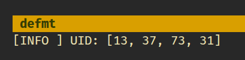

# How to Read an RFID Card UID with Raspberry Pi Pico in Embedded Rust

Now that the wiring is complete, we will move on to the coding part. Let us keep things simple. We will first detect an RFID card and read its UID. We will not deal with authentication or data access yet.

In this section, we will print the UID using a debug probe. Logging is done with defmt, and the output appears in the host console through RTT. If you have a debug probe, this is the simplest way to print and inspect the output.

> [!Important]
> In the next section, we will read the same UID but print it using USB serial instead. This is useful when you do not have a debug probe and want to print data to the system console. You are not limited to these two approaches. You may also display the UID on an OLED screen.

## mfrc522 Driver

We will use the [mfrc522](https://crates.io/crates/mfrc522) crate to communicate with the RC522 RFID reader. The crate provides the core functionality required to detect cards and read their UIDs. While it is still under development, it is sufficient for the features we need in this chapter.

## Project from template

Generate a new project using the custom Embassy template.

```sh
cargo generate --git https://github.com/ImplFerris/rp2040-embassy-template.git --tag v0.1.4
```

When prompted, enter a project name, for example "print-uid". Ensure to enable "defmt" for logging.

## Additional Crates required

Update your Cargo.toml to add the required crates along with the existing dependencies. The set of crates depends on how the output is printed.

```toml
mfrc522 = "0.8.0"
embedded-hal-bus = "0.3.0"
```

The mfrc522 crate provides the driver for communicating with the RC522 RFID reader and handles card detection and UID reading. The embedded-hal-bus crate enables SPI bus sharing through the ExclusiveDevice wrapper, which the mfrc522 driver requires.

## Additional imports

Add these imports to your main.rs file:

```rust
// For SPI
use embassy_rp::spi::Spi;
use embassy_rp::spi;
use embassy_time::Delay;
use embedded_hal_bus::spi::ExclusiveDevice;

// For CS Pin
use embassy_rp::gpio::{Level, Output};

// Driver for the MFRC522
use mfrc522::{Mfrc522, comm::blocking::spi::SpiInterface};
```

## Setting Up SPI for the RFID Reader

Let's set up the SPI bus and the pins connected to the reader. This example uses SPI0:

```rust
let miso = p.PIN_0;
let cs_pin = Output::new(p.PIN_1, Level::High);
let clk = p.PIN_2;
let mosi = p.PIN_3;

let mut config = spi::Config::default();
config.frequency = 1000_000;

let spi_bus = Spi::new_blocking(p.SPI0, clk, mosi, miso, config);
```

We configure the SPI bus to run at 1 MHz, which provides reliable communication with the RFID reader. The chip select pin starts high, which is the idle state for SPI devices.

## Getting the `SpiDevice` from SPI Bus

The mfrc522 driver expects an SpiDevice rather than a raw SPI bus. We use the embedded-hal-bus crate to create this device:

```rust
let spi = ExclusiveDevice::new(spi_bus, cs_pin, Delay).expect("Failed to get exclusive device");
```

We use ExclusiveDevice since our setup has just one device on the SPI bus. This wrapper holds the SPI bus and CS pin together, automatically controlling the chip select line during each read or write operation. The delay parameter provides timing control.

## Initialize the mfrc522

With the SPI device ready, we can now initialize the RFID reader.

```rust
let itf = SpiInterface::new(spi);
let mut rfid = Mfrc522::new(itf)
    .init()
    .expect("failed to initialize the RFID reader");
```

## Read the UID and Print

The main loop continuously checks for nearby RFID cards. When a card is detected, we read its UID and display it:

```rust
loop {
    if let Ok(atqa) = rfid.reqa() {
        if let Ok(uid) = rfid.select(&atqa) {
            defmt::info!("UID: {:02x}", uid.as_bytes());
            Timer::after_millis(500).await;
        }
    }
}
```

The reqa method sends a Request command to detect cards in proximity. When a card responds with its ATQA (Answer To Request), we call select to perform the anti-collision protocol and retrieve the UID. The UID bytes are formatted as hexadecimal and sent through defmt to the RTT console.


## Clone the existing project

You can clone (or refer) project I created and navigate to the `print-uid` folder.

```sh
git clone https://github.com/ImplFerris/rp2040-projects
cd rp2040-projects/embassy/rfid/print-uid/
```

## How to Run ?

Don't forget to use the `cargo embed --release` command to flash instead of `cargo flash --release` when you are using a debug probe. I already configured in the template to open up the RTT when flashed, you should see the defmt output.

Now, bring the RFID tag near the reader. You should see the UID bytes displayed in hex format in the RTT console.
 

