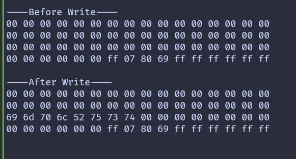

# Write Data

In the previous chapters, we focused on reading data from the tag. In this chapter, we move one step further and write data to the tag memory.

We will write data to block 2 of sector 4. To clearly see the effect of the write operation, we first read and print the block contents before writing, then read the same sector again after the write completes.

Writing is done using the mf_write function provided by the mfrc522 crate. This function writes exactly 16 bytes, which matches the size of a single block on a MIFARE Classic tag.

> [!CAUTION]
> Writing to the wrong block can permanently change authentication keys or access bits.  Avoid writing to sector trailer blocks unless you fully understand their structure.


## Writing a Block

We begin by defining a helper function that performs the write operation. The function receives the tag UID, the sector number, the block number relative to the sector, a 16 byte data buffer, and a mutable reference to the RFID reader. Inside the function, the absolute block number is calculated and the sector is authenticated before the write is performed.

```rust
fn write_block<E, COMM>(
    uid: &mfrc522::Uid,
    sector: u8,
    rel_block: u8,
    data: [u8; 16],
    rfid: &mut Mfrc522<COMM, mfrc522::Initialized>,
) -> Result<(), &'static str>
where
    COMM: mfrc522::comm::Interface<Error = E>,
{
    const AUTH_KEY: [u8; 6] = [0xFF; 6];

    let block_offset = sector * 4;
    let abs_block = block_offset + rel_block;

    rfid.mf_authenticate(uid, block_offset, &AUTH_KEY)
        .map_err(|_| "Auth failed")?;

    rfid.mf_write(abs_block, data).map_err(|_| "Write failed")?;

    Ok(())
}
```

## Preparing the Data

Each block stores exactly 16 bytes. When writing text or smaller values, the remaining bytes still need to be provided. In this example, we write the string implRust and pad the remaining bytes with 0x00.

```rust
let target_sector = 4;
let rel_block = 2;
const DATA: [u8; 16] = [
    b'i', b'm', b'p', b'l', b'R', b'u', b's', b't', // "implRust"
    0x00, 0x00, 0x00, 0x00, 0x00, 0x00, 0x00, 0x00, // Remaining bytes as 0x00
];
```

## Main Loop

The main loop follows a simple sequence. After detecting and selecting a tag, the current contents of the target sector are read and printed. The new data is then written to the selected block, and the sector is read again to confirm the change. Finally, the tag is placed into the HALT state and encryption is stopped.

```rust

loop {
    if let Ok(atqa) = rfid.reqa() {
        if let Ok(uid) = rfid.select(&atqa) {
            info!("\r\n----Before Write----\r\n");
            if let Err(e) = read_sector(&uid, target_sector, &mut rfid) {
                error!("Error reading sector: {:?}", e);
            }

            if let Err(e) = write_block(&uid, target_sector, rel_block, DATA, &mut rfid) {
                error!("Error writing data: {:?}", e);
            }

            info!("\r\n----After Write----\r\n");
            if let Err(e) = read_sector(&uid, target_sector, &mut rfid) {
                error!("Error reading sector: {:?}", e);
            }
            let _ = rfid.hlta();
            let _ = rfid.stop_crypto1();
            Timer::after_millis(500).await;
        }
    }
    Timer::after_millis(100).await;
}
```

## Clone the existing project

You can clone the example project and navigate to the write example directory.

```sh
git clone https://github.com/ImplFerris/rp2040-projects
cd rp2040-projects/embassy/rfid/write-data/
```

## Output

When the program runs successfully, the output shows the block contents before and after the write. You should see the ASCII bytes for implRust appear in block 2, confirming that the write operation worked as expected.


