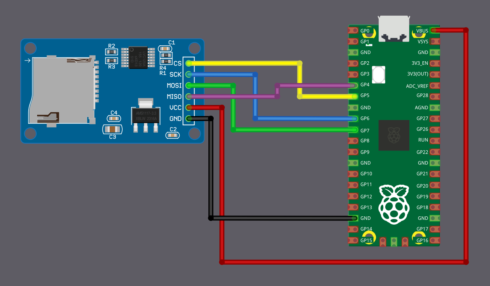

# Connecting Micro SD Card Reader with Raspberry Pi Pico

In this section, we are going to wire a microSD card reader module to the Raspberry Pi Pico using SPI mode.

## microSD Card Pin Mapping for SPI Mode

We will focus only on the microSD card itself, since that is what we are using. A microSD card has 8 physical pins, but in SPI mode only 6 of them are actually required.

You may have noticed that most microSD card reader modules also expose only 6 pins. That is because those modules are already wired internally for SPI operation, and the unused pins are simply not brought out.

The table below shows how the microSD card pins map to SPI signals.

  
  <table>
    <thead>
      <tr>
        <th>microSD Card Pin</th>
        <th>SPI Function</th>
      </tr>
    </thead>
    <tbody>
      <tr>
        <td>1</td>
        <td>-</td>
      </tr>
      <tr>
        <td>2</td>
        <td>Chip Select (CS); also referred as Card Select</td>
      </tr>
      <tr>
        <td>3</td>
        <td>Data Input (DI) - corresponds to MOSI. To receive data from the microcontroller.</td>
      </tr>
      <tr>
        <td>4</td>
        <td>VDD - Power supply (3.3V)</td>
      </tr>
      <tr>
        <td>5</td>
        <td>Serial Clock (SCK)</td>
      </tr>
      <tr>
        <td>6</td>
        <td>Ground (GND)</td>
      </tr>
      <tr>
        <td>7</td>
        <td>Data Output (DO) - corresponds to MISO. To send data from the microSD card to the microcontroller.</td>
      </tr>
      <tr>
        <td>8</td>
        <td>-</td>
      </tr>
    </tbody>
  </table>

## Connecting the Raspberry Pi Pico to the SD Card Reader

The Raspberry Pi Pico's GPIO pins are 3.3V tolerant and can be permanently damaged by 5V signals. Micro SD cards also operate at 3.3V and can be damaged if higher voltages are applied.

SD card reader modules come in different configurations:

**3.3V-only modules:** These modules are simple microSD breakout boards designed to run directly at 3.3V. Because both the Raspberry Pi Pico and the SD card use the same voltage, the module can be connected without any extra circuitry. Power it from the Pico's 3V3(OUT) pin and connect the SPI data lines directly to the Pico's GPIO pins. This is the simplest and safest option when working with the Raspberry Pi Pico.

**5V modules with voltage regulation:** Some SD card modules are designed to be powered from 5V. These modules include extra components so the SD card itself still runs at 3.3V. Some higher-quality modules also make sure that all signal lines stay at safe 3.3V levels.

If a 5V module is designed correctly, it can be used with the Raspberry Pi Pico. However, not all 5V modules handle the signal levels properly. Because of this, you should always check the module description or documentation before connecting it to the Pico.

### The Module Used in This Guide

The SD card module used in this guide is designed to be powered from 5V and outputs 3.3V signals, making it safe to use with the Raspberry Pi Pico.

Power the module from the Pico's VBUS pin, which provides 5V when the Pico is powered through USB. Do not power this type of module from the Pico's 3.3V pin, as it may not work reliably.

> [!Caution]
> Always verify your SD card module outputs 3.3V signals before connecting it to the Pico. If uncertain, use a 3.3V-only module to avoid damaging your Pico.

### Wiring Diagram

<table>
  <thead>
    <tr>
      <th>Pico Pin</th>
      <th style="width: 250px; margin: 0 auto;">Wire</th>
      <th>SD Card Pin</th>
    </tr>
  </thead>
  <tbody>
    <tr>
      <td>GPIO 4 (RX)</td>
      <td style="text-align: center; vertical-align: middle; padding: 0;">
        

          

          

        

      </td>
      <td>MISO</td>
    </tr>
    <tr>
      <td>GPIO 5</td>
      <td style="text-align: center; vertical-align: middle; padding: 0;">
        

          

          

        

      </td>
      <td>CS</td>
    </tr>
    <tr>
      <td>GPIO 6</td>
      <td style="text-align: center; vertical-align: middle; padding: 0;">
        

          

          

        

      </td>
      <td>SCK</td>
    </tr>
    <tr>
      <td>GPIO 7 (TX)</td>
      <td style="text-align: center; vertical-align: middle; padding: 0;">
        

          

          

        

      </td>
      <td>MOSI</td>
    </tr>
        <tr>
      <td>VBUS</td>
      <td style="text-align: center; vertical-align: middle; padding: 0;">
        

          

          

        

      </td>
      <td>VCC</td>
    </tr>
    <tr>
      <td>GND</td>
      <td style="text-align: center; vertical-align: middle; padding: 0;">
        

          

          

        

      </td>
      <td>GND</td>
    </tr>
  </tbody>
</table>
 

