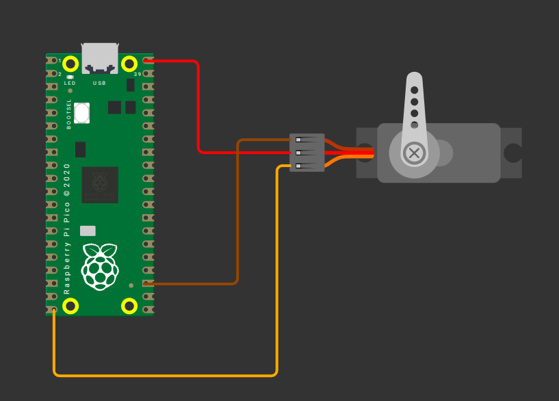

# Servo with Raspberry Pi Pico (RP2040)

The required power supply and pulse width can vary depending on the servo motor you use, so it is always best to check the datasheet or product specifications. The servo I am using operates in the 4.8V to 6V range, so I will power it with 5V.

1. Ground (GND): Connect the servo's GND pin (typically the brown wire, though it may vary) to any ground pin on the Pico.
2. Power (VCC): Connect the servo's VCC pin (usually the red wire) to the Pico's 5V power pin(VBUS).
3. Signal (PWM): Connect the servo's control (signal) pin to GPIO15 on the Pico, configured for PWM. This is commonly the orange wire (may vary).

<table style="margin-bottom:20px">
  <thead>
    <tr>
      <th>Pico Pin</th>
      <th style="width: 250px; margin: 0 auto;">Wire</th>
      <th>Servo Motor</th>
      <th>Notes</th>
    </tr>
  </thead>
  <tbody>
    <tr>
      <td>VBUS</td>
      <td style="text-align: center; vertical-align: middle; padding: 0;">
        

          

          

        

      </td>
      <td>Power (Red Wire)</td>
      <td>Supplies 5V power to the servo.</td>
    </tr>
    <tr>
      <td>GND</td>
      <td style="text-align: center; vertical-align: middle; padding: 0;">
        

          

          

        

      </td>
      <td>Ground (Brown Wire)</td>
      <td>Connects to ground.</td>
    </tr>
    <tr>
      <td>GPIO 15</td>
      <td style="text-align: center; vertical-align: middle; padding: 0;">
        

          

          

        

      </td>
      <td>Signal (Orange/yellow Wire)</td>
      <td>Receives PWM signal to control the servo's position.</td>
    </tr>
  </tbody>
</table>

