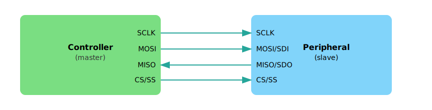
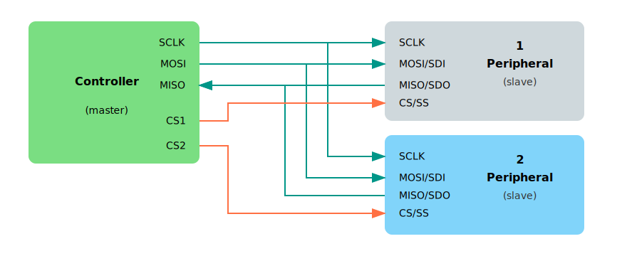

# Serial Peripheral Interface (SPI)

In this section, we will learn what SPI is and how to use the SPI communication buses of the Raspberry Pi Pico.

## What is SPI?

SPI stands for Serial Peripheral Interface. It is one of the most common ways for microcontrollers to communicate with devices like displays, sensors, and SD Cards. Technically, it is called as a serial, full duplex, and synchronous interface. But what do those terms mean?

- **Serial** means data is sent one bit at a time, one after another, over a single data line. This is different from parallel communication, where multiple bits are sent at the same time using multiple data lines.

- **Full duplex** means two devices can send and receive data at the same time. Both devices can transmit to each other simultaneously without waiting for the other to finish. This is different from half duplex, where devices must take turns: one sends while the other receives.

- **Synchronous** means both devices use a shared clock signal. This clock defines exactly when each bit of data is sent and read, so both sides stay aligned during communication.

## Controller and Peripheral

SPI uses a controller-peripheral model (previously called master-slave). The controller is the device that starts the communication and provides the clock signal. The peripheral is the device that responds to the controller.

In our case, the Raspberry Pi Pico acts as the controller, and devices like displays, sensors, or SD Cards are peripherals.

<em>Figure: Single SPI bus with a controller and a single peripheral</em>

The connection typically uses four lines:

- The SCK (Serial Clock) line carries the clock signal generated by the controller. This signal keeps both the controller and the device in sync during data transfer.

- The MOSI (Master Out, Slave In) line is used to send data from the controller to the device. In some datasheets, this line may be labeled as SDO (Serial Data Out).

- The MISO (Master In, Slave Out) line carries data from the device to the controller. It may also be referred to as SDI (Serial Data In) depending on the device.

- Finally, the CS (Chip Select) line is used by the controller to choose which device it wants to communicate with. Each connected device usually has its own dedicated CS line. When the controller pulls a device's CS line low(active), that device becomes active and ready to communicate.  In some older documentation, this line may be referred to as SS (Slave Select).

<em>Figure: Single SPI bus with a controller and multiple peripherals</em>

### SPI Modes

SPI supports four modes, numbered from 0 to 3. These decide when data is read and written depending on the clock's idle level and edge.

Don't worry too much about the details right now. Mode 0 is the most common and works with most devices.

## Why SPI?

SPI is a great choice when you want fast and reliable communication between your microcontroller and a peripheral. It's much faster than I²C or UART, simple to use, and allows data to be sent and received at the same time (full-duplex). This makes it ideal for high-speed devices like displays or SD cards. 

As long as you have enough GPIO pins and don't need to connect a large number of devices, SPI is usually the best tool for the job.

## Resources

For more in-depth technical details, refer these
- [Serial Peripheral Interface (SPI) by Sparkfun](https://learn.sparkfun.com/tutorials/serial-peripheral-interface-spi/all) 
- [Basics of the SPI Communication Protocol](https://www.circuitbasics.com/basics-of-the-spi-communication-protocol/)
