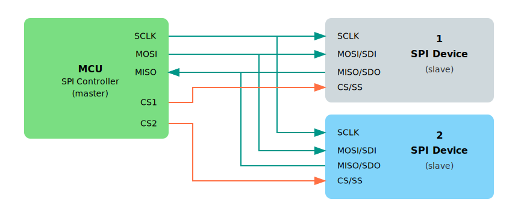
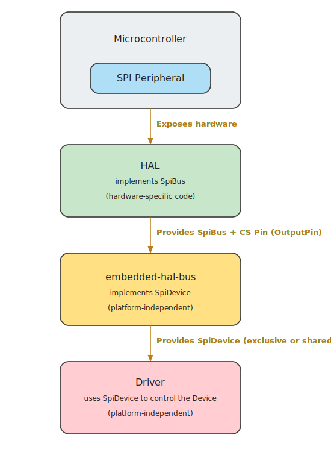

# Using SPI with Embedded Rust Ecosystem

In the previous section, we learned what SPI is and how the controller-peripheral model works. Now, let's see how these concepts apply within the Embedded Rust ecosystem.

Rust's embedded ecosystem is designed to be modular and reusable. This means you can write code for one microcontroller and reuse it on another with minimal changes. One key to this flexibility is the use of traits defined by the embedded-hal crate.

## SPI in embedded-hal

The embedded-hal crate defines standard traits for working with SPI, so that drivers and libraries can be written generically. Two important traits for SPI are:

- SpiBus: Represents full control over the SPI bus, including the SCK, MOSI, and MISO lines. This must be implemented by the microcontroller's HAL crate. For example, the esp-hal crate implements SpiBus. If you are curious, you can look at the implementation [here](https://github.com/esp-rs/esp-hal/blob/de67c3101346cdbe030ffa1bb95b13943ee8d790/esp-hal/src/spi/master.rs#L2703).

- SpiDevice: Represents access to a single SPI device that may share the bus with others. It takes control of the chip select (CS) pin and ensures the device is properly selected before communication and released afterward. 

## Platform-Independent Drivers

Imagine you are writing a driver for a sensor or a display that communicates over SPI. You don't want to tie your code to a specific microcontroller like the Raspberry Pi Pico or ESP32. Instead, you can write the driver in a generic way using the embedded-hal traits.

As long as your driver only depends on the SpiDevice or SpiBus traits, it can run on any platform that provides an implementation of these traits-such as STM32, nRF, or ESP32.

## Sharing the SPI Bus

In many projects, multiple SPI devices share the same SPI bus. For example, you might have a display, an SD card, and a temperature sensor all connected to the same MOSI, MISO, and SCK lines. The only thing that separates them is their chip select (CS) pin.

<em>Figure: Single SPI bus with a controller and multiple peripherals</em>

If you give full control of the SPI bus to just one driver (using SpiBus), the others can't use it. Instead, we need a way to share the SPI bus safely across multiple devices.

That's where SpiDevice comes in - it allows each driver to use only its own CS pin, while still sharing the underlying bus.

In practice, this means we need to pass a struct that implements SpiDevice to each driver, rather than giving them the full bus.

## How do we get a SpiDevice?

We said that each driver should be given a SpiDevice implementation instead of the full SpiBus. But are we supposed to write this SpiDevice struct ourselves?

Not really. While it's possible to write your own implementation, it's usually unnecessary-and can be tricky to get right, especially when multiple devices need to coordinate bus access.

That's where the embedded-hal-bus crate comes in. It provides ready-to-use wrappers that implement the SpiDevice trait for you. These wrappers handle bus access, chip select control, and optional synchronization between devices.

- If your project only uses one SPI device and doesn't need sharing, you can use the `ExclusiveDevice` struct - it gives exclusive access to the bus for one device.

- But if your project has multiple SPI devices sharing the same bus, you can choose one of the shared access implementations such as `AtomicDevice` or `CriticalSectionDevice`. These manage access to the bus so that each device gets a turn without interfering with the others.

These structs allow you to focus on using or building drivers without worrying about low-level coordination or writing boilerplate code.

## Resources

- [embedded-hal docs on SPI](https://docs.rs/embedded-hal/latest/embedded_hal/spi/index.html): This documentation provides in-depth details on how SPI traits are structured and how they are intended to be used across different platforms.

