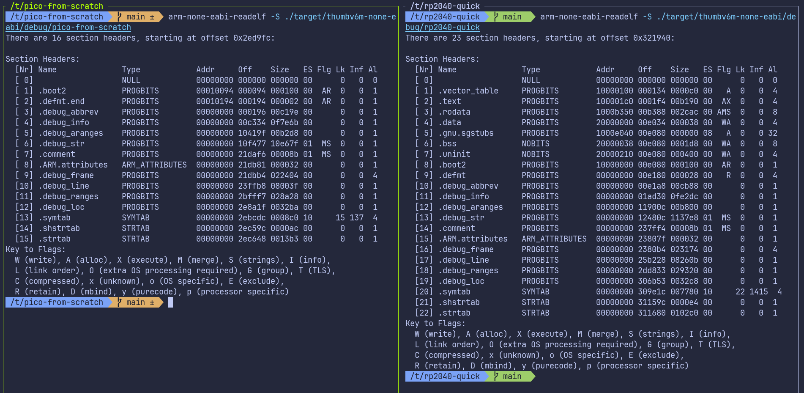
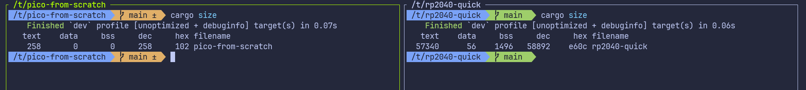

# Linker Script

The program now compiles successfully. However, when you attempt to flash it onto the Pico, you may encounter an error like the following:

```sh
ERROR: File to load contained an invalid memory range 0x00010000-0x000100aa
```

## Comparing our project with quick start project

To understand why flashing fails, let's inspect the compiled program using the arm-none-eabi-readelf tool. This tool shows how the compiler and linker organized the program in memory.

I took the binary from the quick-start project and compared it with the binary our project produces at its current state.

<div class="image-with-caption" style="text-align:center; display:inline-block;">
    
    <div class="caption" style="font-size:0.9em; color:#555; margin-top:6px;">Quick Start vs our Project</div>
</div>

You don't need to understand every detail in this output. The important part is simply noticing that the two binaries look very different, even though our Rust code is almost the same.

The big difference is that our project is missing some important sections like .text, .rodata, .data, and .bss. These sections are normally created by the linker:

- .text : this is where the actual program instructions (the code) go
- .rodata : read-only data, such as constant values
- .data : initialized global or static variables
- .bss : uninitialized global or static variables

You can also use `cargo size` command provided by the [cargo-binutils](https://github.com/rust-embedded/cargo-binutils) toolset to compare them.


<div class="image-with-caption" style="text-align:center; display:inline-block;">
    
    <div class="caption" style="font-size:0.9em; color:#555; margin-top:6px;">cargo size: Quick Start vs our Project</div>
</div>

## Linker

This is usually taken care of by something called linker. The role of the linker is to take all the pieces of our program, like compiled code, library code, startup code, and data, and combine them into one final executable that the device can actually run. It also decides where each part of the program should be placed in memory, such as where the code goes and where global variables go.

However, the linker does not automatically know the memory layout of the RP2040. We have to tell it how the flash and RAM are arranged. This is done through a linker script. If the linker script is missing or incorrect, the linker will not place our code in the proper memory regions, which leads to the flashing error we are seeing.

### Linker Script

We are not going to write a linker script from scratch. The cortex-m-rt crate already provides a default linker script called link.x. This script takes care of the Cortex-M startup and runtime parts, but it does not know anything about the memory layout of the specific microcontroller we are targeting.

Every microcontroller has its own flash size, RAM size, and memory map. Because of this, cortex-m-rt expects us to provide an additional linker script called memory.x. This file describes how the memory on the device is laid out.

In memory.x, we describe the memory regions available on the device. At a minimum, we define a FLASH region and a RAM region. The program code and read-only data are placed in flash, while initialized data, uninitialized data, the stack, and the heap are placed in RAM.

For the RP2040, the datasheet (chapter 2.2, Address map) shows that external QSPI flash is memory-mapped starting at address 0x10000000. This is the XIP region used to execute code directly from flash. SRAM is mapped starting at address 0x20000000. On the Raspberry Pi Pico board, the external flash size is 2 MB, and the RP2040 provides a total of 264 KB of SRAM.

The memory.x for RP2040 looks like this:

```
MEMORY {
    BOOT2 : ORIGIN = 0x10000000, LENGTH = 0x100
    FLASH : ORIGIN = 0x10000100, LENGTH = 2048K - 0x100

    /* Pick one of the two options for RAM layout     */

    /* OPTION A: Use all RAM banks as one big block   */
    /* Reasonable, unless you are doing something     */
    /* really particular with DMA or other concurrent */
    /* access that would benefit from striping        */
    RAM   : ORIGIN = 0x20000000, LENGTH = 264K

    /* OPTION B: Keep the unstriped sections separate */
    /* RAM: ORIGIN = 0x20000000, LENGTH = 256K        */
    /* SCRATCH_A: ORIGIN = 0x20040000, LENGTH = 4K    */
    /* SCRATCH_B: ORIGIN = 0x20041000, LENGTH = 4K    */
}
```

You can download the memory.x file from [here](https://github.com/embassy-rs/embassy/blob/61797d5148bda4ce9a0889916e8085b29d529936/examples/rp/memory.x) and place it in the root of your project.


## Codegen Option for Linker

Putting the memory.x file in the project folder is not enough. We also need to make sure the linker actually uses the linker script provided by cortex-m-rt.


To fix this, we tell Cargo to pass the linker script (link.x) to the linker.  There are multiple ways we can pass the argument to the rust. we can use the method like .cargo/config.toml or build script (build.rs) file. In the quick start, we are using the build.rs. So we will use the .cargo/config.toml approach. In the file, update the target section with the following

```toml
[target.thumbv6m-none-eabi]
runner = "picotool load -u -v -x -t elf" # we alerady added this
rustflags = ["-C", "link-arg=-Tlink.x"]  # This is the new line 
```

## Run Pico Run

With everything set up, you can now flash the program to the Pico:

```rust
cargo run --release
```

Phew... we took a normal Rust project, turned it into a no_std firmware for the Pico. Finally, we can now see the LED blinking.


## Resources

-  [Everything You Never Wanted To Know About Linker Script](https://mcyoung.xyz/2021/06/01/linker-script/)

