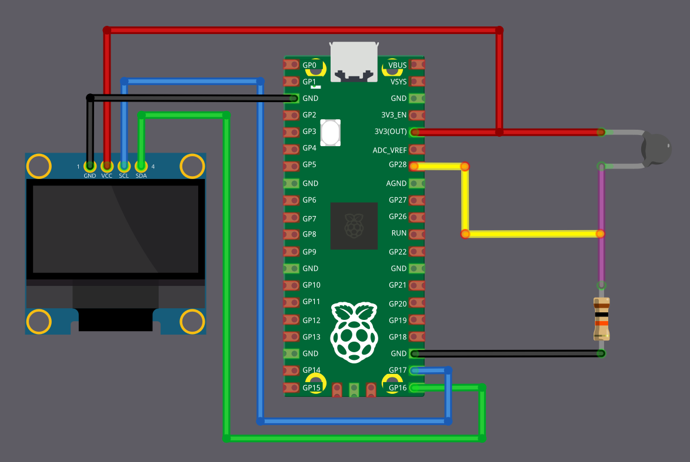

# Displaying Temperature on an OLED Using Embedded Rust on Raspberry Pi Pico

In this chapter, we are going to read temperature from a thermistor and display it on an OLED screen.

By now, you should already be familiar with using an OLED display with the Raspberry Pi Pico. Instead of printing values to a console, we will make it fun by displaying on the hardware display.

## Hardware Requirments

- NTC 103 Thermistor: 10K OHM, 5mm epoxy coated disc
- An OLED display: (0.96 Inch I2C/IIC 4-Pin, 128x64 resolution, SSD1306 chip)
- 10kΩ Resistor: Used with the thermistor to form a voltage divider 
- Jumper wires

## Circuit to connect OLED, Thermistor with Raspberry Pi Pico

### Thermistor Connection

We are going to connect the thermistor as a voltage divider and feed the divider output into an ADC pin on the Pico. Here, the thermistor acts as R1 and is connected to the 3.3 V supply, which means the ADC value decreases as the temperature increases (NTC behavior).

<table>
  <thead>
    <tr>
      <th>Pico Pin</th>
      <th style="width: 250px; margin: 0 auto;">Wire</th>
      <th>Component</th>
    </tr>
  </thead>
  <tbody>
    <tr>
      <td>3.3&nbsp;V</td>
      <td style="text-align: center; vertical-align: middle; padding: 0;">
        

          

          

        

      </td>
      <td>One end of the thermistor</td>
    </tr>
    <tr>
      <td>GPIO&nbsp;28 (ADC2)</td>
      <td style="text-align: center; vertical-align: middle; padding: 0;">
        

          

          

        

      </td>
      <td>Junction between thermistor and 10&nbsp;kΩ resistor</td>
    </tr>
    <tr>
      <td>10&nbsp;kΩ resistor</td>
      <td style="text-align: center; vertical-align: middle; padding: 0;">
        

          

          

        

      </td>
      <td>Other end of the thermistor</td>
    </tr>
    <tr>
      <td>GND</td>
      <td style="text-align: center; vertical-align: middle; padding: 0;">
        

          

          

        

      </td>
      <td>Other end of the 10&nbsp;kΩ resistor</td>
    </tr>
  </tbody>
</table>

### OLED (I2C) Connection

The OLED display is connected using I2C. SDA is connected to GPIO&nbsp;16 and SCL is connected to GPIO&nbsp;17.

<table>
  <thead>
    <tr>
      <th>Pico Pin</th>
      <th style="width: 250px; margin: 0 auto;">Wire</th>
      <th>OLED Pin</th>
    </tr>
  </thead>
  <tbody>
    <tr>
      <td>GND</td>
      <td style="text-align: center; vertical-align: middle; padding: 0;">
        

          

          

        

      </td>
      <td>GND</td>
    </tr>
    <tr>
      <td>3.3&nbsp;V</td>
      <td style="text-align: center; vertical-align: middle; padding: 0;">
        

          

          

        

      </td>
      <td>VCC</td>
    </tr>
    <tr>
      <td>GPIO&nbsp;16</td>
      <td style="text-align: center; vertical-align: middle; padding: 0;">
        

          

          

        

      </td>
      <td>SDA</td>
    </tr>
    <tr>
      <td>GPIO&nbsp;17</td>
      <td style="text-align: center; vertical-align: middle; padding: 0;">
        

          

          

        

      </td>
      <td>SCL</td>
    </tr>
  </tbody>
</table>

