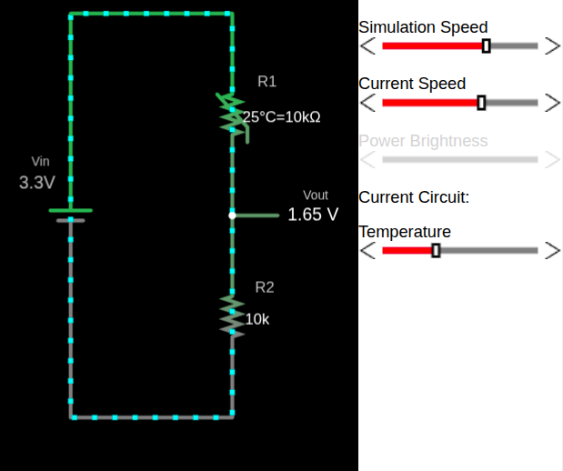
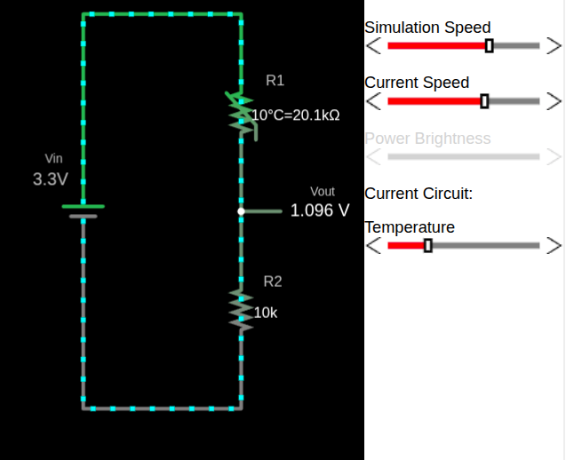
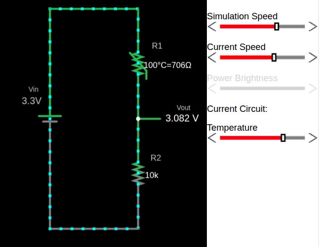

# NTC and Voltage Divider

To understand how an NTC thermistor behaves in a voltage divider, I created a simple simulation using Falstad. In the circuit, the thermistor is shown as a resistor whose value changes with temperature.

You can import the circuit file I created, [voltage-divider-thermistor.circuitjs.txt](./voltage-divider-thermistor.circuitjs.txt), into the Falstad website and experiment with it yourself. I have also embedded a small simulator at the bottom of this page, so you can use either option.

In this configuration, the NTC thermistor is placed on the top of the voltage divider (R1), with a fixed resistor at the bottom (R2).  As the temperature changes, the resistance of the thermistor changes, and that directly affects the output voltage of the voltage divider.

> [!Important]
> Swapping the thermistor and the fixed resistor will invert the behavior of the output voltage.
> If you place the thermistor as R2 instead of R1, increase in temperature will cause \\( V_{out} \\) to decrease instead.

### Thermistor at 25°C

The thermistor has a resistance of 10kΩ at 25°C, resulting in an output voltage (\\( V_{out} \\)) of 1.65V.

## Thermistor at 10°C

The thermistor's resistance increases, resulting in a lower output voltage (\\( V_{out} \\)).

## Thermistor at 100°C

The thermistor's resistance decreases due to its negative temperature coefficient. This results in increase of output voltage.

## NTC Thermistor Voltage Divider Simulator

    
🌡️ NTC Thermistor Voltage Divider Simulator

    

        <canvas id="thermistorSimCanvas" class="thermistor-sim-canvas" width="370" height="500"></canvas>
        

            <label class="thermistor-sim-label">🌡️ Temperature</label>
            

                <input type="range" class="thermistor-sim-slider" id="thermistorSimTemp" min="0" max="100" value="25">
                25°C
            

            
25°

        

    

