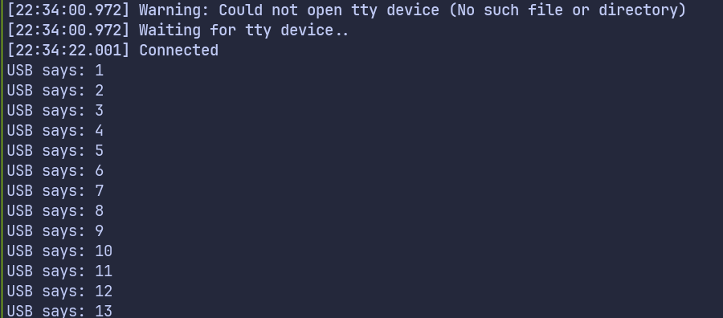

# USB Serial Logging with Embassy on Raspberry Pi Pico

In this chapter, we will look at a simple way to log messages from the Raspberry Pi Pico to the system console using USB serial. We will use the USB interface along with the embassy-usb-logger crate to send log output to the host.

We will keep the example intentionally small. The Pico maintains a counter that increments once every second. Each time the value changes, we print it to the system console over USB. When the counter reaches its limit, it wraps back to zero and continues. The goal here is not the counter itself, but to show how logging works when USB serial is used as the output.

This approach is useful when you want log output to appear as a regular serial device on your computer. Once this is set up, you can use the same logging method to print sensor values, state changes, or debug messages from your application.

## Project from template

Generate a new project using the custom Embassy template.

```sh
cargo generate --git https://github.com/ImplFerris/rp2040-embassy-template.git --tag v0.1.4
```

NOTE: For this example, we will disable defmt logging. All log output is sent over USB serial using embassy-usb-logger.

## Additional crates required

Update your Cargo.toml to include the USB logger crate.

```toml
embassy-usb-logger = "0.5.1"
log = "0.4"
```

The embassy-usb-logger crate provides a ready to use logger implementation that sends log messages over USB. The log crate provides the logging macros used throughout the program.

## Additional imports

Add the following imports to your main.rs file.

```rust
// For USB
use embassy_rp::{peripherals::USB, usb};
```

## USB interrupt binding

The USB peripheral requires an interrupt handler. Embassy provides the handler, and we only need to bind it.

```rust
embassy_rp::bind_interrupts!(struct Irqs {
    USBCTRL_IRQ => usb::InterruptHandler<USB>;
});
```

## USB logger task

USB handling runs in its own task. This task creates the USB driver and starts the USB logger.

```rust
#[embassy_executor::task]
async fn logger_task(usb: embassy_rp::Peri<'static, embassy_rp::peripherals::USB>) {
    let driver = embassy_rp::usb::Driver::new(usb, Irqs);

    embassy_usb_logger::run!(1024, log::LevelFilter::Info, driver);
}
```

The logger task runs continuously and handles all USB communication in the background.


## Main function 

In the main function, we spawn the USB logger task.

```rust
spawner.must_spawn(logger_task(p.USB));
```

## Main loop

We keep a simple counter and increase it once every second. The counter uses wrapping arithmetic, so after reaching its maximum value it rolls back to zero. On each iteration, we log the current value using `log::info!`, which sends the message over USB serial.

```rust
let mut i: u8 = 0;
loop {
    i = i.wrapping_add(1);
    log::info!("USB says: {}", i);

    Timer::after_secs(1).await;
}
```


## Clone the existing project

You can clone (or refer) project I created and navigate to the `cdc-logger` folder.

```sh
git clone https://github.com/ImplFerris/rp2040-projects
cd rp2040-projects/embassy/usb-serial/cdc-logger
```

## How to Run ?

The method to flash (run the code) on the Pico is the same as usual. However, we need to set up tio to interact with the Pico through the serial port (/dev/ttyACM0). This allows us to read data from the Pico or send data to it.

### tio

Make sure you have tio installed on your system. If not, you can install it using:

```sh
apt install tio
```

### Connecting to the Serial Port

Run the following command to connect to the Pico's serial port:

```sh
tio /dev/ttyACM0
```

This will open a terminal session for communicating with the Pico.

### Flashing and Running the Code

Open another terminal, navigate to the project folder, and flash the code onto the Pico as usual:

```sh
cargo run --release
```
Once the program starts running, you should see the counter value printed once every second in the tio terminal.


